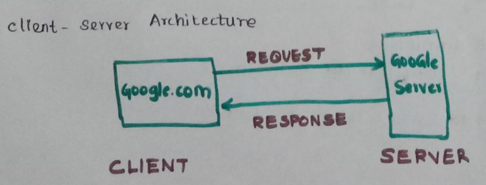
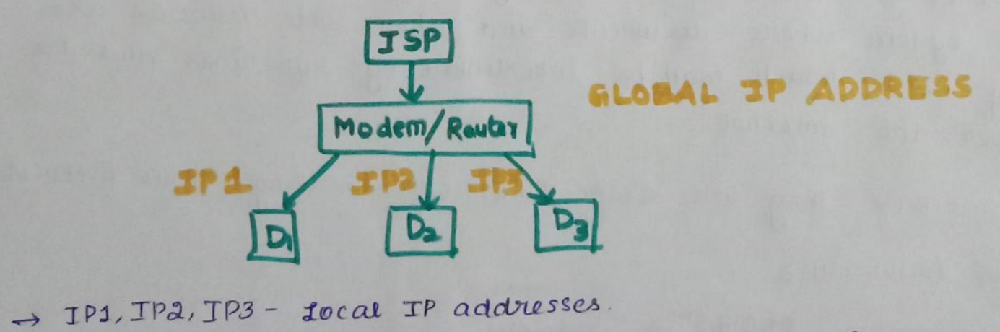

## What exactly is the World Wide Web?

The World Wide Web—commonly referred to as the **Web**—is an public information system where documents and other web resources are identified by URLs(Uniform Resource Locator). They are displayed in the form of web pages, which may be interconnected. 

The Web could be accessed through the Internet. The Web is not the same as the Internet: the Web is one of many applications built on top of the Internet.

The web was originally conceived and developed to meet the demand for automated information and research sharing between scientists in universities and institutes around the world.

Note that it wasn't possible to search for resources in this system, which was a problem. Specific documents could only be accessed if their URL was known or by reaching it through hyperlinks in other documents.

This was solved with the invention of search engines.

# Network Protocols

## What is a Protocol?

In networking, a protocol is a set of rules for formatting and processing data defined by organizations like The Internet Society. Network protocols are like a common language for computers. The computers within a network may use vastly different software and hardware; however, the use of protocols enables them to communicate with each other regardless.

## `TCP` (Transmission Control Protocol)

All data reaches the destination uncorrupted. For documents etc.

## `UDP` (User Datagram Protocol)

All data need not reach the other end. For video conferencing where some frame drops don't matter.

## `HTTP` (HyperText Transfer Protocol)

This is used by web browsers.

It defines the format of data transmission between clients and web servers. 

## `DHCP` (Dynamic Host Configuration Protocol)

# Global and Local IP Addresses

Your ISP gives you a [modem](#what-is-a-modem) which has a global IP address. It helps us connect to a [Wide Area Network](#wide-area-network).

We use a [router](#what-is-a-router) in combination with the modem in order to connect multiple devices to the internet.

The router gives distinct IP addresses to the devices connected as well, which are known as Local IP Addresses. This process of assigning local IP addresses is carried out using [`DHCP`](#dhcp-dynamic-host-configuration-protocol).

If suppose a device attempts to make a request to a particular website, the ISP will forward that request to the website. 

The website will only see the global IP address of the device. When the response comes to the modem, it forwards the data to the router which sends the data to the local IP address of the device that made the request, using `NAT` (Network Address Translation).

## `NAT` (Network Address Translation)

Network Address Translation (NAT) is a process that enables one, unique IP address to represent an entire group of computers. 

In network address translation, a router assigns a computer or computers inside a private network having private IP addresses, a common public address.

In this way, network address translation allows the single device to act as an intermediary or agent between the local, private network and the public network that is the internet. 

NAT’s main purpose is to conserve the number of public IP addresses in use, for both security and economic goals.

### `NAT` types

These `NAT` types are a result of the type of connection setup on your machine. 

#### `NAT` type 1

Machine is directly connected to the internet i.e., it is not a part of a private LAN, where it has a local IP address. Rather, it only has a public IP address, which refers directly to that specific machine.

The issue with this is that only 1 device can be connected to the internet using that modem since there is no private LAN where different devices can have various private IP addresses. Also, it is incredibly unsafe because every port on the device is directly accessible using the public IP address.

#### `NAT` type 2

#### `NAT` type 3

# Ports

Note that the local IP address helps decide which device to send the data to. 

But a single device can be running many internet applications (browser, game, text-editor, etc), each of which could have made the request.

To eliminate this confusion, each application has its own port number.

Port number is a 16 bit number so there are a total of 2^16 = 65536 port numbers. 

## Types of Ports

### Reserved Ports (0 - 1023)

Reserved Ports are assigned to privileged services and controlled. They are designated as well-known ports. 

Ports from 0 to 1023 are Reserved Ports. For example, for HTTP, port 80 is reserved.

### Registered Ports (1024 - 49151)

Ports in the range 1024 to 49151 are not assigned or controlled, but they can be assigned to specific applications to prevent duplication. 

They are known as Registered Ports.

### Dynamic Ports (49152 - 65535)

Dynamic Ports are not assigned, controlled, or registered. They are used for temporary or private ports. They are also known as private or non-reserved ports.

Ports in the range 49152 to 65535 are Dynamic Ports.

## What is Port Forwarding?

As we know, a port is the number associated with a specific internet application running locally on our machine. 

Port Forwarding is when a machine which is a part of another LAN is given the ability to access an application associated with a specific port, running on your system, even though the two machines are not a part of the same LAN.

There is no need for this when we send a request and the server is sending the data back to us. The router allows the server to access the port on our machine since we initiated the connection.

Note that it is particularly useful in the case where a connection is to be initiated from the outside, wherein routers usually block entities from accessing a specific port on a specific local IP address part of the local LAN. 

Port Forwarding allows entities to use the public IP address associated with the router, along with the port that is to be accessed on the device. 

### Setting up Port Forwarding

To set this up, it is important for the device in question to have a static local IP address. Otherwise, if the router changed the local IP address after port forwarding has been set up, the connection would stop working.

Changes must be made in the settings of the router such that the static local IP address and the port number of the application to be forwarded must be specified. 

The permissions given to people accessing the application using Forwarding is controlled by the application itself, not by the router.

### Uses of Port Forwarding

- Providing public access to a web server
- Providing public access to a game server
- Accessing your computers/network remotely

# Types of Networks

Internet is a collection of 3 types of networks. 

A lot of [Local Area Networks](#local-area-network) that are connected to each other using [Metropolitan Area Networks](#metropolitan-area-network) that are connected to each other using a [Wide Area Network](#wide-area-network) is an internet.

## Local Area Network 

It interconnects computers within a **limited area** such as a residence, school, university campus etc, with no limitation on the number of devices.

## Metropolitan Area Network 

It interconnects users with computer resources in a geographic region of the size of a metropolitan area (cities).

## Wide Area Network

It extends over a large geographical area, across countries, usually using submarine optical fiber cables.

### SONET (Synchronous Optical Networking)

### Frame relay

# What is the difference between a Modem and a Router?

To put it simply, a modem connects your home to the Internet, while a router creates a network inside your house.

## What is a Modem?

Modem is short for "modulator demodulator".

It is a device that receives an analog signal from your Internet Service Provider (ISP) and the converts it into a digital signal your devices can understand and vice versa.

Modems help convert digital signals to analog electrical signals.

## What is a Router?

A router helps in associating a single public IP address with multiple devices. It does this by setting up a private LAN/WLAN and assigning local IP addresses to each device connected to it.

These local IP addresses are usually dynamic in nature but can be kept static as well.

Whenever data is received by the modem, it is passed on to the router, which uses [`NAT`](#nat-network-address-translation) to determine which device the data is meant for.

A router allows a single modem to be used for connecting mutiple devices to the internet.

<!-- # Packets -->
<!-- # Firewall -->