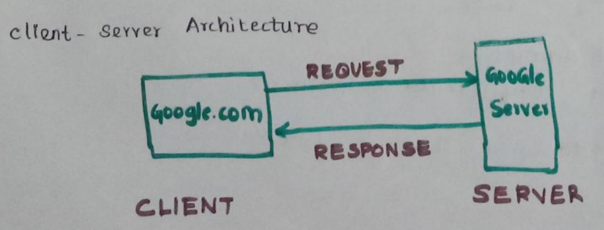
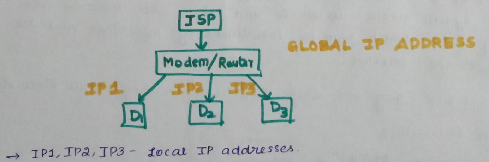
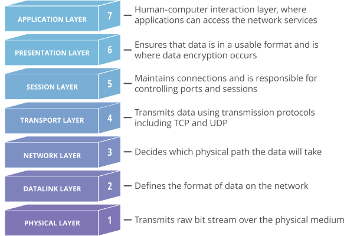

# INDEX

- [INDEX](#index)
- [What exactly is the World Wide Web?](#what-exactly-is-the-world-wide-web)
- [URL (Uniform Resource Locator)](#url-uniform-resource-locator)
  - [Scheme](#scheme)
    - [`mailto` scheme](#mailto-scheme)
  - [Authority (Domain \& Port)](#authority-domain--port)
    - [Separator between the scheme and authority (`://`)](#separator-between-the-scheme-and-authority-)
  - [Path to resource](#path-to-resource)
  - [Parameters](#parameters)
  - [Anchor](#anchor)
- [User Agent](#user-agent)
  - [User Agent string](#user-agent-string)
  - [State and Identity of User Agent](#state-and-identity-of-user-agent)
- [State in the context of *components*](#state-in-the-context-of-components)
- [Types of States in Web Applications](#types-of-states-in-web-applications)
  - [Application/Program State](#applicationprogram-state)
  - [Resource State](#resource-state)
    - [Working with resources stateless using REST](#working-with-resources-stateless-using-rest)
    - [Better alternative to REST : GraphQL (TODO)](#better-alternative-to-rest--graphql-todo)
  - [Session State](#session-state)
- [Network Protocols](#network-protocols)
  - [What is a Network Protocol?](#what-is-a-network-protocol)
  - [Stateful Protocol](#stateful-protocol)
  - [Stateless and Stateful Protocols (TODO)](#stateless-and-stateful-protocols-todo)
  - [`TCP` (Transmission Control Protocol)](#tcp-transmission-control-protocol)
  - [`UDP` (User Datagram Protocol)](#udp-user-datagram-protocol)
  - [`HTTP` (HyperText Transfer Protocol)](#http-hypertext-transfer-protocol)
    - [`HTTP` request methods](#http-request-methods)
      - [Safe Methods](#safe-methods)
      - [Idempotent Methods](#idempotent-methods)
      - [Cacheable Methods](#cacheable-methods)
  - [`HTTPS` (HyperText Transfer Protocol Secure)](#https-hypertext-transfer-protocol-secure)
  - [`SSL` (Secure Socket Layer)](#ssl-secure-socket-layer)
  - [`ARP` (Address Resolution Protocol)](#arp-address-resolution-protocol)
    - [ARP Cache](#arp-cache)
    - [Taking an example to understand...](#taking-an-example-to-understand)
  - [`DHCP` (Dynamic Host Configuration Protocol)](#dhcp-dynamic-host-configuration-protocol)
- [Global and Local IP Addresses](#global-and-local-ip-addresses)
  - [`NAT` (Network Address Translation)](#nat-network-address-translation)
    - [`NAT` types](#nat-types)
      - [`NAT` type 1](#nat-type-1)
      - [`NAT` type 2](#nat-type-2)
      - [`NAT` type 3](#nat-type-3)
- [Ports](#ports)
  - [Types of Ports](#types-of-ports)
    - [Reserved Ports (0 - 1023)](#reserved-ports-0---1023)
    - [Registered Ports (1024 - 49151)](#registered-ports-1024---49151)
    - [Dynamic Ports (49152 - 65535)](#dynamic-ports-49152---65535)
  - [What is Port Forwarding?](#what-is-port-forwarding)
    - [Setting up Port Forwarding](#setting-up-port-forwarding)
    - [Uses of Port Forwarding](#uses-of-port-forwarding)
- [How are Web Server IP Addresses and Domain Names linked? : Introduction to DNS](#how-are-web-server-ip-addresses-and-domain-names-linked--introduction-to-dns)
  - [What are hostnames?](#what-are-hostnames)
    - [Why do we use `www` in front of a hostname (TODO)](#why-do-we-use-www-in-front-of-a-hostname-todo)
  - [Understanding Sub-domains (TODO)](#understanding-sub-domains-todo)
  - [Top-level domain (TODO)](#top-level-domain-todo)
  - [Fully Qualified Domain Name (`FQDN`)](#fully-qualified-domain-name-fqdn)
    - [Examples of `FQDN`](#examples-of-fqdn)
  - [Partially Qualified Domain Name (`PQDN`)](#partially-qualified-domain-name-pqdn)
    - [Examples of `PQDN`](#examples-of-pqdn)
  - [A (Address) Record](#a-address-record)
  - [CNAME (Canonical Name) Record](#cname-canonical-name-record)
- [Types of Networks](#types-of-networks)
  - [Local Area Network](#local-area-network)
  - [Metropolitan Area Network](#metropolitan-area-network)
  - [Wide Area Network](#wide-area-network)
    - [SONET (Synchronous Optical Networking)](#sonet-synchronous-optical-networking)
    - [Frame relay](#frame-relay)
- [What is the difference between a Modem and a Router?](#what-is-the-difference-between-a-modem-and-a-router)
  - [What is a Modem?](#what-is-a-modem)
  - [What is a Router?](#what-is-a-router)
- [OSI (Open Systems Interconnection) Model](#osi-open-systems-interconnection-model)
  - [7. Application Layer](#7-application-layer)
  - [6. Presentation Layer](#6-presentation-layer)
  - [5. Session Layer](#5-session-layer)
  - [4. Transport Layer](#4-transport-layer)
  - [3. Network Layer](#3-network-layer)
  - [2. Data-Link Layer](#2-data-link-layer)
  - [1. Physical Layer](#1-physical-layer)
- [Types of Cyber Attacks](#types-of-cyber-attacks)
  - [Denial-of-Service (DoS) attack](#denial-of-service-dos-attack)
  - [Distributed-Denial-of-Service (DDoS) attack](#distributed-denial-of-service-ddos-attack)
  - [Subdomain Takeover attack (TODO)](#subdomain-takeover-attack-todo)
- [Hosting](#hosting)
  - [Virtual Hosting](#virtual-hosting)
    - [IP-based virtual hosting](#ip-based-virtual-hosting)
    - [Name-based virtual hosting](#name-based-virtual-hosting)
- [Other Concepts](#other-concepts)
  - [Content Negotiation](#content-negotiation)
  - [IP Spoofing](#ip-spoofing)
  - [What is a Bot?](#what-is-a-bot)
    - [Botnet](#botnet)
  - [Packets](#packets)
  - [Firewall](#firewall)
- [TODO](#todo)

# What exactly is the World Wide Web?

The World Wide Web—commonly referred to as the **Web**—is a public information system where documents and other web resources are identified by [URLs (Uniform Resource Locator)](#url-uniform-resource-locator). They are displayed in the form of web pages, which may be interconnected. 

The Web could be accessed through the Internet. The Web is not the same as the Internet: the Web is one of many applications built on top of the Internet.

The web was originally conceived and developed to meet the demand for automated information and research sharing between scientists in universities and institutes around the world.

Note that it wasn't possible to search for resources in this system, which was a problem. Specific documents could only be accessed if their URL was known or by reaching it through hyperlinks in other documents.

This was solved with the invention of search engines.



# URL (Uniform Resource Locator)

A URL is nothing more than the address of a given unique resource on the Web. 

In theory, each valid URL points to a unique resource. Such resources can be an HTML page, a CSS document, an image, etc. 

In practice, there are some exceptions, the most common being a URL pointing to a resource that no longer exists or that has moved.

A URL is composed of different parts, some mandatory and others optional. The most important parts are highlighted on the URL below:


Note: 

A URL can be thought of like a regular postal mail address: 
- the [*scheme*](#scheme) represents the postal service you want to use
- the [*domain*](#authority-domain--port) name is the city or town
- the [*port*](#authority-domain--port) is like the zip code
- the [*path*](#path-to-resource) represents the building where your mail should be delivered; 
- the [*parameters*](#parameters) represent extra information such as the number of the apartment in the building 
- finally, the [*anchor*](#anchor) represents the actual person to whom you've addressed your mail.

## Scheme


The first part of the URL is the scheme, which indicates the protocol that the browser must use to request the resource.

Usually for websites the protocol is [`https`](#http-hypertext-transfer-protocol-secure) or [`http`](#http-hypertext-transfer-protocol). 

Addressing web pages requires one of these two, but browsers also know how to handle other schemes such as `mailto:` (to open a mail client).

### `mailto` scheme

`mailto` is a Uniform Resource Identifier (URI) scheme for email addresses. 

It is used to produce hyperlinks on websites that allow users to send an email to a specific address directly from an HTML document, without having to copy it and entering it into an email client.

URLs having schemes as `mailto` are examples of URLs that don't use an authority. 

That is why a URL containing `mailto` looks like this:
```
mailto:example@gmail.com
```
The need of `//` in the URL is explained [below](#separator-between-the-scheme-and-authority).

## Authority (Domain & Port)


Next follows the authority, which is separated from the scheme by the character pattern `://`. 

If present, the authority includes both the domain (e.g. www.example.com) and the port (80), separated by a colon (`:`).

- The domain indicates which Web server is being requested. 
  
  Usually this is a domain name, but an IP address may also be used (but this is rare as it is much less convenient).

    A section is given [below](#how-are-web-server-ip-addresses-and-domain-names-linked--introduction-to-dns) for understanding how a domain name is converted into an IP address.

- The [port](#ports) indicates the technical "gate" used to access the resources on the web server. 
  
  It is usually omitted if the web server uses the standard ports of the HTTP protocol (80 for [`HTTP`](#http-hypertext-transfer-protocol) and 443 for [`HTTPS`](#http-hypertext-transfer-protocol-secure)) to grant access to its resources. Otherwise, it is mandatory.

### Separator between the scheme and authority (`://`)

- `:` separates the scheme from the next part of the URL.
- `//` indicates that the next part of the URL is the **authority**.

## Path to resource


`/path/to/myfile.html` is the path to the resource on the Web server. 

In the early days of the Web, a path like this represented a physical file location on the Web server. 

Nowadays, it is mostly an abstraction handled by Web servers without any physical reality.

## Parameters


`?key1=value1&key2=value2` are extra parameters provided to the Web server. 

Those parameters are a list of key/value pairs, separated by the `&` symbol. The starting point of the list is indicated by the `?` symbol.

The Web server can use those parameters to do extra stuff before returning the resource. Each Web server has its own rules regarding parameters, and the only reliable way to know if a specific Web server is handling parameters is by asking the Web server owner.

## Anchor


`#SomewhereInTheDocument` is an anchor to another part of the resource itself. 

An anchor represents a sort of "bookmark" inside the resource, giving the browser the directions to show the content located at that "bookmarked" spot. 

For example:
- On an HTML document, the browser will scroll to the point where the anchor is defined; 
- On a video or audio document, the browser will try to go to the time the anchor represents. 
  
Note that the part after the `#`, also known as the **fragment identifier**, is never sent to the server with the request.

# [User Agent](https://github.com/rohan-verma19/javascripting#user-agent)

## [User Agent string](https://github.com/rohan-verma19/javascripting#user-agent-string)

## [State and Identity of User Agent](https://github.com/rohan-verma19/javascripting#state-and-identity-of-user-agent)

# State in the context of *components*

State refers to how something is; its *configuration*, *attributes*, *condition* or *information content*.

- Virtually all **components** (both software and hardware) have state, from **applications** to **operating systems** to **network layers**.

- A **component** changes from one state to another over time when triggered by *some kind of event*; such as a network message, a timer expiring or an application message.

- **Components** that have no such trigger that causes a transition, are called ***stateless***.

# Types of States in Web Applications

## Application/Program State 

It represents everything necessary to keep an application running.

- When we refer *application state*, we are normally referring to the **state of the program/application**, as it exists in the *server's memory*.

  > ***Note***: State of a program/application encompasses general information related to the program as described [above](#state-in-the-context-of-components), such as the program's *configuration*, attributes, etcetera.

- Since this application-related data is stored on the *server's memory*, the *information and functionality core to the application* is lost if a server goes down/restarts, since memory is volatile.

- This is why in web development we often use stateless resource controllers which distribute the infromation necessary to the running of the application.

  This way the application does not rely heavily on the holding of data on the *server's memory*, for retrieval.

  > ***Note***: An example of this is how HTTP, which is a [*stateless protocol*](#stateless-protocols), is partially made *stateful* with the help of cookies and caching on the client side (in the browser), instead of the server side.
  >
  > Every cookie is re-transmitted in both directions to try to "fake" some amount of a "session" for the user's sake. 
  >
  > The servers don't hold any resources open for any given client across requests -- each one starts from scratch.


Examples of things which make an application *stateful*:

- **Does the application have a file open, positioned at byte 225?** 

  If so, that file is part of the *application's state* because the next byte written should go to position 226.

- **Has the application authenticated itself to a secure server with a time-based key?** 
  
  Then that connection is part of the *application's state*, because if the application were to be suspended for 24 hours, when it resumes it will no longer have a valid connection to the secure server because it will have timed out.

---

## Resource State

It refers to the state of the **resources** (*files*, *images*, *database records*, etc) being stored on the server. 

- The ***resource state*** changes as **resources** are added, modified, or deleted.

### Working with resources stateless using REST

REST Architecture is a stateless way of working with web **resources**.
  
Each request in REST explicitly communicates its intended action on the **resource** and passes with it, the information necessary for achieving that action.

But, nowadays even REST is not adequate. 

Applications are becoming so laden with information that making multiple HTTP requests to retrieve the resources using traditional REST endpoints is becoming cumbersome on performance.

### Better alternative to REST : GraphQL (TODO)

<!-- See networking TODO in edge -->

---

## Session State

- It keeps of track of user interaction during a **browser session**.
- It holds the status of the communication between the client and the server.
- Now, we use it broadly to describe the state that relates to a *session ID* and *HTTP cookies*.
- It is the **session state** that:
  - Remembers the last visited page.
  - Holds cart items such that, they can be restored if the browser gets closed; and the user later on navigates back to the website.
  - Informs the website as to whether a user is authorized to view a specific page.

# Network Protocols

## What is a Network Protocol?

In networking, a protocol is a set of rules for formatting and processing data defined by organizations like The Internet Society. Network protocols are like a common language for computers. The computers within a network may use vastly different software and hardware; however, the use of protocols enables them to communicate with each other regardless.

## Stateful Protocol

It is a protocol that has the ability to recollect and reserve the attributes of the interactions 

## Stateless and Stateful Protocols (TODO)

https://www.mygreatlearning.com/blog/stateful-vs-stateless/

## `TCP` (Transmission Control Protocol)

All data reaches the destination uncorrupted. For documents etc.

https://www.educative.io/answers/what-is-tcp 

<!-- TODO: See diagram of this on educative -->

## `UDP` (User Datagram Protocol)

All data need not reach the other end. For video conferencing where some frame drops don't matter.

## `HTTP` (HyperText Transfer Protocol)

This is used by web browsers.

It defines the format of data transmission between clients and web servers. 

### `HTTP` request methods

HTTP defines a set of request methods to indicate the desired action to be performed for a given resource. 

These request methods are sometimes referred to as *HTTP verbs*.

Each of them implements a different semantic/logic, but some common features are shared by a group of them:

#### Safe Methods

Methods that don't alter the state of the server

#### Idempotent Methods

#### Cacheable Methods

HTTP provides a simple set of operations 

Read about `HTTP` APIs which utilize  in the API README [here](../APIs/README.md#api-request-http-response-codes).

## `HTTPS` (HyperText Transfer Protocol Secure)

TODO

## `SSL` (Secure Socket Layer)

TODO

## `ARP` (Address Resolution Protocol)

Address Resolution Protocol is used to keep track of the IP address of a device and its associated MAC address. 

Whenever you request any data or communicate with other devices, it always looks for MAC address associated with an incoming IP address in [ARP cache](#arp-cache). 

### ARP Cache

Every time there is a communication between two devices IP and MAC addresses are stored in ARP cache if not already there.

ARP cache holds data for both wireless and ethernet connections. This data is stored in ARP cache which is in memory for each computer so that it can reduce the time required for an ARP process every time.

### Taking an example to understand...

If suppose we try pinging our own device using its local IP address (assigned to it by our [Router](#what-is-a-router), which creates a LAN for this process), the request would be sent to our **Router**, to resolve which device has that specific local IP address, and we would get our own MAC address or the information that the device is `localhost` i.e., our own device.

This information that the IP address maps to `localhost` is stored in the ARP cache.

So now, even if we disconnect from the LAN of our Router and try pinging our previous local IP address, we would get information from the ARP cache, that the machine we are trying to ping is `localhost` itself, which is why we would still get a response.

But, if we restart our machine, the ARP cache would get reset. So, if we tried pinging the address while not connected to the Router, we would no longer get a response.

## `DHCP` (Dynamic Host Configuration Protocol)


# Global and Local IP Addresses

Your ISP gives you a [modem](#what-is-a-modem) which has a global IP address. It helps us connect to a [Wide Area Network](#wide-area-network).

We use a [router](#what-is-a-router) in combination with the modem in order to connect multiple devices to the internet.

The router gives distinct IP addresses to the devices connected as well, which are known as Local IP Addresses. This process of assigning local IP addresses is carried out using [`DHCP`](#dhcp-dynamic-host-configuration-protocol).



If suppose a device attempts to make a request to a particular website, the ISP will forward that request to the website. 

The website will only see the global IP address of the device. When the response comes to the modem, it forwards the data to the router which sends the data to the local IP address of the device that made the request, using `NAT` (Network Address Translation).

## `NAT` (Network Address Translation)

Network Address Translation (NAT) is a process that enables one, unique IP address to represent an entire group of computers. 

In network address translation, a router assigns a computer or computers inside a private network having private IP addresses, a common public address.

In this way, network address translation allows the single device to act as an intermediary or agent between the local, private network and the public network that is the internet. 

NAT’s main purpose is to conserve the number of public IP addresses in use, for both security and economic goals.

### `NAT` types

These `NAT` types are a result of the type of connection setup on your machine. 

#### `NAT` type 1

Machine is directly connected to the internet i.e., it is not a part of a private LAN, where it has a local IP address. Rather, it only has a public IP address, which refers directly to that specific machine.

The issue with this is that only 1 device can be connected to the internet using that modem since there is no private LAN where different devices can have various private IP addresses. Also, it is incredibly unsafe because every port on the device is directly accessible using the public IP address.

#### `NAT` type 2


#### `NAT` type 3


# Ports

Note that the local IP address helps decide which device to send the data to. 

But a single device can be running many internet applications (browser, game, text-editor, etc), each of which could have made the request.

To eliminate this confusion, each application has its own port number.

Port number is a 16 bit number so there are a total of 2^16 = 65536 port numbers. 

## Types of Ports

### Reserved Ports (0 - 1023)

Reserved Ports are assigned to privileged services and controlled. They are designated as well-known ports. 

Ports from 0 to 1023 are Reserved Ports. For example, for HTTP, port 80 is reserved.

### Registered Ports (1024 - 49151)

Ports in the range 1024 to 49151 are not assigned or controlled, but they can be assigned to specific applications to prevent duplication. 

They are known as Registered Ports.

### Dynamic Ports (49152 - 65535)

Dynamic Ports are not assigned, controlled, or registered. They are used for temporary or private ports. They are also known as private or non-reserved ports.

Ports in the range 49152 to 65535 are Dynamic Ports.

## What is Port Forwarding?

As we know, a port is the number associated with a specific internet application running locally on our machine. 

Port Forwarding is when a machine which is a part of another LAN is given the ability to access an application associated with a specific port, running on your system, even though the two machines are not a part of the same LAN.

There is no need for this when we send a request and the server is sending the data back to us. The router allows the server to access the port on our machine since we initiated the connection.

Note that it is particularly useful in the case where a connection is to be initiated from the outside, wherein routers usually block entities from accessing a specific port on a specific local IP address part of the local LAN. 

Port Forwarding allows entities to use the public IP address associated with the router, along with the port that is to be accessed on the device. 

### Setting up Port Forwarding

To set this up, it is important for the device in question to have a static local IP address. Otherwise, if the router changed the local IP address after port forwarding has been set up, the connection would stop working.

Changes must be made in the settings of the router such that the static local IP address and the port number of the application to be forwarded must be specified. 

The permissions given to people accessing the application using Forwarding is controlled by the application itself, not by the router.

### Uses of Port Forwarding

- Providing public access to a web server
- Providing public access to a game server
- Accessing your computers/network remotely

# How are Web Server IP Addresses and Domain Names linked? : Introduction to DNS

TODO

## What are hostnames?

### Why do we use `www` in front of a hostname (TODO)

https://superuser.com/questions/1644463/difference-between-subdomain-hostname-host-and-www-in-a-dns-system

## Understanding Sub-domains (TODO)

## Top-level domain (TODO)

## Fully Qualified Domain Name (`FQDN`)

An FQDN, or a Fully Qualified Domain Name, is written with the hostname and the domain name, including the top-level domain, in that order: `[hostname].[domain].[tld].`

In this scenario, "qualified" means "specified" since the full location of the domain is specified in the name. 

The `FQDN` specifies the exact location of a host within DNS. 

An FQDN might also be called an **absolute domain name**, since it provides the absolute path of the host.

### Examples of `FQDN`

A fully qualified domain name is always written in this format: `[hostname].[domain].[tld].` 

For example, a mail server on the `example.com` domain may use the FQDN `mail.example.com.`

Fully qualified domain names actually require a period at the end. This means `www.microsoft.com.` would be the acceptable way to enter that `FQDN`. However, most systems simply imply the period, even if you don't explicitly give it.

Here are some other examples of fully qualified domain names:
```
www.microsoft.com
en.wikipedia.org
p301srv03.timandtombreadco.us
```

## Partially Qualified Domain Name (`PQDN`)

Another term that's similar to FQDN is PQDN, or partially qualified domain name, which is just a domain name that isn't fully specified. 

Partially qualified domain names are just used for convenience, but only in certain contexts. 

An FQDN provides the full absolute path of the host, while the PQDN only gives a relative name that's just a small portion of the full domain name.

### Examples of `PQDN`

Suppose we use just `google.com` instead of the FQDN `www.google.com`. That would qualify as a `PQDN`.

## A (Address) Record

An Address Record (abbreviated as **A record**) returns a 32-bit `IPv4` address, most commonly used to map hostnames to an IP address of the host. 

## CNAME (Canonical Name) Record

A Canonical Name record (abbreviated as **CNAME record**) is a type of resource record in the Domain Name System (DNS) that maps one domain name (an alias) to another (the canonical name).

This can prove convenient when running multiple services (like an FTP server and a web server, each running on different ports) from a single IP address. 

For example, we can use CNAME records to point `ftp.example.com` and `www.example.com` to the DNS entry for `example.com`, which in turn has an [A record](#a-address-record) which points to the IP address. 

Then, if the IP address ever changes, one only has to record the change in one place within the network: in the DNS [A record](#a-address-record) for `example.com`.

CNAME records must always point to another domain name, never directly to an IP address.

# Types of Networks

Internet is a collection of 3 types of networks. 

A lot of [Local Area Networks](#local-area-network) that are connected to each other using [Metropolitan Area Networks](#metropolitan-area-network) that are connected to each other using a [Wide Area Network](#wide-area-network) is an internet.

## Local Area Network 

It interconnects computers within a **limited area** such as a residence, school, university campus etc, with no limitation on the number of devices.

## Metropolitan Area Network 

It interconnects users with computer resources in a geographic region of the size of a metropolitan area (cities).

## Wide Area Network

It extends over a large geographical area, across countries, usually using submarine optical fiber cables.

### SONET (Synchronous Optical Networking)

TODO

### Frame relay

TODO

# What is the difference between a Modem and a Router?

To put it simply, a modem connects your home to the Internet, while a router creates a network inside your house.

## What is a Modem?

Modem is short for "modulator demodulator".

It is a device that receives an analog signal from your Internet Service Provider (ISP) and the converts it into a digital signal your devices can understand and vice versa.

Modems help convert digital signals to analog electrical signals.

## What is a Router?

A router helps in associating a single public IP address with multiple devices. It does this by setting up a private LAN/WLAN and assigning local IP addresses to each device connected to it.

These local IP addresses are usually dynamic in nature but can be kept static as well.

Whenever data is received by the modem, it is passed on to the router, which uses [`NAT`](#nat-network-address-translation) to determine which device the data is meant for.

A router allows a single modem to be used for connecting mutiple devices to the internet.

# OSI (Open Systems Interconnection) Model

Standard way about how computers communicate with each other.

The OSI Model can be seen as a universal language for computer networking. It’s based on the concept of splitting up a communication system into seven abstract layers, each one stacked upon the last.

The seven abstraction layers of the OSI model can be defined as follows, from top to bottom:



## 7. Application Layer

## 6. Presentation Layer

## 5. Session Layer

## 4. Transport Layer

## 3. Network Layer

## 2. Data-Link Layer

## 1. Physical Layer

# Types of Cyber Attacks

## Denial-of-Service (DoS) attack

Denial-of-Service Attacks are any type of attack on anything that keeps the legitimate owner or user from utilizing their own resources, generally by overloading the resource or the access paths to it.

An example would be a person or organization conducting an attack on a computer service operated by someone they don't like by sending more traffic to the server than can be handled reliably by either the server itself or the communications paths leading to it. 

## Distributed-Denial-of-Service (DDoS) attack

Distributed Denial Of Service Attacks differ from the [normal sort](#denial-of-service-dos-attack) in that the source of the attack is itself 'distributed'. 

Instead of coming from one machine, it comes from a large number; hundreds, thousands, or millions, generally with command and control from one or many points, often in a [**botnet**](#botnet).

This sort of attack is more difficult to mitigate than the usual type because there's often no good choke point at which to drop the incoming attack packets.

Also, they may come in slowly enough from each attacking host that you can't even tell they're an attack; they may be valid requests, just in UNSUPPORTABLE numbers.

## Subdomain Takeover attack (TODO)

https://developer.mozilla.org/en-US/docs/Web/Security/Subdomain_takeovers


---
# Hosting

Hosting, in its most generic sense, is a service through which storage and computing resources are providing to an individual or organization for the accommodation and maintenance of one or more websites and related services.

## Virtual Hosting

Virtual hosting is a method for hosting multiple domain names (with separate handling of each name) on a single server (or pool of servers). 

This allows one server to share its resources, such as memory and processor cycles, without requiring all services provided to use the same host name. 

The term virtual hosting is usually used in reference to web servers but the principles do carry over to other Internet services.

### IP-based virtual hosting

IP-based virtual hosting uses the IP address to determine the correct virtual host to serve, and it can be performed with any protocol but requires a dedicated IP address per domain name served.

Therefore you need to have a separate IP address for each host.

### Name-based virtual hosting

With name-based virtual hosting, the server relies on the client to report the hostname as part of the HTTP headers.

Using this technique, many different hosts can share the same IP address and the associated administrative overhead is saved, but the protocol being served must supply the host name at an appropriate point. 

In particular, there are significant difficulties using name-based virtual hosting with SSL/TLS.  

# Other Concepts

## Content Negotiation

Content negotiation refers to mechanisms defined as a part of [`HTTP`](#http-hypertext-transfer-protocol) that make it possible to ***serve*** different versions of a document (or more generally, representations of a resource) at the same URI, so that [user agents](https://github.com/rohan-verma19/javascripting#user-agent) can specify which version fits their capabilities the best. 

One classical use of this mechanism is to serve an image in GIF or PNG format, so that a browser that CANNOT display PNG images (e.g. **MS Internet Explorer 4**), will be served the GIF version.

## IP Spoofing

Spoofing is a specific type of cyber-attack in which someone attempts to use a computer, device, or network to trick other computer networks by pretending to be a legitimate entity.

IP spoofing is the creation of Internet Protocol (IP) packets which have a modified source address in order to hide the identity of the sender, to impersonate another computer system, or both. 

It is a technique often used by bad actors to invoke [DDoS](#distributed-denial-of-service-ddos-attack) attacks against a target device or the surrounding infrastructure.

## What is a Bot?

An Internet bot, or simply bot, is a software application that runs automated tasks (scripts) over the Internet, usually with the intent to imitate human activity on the Internet, such as messaging, on a large scale.

An Internet bot plays the client role in a client–server model whereas the server role is usually played by web servers. 

Internet bots are able to perform tasks, that are simple and repetitive, much faster than a person could ever do. 

The most extensive use of bots is for web crawling, in which an automated script fetches, analyzes and files information from web servers. 

### Botnet

A botnet is a group of Internet-connected devices, each of which runs one or more bots. 

Botnets can be used to perform Distributed Denial-of-Service (DDoS) attacks, steal data, send spam, and allow the attacker to access the device and its connection.

## Packets

TODO

## Firewall

TODO

# TODO

subnet

Learn how [IP spoofing](#ip-spoofing) is done.
