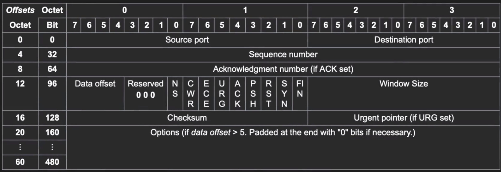
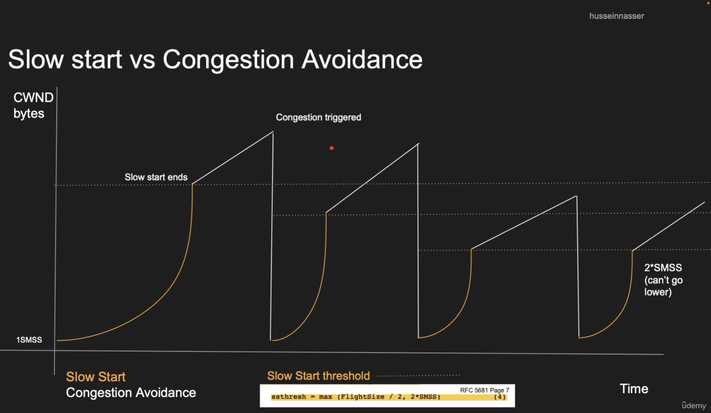
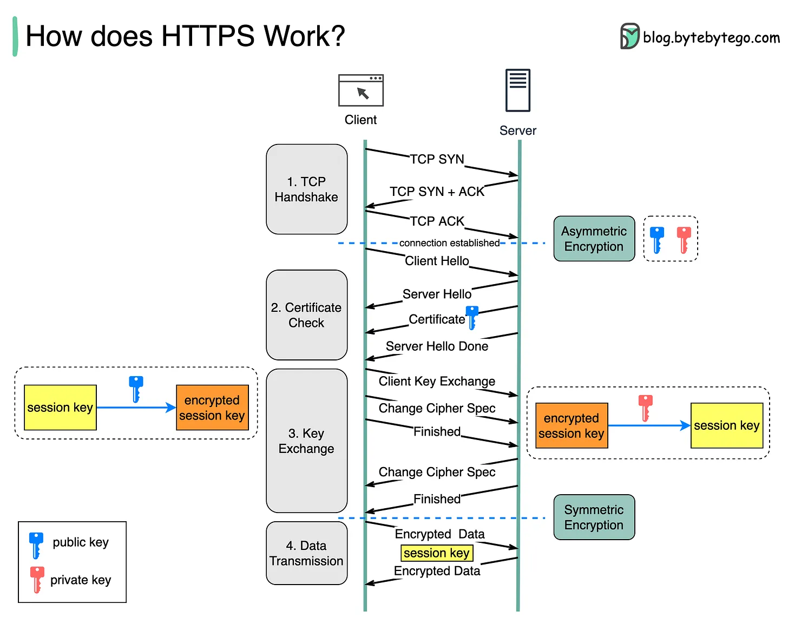
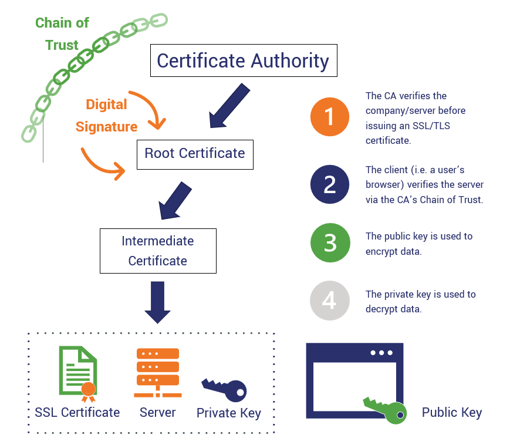

# INDEX

- [INDEX](#index)
- [What exactly is the World Wide Web?](#what-exactly-is-the-world-wide-web)
- [URL (Uniform Resource Locator)](#url-uniform-resource-locator)
  - [Scheme](#scheme)
    - [`mailto` scheme](#mailto-scheme)
  - [Authority (Domain \& Port)](#authority-domain--port)
    - [Separator between the scheme and authority (`://`)](#separator-between-the-scheme-and-authority-)
  - [Path to resource](#path-to-resource)
  - [Parameters](#parameters)
  - [Anchor](#anchor)
- [Origins](#origins)
  - [What is an Origin?](#what-is-an-origin)
  - [Same-Origin Policy](#same-origin-policy)
  - [Cross-Origin-Resource-Sharing (CORS)](#cross-origin-resource-sharing-cors)
    - [CORS Preflight request](#cors-preflight-request)
    - [Some scenarios of browsers fetching resources where CORS comes into play](#some-scenarios-of-browsers-fetching-resources-where-cors-comes-into-play)
    - [Inherited Origins](#inherited-origins)
    - [Is it possible to face CORS issue on making an API request from client side?](#is-it-possible-to-face-cors-issue-on-making-an-api-request-from-client-side)
    - [Using a proxy server to avoid CORS issues](#using-a-proxy-server-to-avoid-cors-issues)
      - [Why are proxy servers allowed to make requests to the required domain but not the browser?](#why-are-proxy-servers-allowed-to-make-requests-to-the-required-domain-but-not-the-browser)
- [Content Security Policy (CSP)](#content-security-policy-csp)
  - [What is CSP?](#what-is-csp)
    - [Scripts](#scripts)
    - [Styles](#styles)
    - [Images](#images)
    - [Frames](#frames)
    - [Plugins](#plugins)
    - [AJAX and WebSockets](#ajax-and-websockets)
    - [Objects](#objects)
    - [Eval() and inline-code execution](#eval-and-inline-code-execution)
  - [Who is responsible for specifying the CSP rules of a particular website?](#who-is-responsible-for-specifying-the-csp-rules-of-a-particular-website)
- [Whose interests are protected by CORS and CSP?](#whose-interests-are-protected-by-cors-and-csp)
- [Caching](#caching)
- [Cookies](#cookies)
  - [HTTP Cookies](#http-cookies)
    - [Todo (Watch Hussein Nasser's video on HTTP cookies, in networking TODO in edge)](#todo-watch-hussein-nassers-video-on-http-cookies-in-networking-todo-in-edge)
- [Packets](#packets)
- [Payload](#payload)
- [User Agent](#user-agent)
- [State in the context of *components*](#state-in-the-context-of-components)
- [Types of States in Web Applications](#types-of-states-in-web-applications)
  - [Application/Program State](#applicationprogram-state)
  - [How a stateless protocol like HTTP, is made somewhat *stateful* using Cookies](#how-a-stateless-protocol-like-http-is-made-somewhat-stateful-using-cookies)
    - [Examples of things which make an application *stateful*](#examples-of-things-which-make-an-application-stateful)
  - [Resource State](#resource-state)
    - [Working with resources statelessly using REST](#working-with-resources-statelessly-using-rest)
    - [Better alternative to REST : GraphQL (TODO)](#better-alternative-to-rest--graphql-todo)
  - [Session State](#session-state)
- [REST (Representational State Transfer)](#rest-representational-state-transfer)
- [MAC Addresses](#mac-addresses)
  - [If we have a globally unique identifier, why do we further need IP addresses?](#if-we-have-a-globally-unique-identifier-why-do-we-further-need-ip-addresses)
  - [Why not get rid of MAC addresses then?](#why-not-get-rid-of-mac-addresses-then)
  - [Unique MAC Address Prefixes By Manufacturer (Organizationally Unique Identifier)](#unique-mac-address-prefixes-by-manufacturer-organizationally-unique-identifier)
- [IP Addresses](#ip-addresses)
  - [IPv4](#ipv4)
  - [Process of reaching from host to destination (***Network \& Host Address***)](#process-of-reaching-from-host-to-destination-network--host-address)
  - [Unusable addresses in a network (all 0s \& all 1s)](#unusable-addresses-in-a-network-all-0s--all-1s)
  - [Global and Local IP Addresses](#global-and-local-ip-addresses)
  - [Static \& Dynamic IP Addresses (`DHCP`: Dynamic Host Configuration Protocol) (TODO)](#static--dynamic-ip-addresses-dhcp-dynamic-host-configuration-protocol-todo)
  - [`NAPT` (Network Address and Port Translation). Previously `NAT` (Network Address Translation)](#napt-network-address-and-port-translation-previously-nat-network-address-translation)
    - [Basic Idea (Full working just below)](#basic-idea-full-working-just-below)
    - [How it works](#how-it-works)
    - [What if two devices connected to the router make a network address to the same destination IP address and port?](#what-if-two-devices-connected-to-the-router-make-a-network-address-to-the-same-destination-ip-address-and-port)
    - [`NAT` types](#nat-types)
      - [`NAT` type 1](#nat-type-1)
      - [`NAT` type 2](#nat-type-2)
      - [`NAT` type 3](#nat-type-3)
  - [Subnets](#subnets)
    - [1. Efficient IP address allocation](#1-efficient-ip-address-allocation)
    - [2. Improved network performance](#2-improved-network-performance)
    - [3. Enhanced network security](#3-enhanced-network-security)
    - [4. Scalability](#4-scalability)
    - [Subnet Mask (Used to identify Subnets)](#subnet-mask-used-to-identify-subnets)
    - [Practical Instance when Subnet Masks are used](#practical-instance-when-subnet-masks-are-used)
      - [First TO Second Device (Same Subnet)](#first-to-second-device-same-subnet)
      - [First TO Third Device (Different Subnet)](#first-to-third-device-different-subnet)
- [Ports](#ports)
  - [Types of Ports](#types-of-ports)
    - [Reserved Ports (0 - 1023)](#reserved-ports-0---1023)
    - [Registered Ports (1024 - 49151)](#registered-ports-1024---49151)
    - [Dynamic Ports (49152 - 65535)](#dynamic-ports-49152---65535)
  - [What is Port Forwarding?](#what-is-port-forwarding)
    - [Setting up Port Forwarding](#setting-up-port-forwarding)
    - [Uses of Port Forwarding](#uses-of-port-forwarding)
- [Network Protocols](#network-protocols)
  - [What is a Network Protocol?](#what-is-a-network-protocol)
  - [Stateful Protocol](#stateful-protocol)
  - [Stateless and Stateful Protocols (TODO)](#stateless-and-stateful-protocols-todo)
  - [`IP` (Internet Protocol)](#ip-internet-protocol)
    - [Basic Description (TODO)](#basic-description-todo)
    - [Introduction to `IP` packets](#introduction-to-ip-packets)
    - [Structure of `IP` packets](#structure-of-ip-packets)
      - [1. Version field](#1-version-field)
      - [2. IHL (Internet Header Length)](#2-ihl-internet-header-length)
      - [3. Total Length](#3-total-length)
      - [*Fields useful for implementing packet fragmentation*](#fields-useful-for-implementing-packet-fragmentation)
        - [4. Identification](#4-identification)
        - [5. Flags](#5-flags)
        - [6. Fragment Offset](#6-fragment-offset)
      - [7. Time To Live](#7-time-to-live)
      - [8. Protocol](#8-protocol)
      - [9. Explicit Congestion Notification (ECN)](#9-explicit-congestion-notification-ecn)
    - [How IPv6 packets are different](#how-ipv6-packets-are-different)
  - [`TCP` (Transmission Control Protocol)](#tcp-transmission-control-protocol)
    - [About the protocol](#about-the-protocol)
    - [About TCP connection](#about-tcp-connection)
    - [Format of a TCP segment](#format-of-a-tcp-segment)
    - [Use cases](#use-cases)
    - [Flow Control (Windows \& Window Scaling Factor)](#flow-control-windows--window-scaling-factor)
    - [Congestion Control (Network Congestion)](#congestion-control-network-congestion)
      - [Slow Start](#slow-start)
      - [Congestion Avoidance](#congestion-avoidance)
      - [`ECN` flag in IP packets used by routers to convey congestion to session layer](#ecn-flag-in-ip-packets-used-by-routers-to-convey-congestion-to-session-layer)
      - [What happens when congestion is actually detected by session layer?](#what-happens-when-congestion-is-actually-detected-by-session-layer)
    - [Packets arriving out-of-order in TCP](#packets-arriving-out-of-order-in-tcp)
    - [Is a new socket created by a server when it accepts a SYN request received from a client?](#is-a-new-socket-created-by-a-server-when-it-accepts-a-syn-request-received-from-a-client)
    - [Resources](#resources)
  - [`UDP` (User Datagram Protocol)](#udp-user-datagram-protocol)
    - [About the protocol](#about-the-protocol-1)
    - [UDP Datagram](#udp-datagram)
    - [Use Cases](#use-cases-1)
    - [Advantages](#advantages)
    - [Disadvantages](#disadvantages)
    - [Multiplexing and De-multiplexing in UDP](#multiplexing-and-de-multiplexing-in-udp)
  - [`ICMP` (Internet Control Message Protocol)](#icmp-internet-control-message-protocol)
    - [Host Unreachable](#host-unreachable)
    - [Port Unreachable](#port-unreachable)
    - [Fragmentation Needed](#fragmentation-needed)
    - [Packet expired](#packet-expired)
      - [Maximum Segment Lifetime (MSL)](#maximum-segment-lifetime-msl)
      - [Time to Live (TTL)](#time-to-live-ttl)
      - [TraceRoute (intuitive use of TTL)](#traceroute-intuitive-use-of-ttl)
        - [1. Increased Probe Count](#1-increased-probe-count)
        - [2. Timeout Adjustment](#2-timeout-adjustment)
        - [3. Disable Reverse DNS Lookups](#3-disable-reverse-dns-lookups)
    - [Packets Getting Dropped due to Buffer Overflow](#packets-getting-dropped-due-to-buffer-overflow)
  - [`HTTP` (HyperText Transfer Protocol)](#http-hypertext-transfer-protocol)
    - [What are "Resources"?](#what-are-resources)
    - [`HTTP` request methods](#http-request-methods)
      - [Safe](#safe)
      - [Idempotent](#idempotent)
      - [Cacheable Responses](#cacheable-responses)
    - [Descriptions of HTTP methods](#descriptions-of-http-methods)
      - [`POST` method](#post-method)
      - [`DELETE` method](#delete-method)
  - [`SSL` (Secure Socket Layer) / `TLS` (Transport Layer Security)](#ssl-secure-socket-layer--tls-transport-layer-security)
    - [Meaning of the term `SSL`](#meaning-of-the-term-ssl)
    - [SSL Handshake Procedure](#ssl-handshake-procedure)
  - [`HTTPS` (HyperText Transfer Protocol Secure)](#https-hypertext-transfer-protocol-secure)
  - [`ARP` (Address Resolution Protocol)](#arp-address-resolution-protocol)
    - [ARP Cache OR ARP Table](#arp-cache-or-arp-table)
    - [Example 1 : Pinging another machine in the same subnet](#example-1--pinging-another-machine-in-the-same-subnet)
    - [Example 2 : Pinging another machine in a different network](#example-2--pinging-another-machine-in-a-different-network)
    - [Example 3 : Pinging your own machine](#example-3--pinging-your-own-machine)
- [Public Key Infrastructure](#public-key-infrastructure)
  - [X.509 digital certificates](#x509-digital-certificates)
  - [Digital signatures](#digital-signatures)
  - [Public and private key pairs (asymmetric and symmetric)](#public-and-private-key-pairs-asymmetric-and-symmetric)
  - [Certificate Authority (`CA`)](#certificate-authority-ca)
  - [Chain of trust](#chain-of-trust)
    - [Root Certificate Authority (Root CA)](#root-certificate-authority-root-ca)
    - [Root Certificate Store](#root-certificate-store)
      - [How it works?](#how-it-works-1)
      - [Who is responsible for creating and updating it?](#who-is-responsible-for-creating-and-updating-it)
    - [Intermediate Certificate Authorities (Intermediate CAs)](#intermediate-certificate-authorities-intermediate-cas)
    - [Leaf Certificates](#leaf-certificates)
    - [Certificate Issuance and Chain Formation](#certificate-issuance-and-chain-formation)
    - [Verification Process](#verification-process)
    - [Maintaining Trustworthiness](#maintaining-trustworthiness)
  - [Local Usage of Self Signed Certificates for Development](#local-usage-of-self-signed-certificates-for-development)
- [VPNs (Virtual Private Networks)](#vpns-virtual-private-networks)
  - [Working](#working)
  - [Protocols Used](#protocols-used)
    - [TCP or UDP](#tcp-or-udp)
    - [Directly on IP (TODO)](#directly-on-ip-todo)
  - [Important Examples](#important-examples)
    - [What if the sender is using TCP but the VPN uses UDP?](#what-if-the-sender-is-using-tcp-but-the-vpn-uses-udp)
- [How are Web Server IP Addresses and Domain Names linked? : Introduction to DNS](#how-are-web-server-ip-addresses-and-domain-names-linked--introduction-to-dns)
  - [Why DNS (Domain Name System)?](#why-dns-domain-name-system)
  - [What are hostnames?](#what-are-hostnames)
    - [Why do we use `www` in front of a hostname (TODO)](#why-do-we-use-www-in-front-of-a-hostname-todo)
  - [Understanding Sub-domains (TODO)](#understanding-sub-domains-todo)
  - [Top-level domain (TODO)](#top-level-domain-todo)
  - [Fully Qualified Domain Name (`FQDN`)](#fully-qualified-domain-name-fqdn)
    - [Examples of `FQDN`](#examples-of-fqdn)
  - [Partially Qualified Domain Name (`PQDN`)](#partially-qualified-domain-name-pqdn)
    - [Examples of `PQDN`](#examples-of-pqdn)
  - [DNS Zones](#dns-zones)
  - [Types of DNS records](#types-of-dns-records)
    - [A (Address) Record](#a-address-record)
    - [AAAA (IPv6 Address) Record](#aaaa-ipv6-address-record)
    - [CNAME (Canonical Name) Record](#cname-canonical-name-record)
    - [MX (Mail Exchange) Record](#mx-mail-exchange-record)
      - [Priorities in MX Records](#priorities-in-mx-records)
      - [How MX Records Work?](#how-mx-records-work)
    - [TXT (Text) Record](#txt-text-record)
    - [PTR (Pointer) Record](#ptr-pointer-record)
    - [SRV (Service) Record](#srv-service-record)
    - [NS (Name Server) Record](#ns-name-server-record)
    - [SOA (Start of Authority) Record](#soa-start-of-authority-record)
  - [DNS query from start to end](#dns-query-from-start-to-end)
    - [Storing of DNS query on client side](#storing-of-dns-query-on-client-side)
    - [DNS Resolver](#dns-resolver)
      - [DNS Reflection Attack](#dns-reflection-attack)
    - [Root Server](#root-server)
      - [Why are there only 13 DNS root server addresses?](#why-are-there-only-13-dns-root-server-addresses)
    - [TLD (Top Level Domain) Server](#tld-top-level-domain-server)
    - [Authoritative Name Server](#authoritative-name-server)
      - [Why is it referred to as authoritative?](#why-is-it-referred-to-as-authoritative)
  - [Link between E-mail IDs and Domains](#link-between-e-mail-ids-and-domains)
  - [Load Balancing at DNS level](#load-balancing-at-dns-level)
- [Types of Networks](#types-of-networks)
  - [Local Area Network](#local-area-network)
  - [Metropolitan Area Network](#metropolitan-area-network)
  - [Wide Area Network](#wide-area-network)
    - [SONET (Synchronous Optical Networking) (TODO)](#sonet-synchronous-optical-networking-todo)
    - [Frame relay (TODO)](#frame-relay-todo)
- [Networking HARDWARE](#networking-hardware)
  - [Straight-through vs. Crossover Cables](#straight-through-vs-crossover-cables)
    - [Straight-through cable](#straight-through-cable)
    - [Crossover cable](#crossover-cable)
  - [What is the difference between a Modem and a Router?](#what-is-the-difference-between-a-modem-and-a-router)
    - [What is a Modem?](#what-is-a-modem)
    - [What is a Router?](#what-is-a-router)
  - [What is a Hub?](#what-is-a-hub)
  - [What is a Switch?](#what-is-a-switch)
    - [MAC Address Table in Switches](#mac-address-table-in-switches)
    - [Broadcast Storms in Switching Loops](#broadcast-storms-in-switching-loops)
      - [1. Broadcast Frames](#1-broadcast-frames)
      - [2. Switch Flooding](#2-switch-flooding)
      - [3. Loop Formation](#3-loop-formation)
      - [4. Network Congestion](#4-network-congestion)
      - [5. Broadcast Storm](#5-broadcast-storm)
    - [`STP` (Spanning Tree Protocol) for loop preventiong](#stp-spanning-tree-protocol-for-loop-preventiong)
      - [1. Elect a root bridge](#1-elect-a-root-bridge)
      - [2. Determine root ports](#2-determine-root-ports)
      - [3. Determine designated ports](#3-determine-designated-ports)
      - [4. Use blocking and forwarding states](#4-use-blocking-and-forwarding-states)
      - [5. Calculate path costs and adapt to changes](#5-calculate-path-costs-and-adapt-to-changes)
  - [What is a Firewall?](#what-is-a-firewall)
    - [Network Level Firewall OR Transparent Firewall (performs Packet Filtering)](#network-level-firewall-or-transparent-firewall-performs-packet-filtering)
    - [Stateful Firewall (performs Stateful Inspection)](#stateful-firewall-performs-stateful-inspection)
    - [Application Level Firewall (performs Application Layer Filtering OR Deep Packet Inspection)](#application-level-firewall-performs-application-layer-filtering-or-deep-packet-inspection)
- [OSI (Open Systems Interconnection) Model](#osi-open-systems-interconnection-model)
  - [Practical Example of OSI Model](#practical-example-of-osi-model)
    - [Sender](#sender)
    - [Receiver](#receiver)
    - [Do we always have to go up to layer 7 on both sides during some communication?](#do-we-always-have-to-go-up-to-layer-7-on-both-sides-during-some-communication)
  - [Building Logic in a Particular Layer](#building-logic-in-a-particular-layer)
  - [7. Application Layer](#7-application-layer)
  - [6. Presentation Layer](#6-presentation-layer)
    - [Is it necessary for data to be serialized from  and deserialized into same programming language?](#is-it-necessary-for-data-to-be-serialized-from--and-deserialized-into-same-programming-language)
    - [Why is it debatable whether encryption \& decryption fall into layer 7 of OSI model?](#why-is-it-debatable-whether-encryption--decryption-fall-into-layer-7-of-osi-model)
  - [5. Session Layer](#5-session-layer)
  - [4. Transport Layer](#4-transport-layer)
  - [3. Network Layer](#3-network-layer)
  - [2. Data-Link Layer](#2-data-link-layer)
  - [1. Physical Layer](#1-physical-layer)
- [TCP-IP Model](#tcp-ip-model)
- [Sockets](#sockets)
    - [1. Network Sockets](#1-network-sockets)
    - [2. UNIX Domain Sockets](#2-unix-domain-sockets)
- [Proxy Servers](#proxy-servers)
  - [Forward Proxy](#forward-proxy)
  - [Reverse Proxy](#reverse-proxy)
  - [Clarification 1](#clarification-1)
  - [Clarification 2](#clarification-2)
- [Load Balancers (Intelligent Reverse Proxies)](#load-balancers-intelligent-reverse-proxies)
  - [What are Load Balancers?](#what-are-load-balancers)
  - [Why do Load Balancers need layer 7 information?](#why-do-load-balancers-need-layer-7-information)
    - [1. Content-Based Routing](#1-content-based-routing)
    - [2. Application-Specific Routing](#2-application-specific-routing)
    - [3. Security and Access Control (Reverse Proxy Characteristic)](#3-security-and-access-control-reverse-proxy-characteristic)
    - [4. Session Persistence](#4-session-persistence)
    - [5. Efficient Resource Allocation (TODO: ML in this?)](#5-efficient-resource-allocation-todo-ml-in-this)
    - [6. Load Distribution and Scalability](#6-load-distribution-and-scalability)
- [Content Delivery Networks (glorified Reverse Proxies)](#content-delivery-networks-glorified-reverse-proxies)
  - [Their role in caching (TODO)](#their-role-in-caching-todo)
- [Types of Cyber Attacks \& Vulnerabilities](#types-of-cyber-attacks--vulnerabilities)
  - [Denial-of-Service (DoS) attack](#denial-of-service-dos-attack)
  - [Distributed-Denial-of-Service (DDoS) attack](#distributed-denial-of-service-ddos-attack)
  - [Man-in-the-Middle Attacks](#man-in-the-middle-attacks)
    - [ARP poisoning attack](#arp-poisoning-attack)
  - [SQL Injection Attack](#sql-injection-attack)
    - [Classic SQL Injection](#classic-sql-injection)
    - [Error-Based SQL Injection](#error-based-sql-injection)
    - [Blind SQL Injection](#blind-sql-injection)
      - [Time-Based Blind SQL Injection](#time-based-blind-sql-injection)
      - [Boolean-Based Blind SQL Injection](#boolean-based-blind-sql-injection)
    - [Union-Based SQL Injection](#union-based-sql-injection)
    - [Second-Order SQL Injection](#second-order-sql-injection)
  - [Subdomain Takeover attack (TODO)](#subdomain-takeover-attack-todo)
  - [Cross Site Request Forgery (TODO)](#cross-site-request-forgery-todo)
  - [How is `referrer` information in web exploited (TODO)](#how-is-referrer-information-in-web-exploited-todo)
  - [Time-based attacks involving `setTimeout`](#time-based-attacks-involving-settimeout)
- [Network Waterfall (COMPLETE IN-DEPTH)](#network-waterfall-complete-in-depth)
  - [Basics](#basics)
  - [Stacked requests](#stacked-requests)
  - [Identifying render blocking requests](#identifying-render-blocking-requests)
- [Hosting](#hosting)
  - [Virtual Hosting](#virtual-hosting)
    - [IP-based virtual hosting](#ip-based-virtual-hosting)
    - [Name-based virtual hosting](#name-based-virtual-hosting)
- [Other Concepts](#other-concepts)
  - [Content Negotiation](#content-negotiation)
  - [IP Spoofing](#ip-spoofing)
  - [What is a Bot?](#what-is-a-bot)
    - [Botnet](#botnet)
- [TODO](#todo)
  - [Web Socket](#web-socket)
  - [subnet](#subnet)
  - [Learn how IP spoofing is done.](#learn-how-ip-spoofing-is-done)
  - [HTTP tunneling](#http-tunneling)
- [Doubts](#doubts)
  - [What if two devices on different network have same subnet mask value](#what-if-two-devices-on-different-network-have-same-subnet-mask-value)
  - [](#)

# What exactly is the World Wide Web?

The World Wide Web—commonly referred to as the **Web**—is a public information system where documents and other web resources are identified by [URLs (Uniform Resource Locator)](#url-uniform-resource-locator). They are displayed in the form of web pages, which may be interconnected. 

The Web could be accessed through the Internet. The Web is not the same as the Internet: the Web is one of many applications built on top of the Internet.

The web was originally conceived and developed to meet the demand for automated information and research sharing between scientists in universities and institutes around the world.

Note that it wasn't possible to search for resources in this system, which was a problem. Specific documents could only be accessed if their URL was known or by reaching it through hyperlinks in other documents.

This was solved with the invention of search engines.


# URL (Uniform Resource Locator)

A URL is nothing more than the address of a given unique resource on the Web. 

In theory, each valid URL points to a unique resource. Such resources can be an HTML page, a CSS document, an image, etc. 

In practice, there are some exceptions, the most common being a URL pointing to a resource that no longer exists or that has moved.

A URL is composed of different parts, some mandatory and others optional. The most important parts are highlighted on the URL below:


Note: 

A URL can be thought of like a regular postal mail address: 
- the [*scheme*](#scheme) represents the postal service you want to use
- the [*domain*](#authority-domain--port) name is the city or town
- the [*port*](#authority-domain--port) is like the zip code
- the [*path*](#path-to-resource) represents the building where your mail should be delivered; 
- the [*parameters*](#parameters) represent extra information such as the number of the apartment in the building 
- finally, the [*anchor*](#anchor) represents the actual person to whom you've addressed your mail.

## Scheme


The first part of the URL is the scheme, which indicates the protocol that the browser must use to request the resource.

Usually for websites the protocol is [`https`](#http-hypertext-transfer-protocol-secure) or [`http`](#http-hypertext-transfer-protocol). 

Addressing web pages requires one of these two, but browsers also know how to handle other schemes such as `mailto:` (to open a mail client).

### `mailto` scheme

`mailto` is a Uniform Resource Identifier (URI) scheme for email addresses. 

It is used to produce hyperlinks on websites that allow users to send an email to a specific address directly from an HTML document, without having to copy it and entering it into an email client.

URLs having schemes as `mailto` are examples of URLs that don't use an authority. 

That is why a URL containing `mailto` looks like this:
```
mailto:example@gmail.com
```
The need of `//` in the URL is explained [below](#separator-between-the-scheme-and-authority).

## Authority (Domain & Port)


Next follows the authority, which is separated from the scheme by the character pattern `://`. 

If present, the authority includes both the domain (e.g. www.example.com) and the port (80), separated by a colon (`:`).

- The domain indicates which Web server is being requested. 
  
  Usually this is a domain name, but an IP address may also be used (but this is rare as it is much less convenient).

    A section is given [below](#how-are-web-server-ip-addresses-and-domain-names-linked--introduction-to-dns) for understanding how a domain name is converted into an IP address.

- The [port](#ports) indicates the technical "gate" used to access the resources on the web server. 
  
  It is usually omitted if the web server uses the standard ports of the HTTP protocol (80 for [`HTTP`](#http-hypertext-transfer-protocol) and 443 for [`HTTPS`](#http-hypertext-transfer-protocol-secure)) to grant access to its resources. Otherwise, it is mandatory.

### Separator between the scheme and authority (`://`)

- `:` separates the scheme from the next part of the URL.
- `//` indicates that the next part of the URL is the **authority**.

## Path to resource


`/path/to/myfile.html` is the path to the resource on the Web server. 

In the early days of the Web, a path like this represented a physical file location on the Web server. 

Nowadays, it is mostly an abstraction handled by Web servers without any physical reality.

## Parameters


`?key1=value1&key2=value2` are extra parameters provided to the Web server. 

Those parameters are a list of key/value pairs, separated by the `&` symbol. The starting point of the list is indicated by the `?` symbol.

The Web server can use those parameters to do extra stuff before returning the resource. Each Web server has its own rules regarding parameters, and the only reliable way to know if a specific Web server is handling parameters is by asking the Web server owner.

## Anchor


`#SomewhereInTheDocument` is an anchor to another part of the resource itself. 

An anchor represents a sort of "bookmark" inside the resource, giving the browser the directions to show the content located at that "bookmarked" spot. 

For example:
- On an HTML document, the browser will scroll to the point where the anchor is defined; 
- On a video or audio document, the browser will try to go to the time the anchor represents. 
  
Note that the part after the `#`, also known as the **fragment identifier**, is never sent to the server with the request.

# Origins 

## What is an Origin?

The **origin** of a particular piece of web content is defined by the [scheme](#scheme) (protocol), [hostname](#what-are-hostnames) (domain), and [port](#ports) of the URL used to access it. 

> **What does the term Web Content refer to?**
>
> Web content may include: 
> - Webpage document pages
> - Information
> - Software data and applications
> - E-services
> - Images
> - Audio and video files
> - Personal Web pages
> - Archived e-mail messages stored on email servers, etcetera.

Two objects have the same origin only when the [scheme](#scheme), [hostname](#what-are-hostnames), and [port](#ports) all match.

Some examples to understand origins:

| | | | |
|-|-|-|-|
|https://ranakhalil.com/courses|https://ranakhalil.com/sign_in | Same origin | Same scheme, domain and port. *Sub-domain does not matter* |
|https://ranakhalil.com/courses|http://ranakhalil.com/courses | Different origin | Different scheme, and resultingly different port, since default port is 80 for `HTTP` and 443 for `HTTPS`. |
|http://ranakhalil.com/courses|http://ranakhalil.com:8080/ | Different origin | Same scheme and domain but different port |

---

## Same-Origin Policy

The same-origin policy is a *critical security mechanism* that restricts how a document or script loaded by one origin can **interact** with a resource from another origin.

This policy is enforced by browsers to prevent ***cross-site scripting (XSS)*** attacks, where an attacker injects malicious code into a web page from a different domain and gains access to sensitive information.

It helps isolate potentially malicious documents, reducing possible attack vectors. 

*For example*, it prevents:
- A malicious website on the Internet from running JS in a browser to read data from a third-party webmail service; which the user is signed into. 
- A company intranet, which is protected from direct access by the attacker *just by not having a public IP address*; from relaying that data to the attacker.

Watch [this](https://www.youtube.com/watch?v=bSJm8-zJTzQ&t=08m00s) video on liveoverflow's channel to understand how the same-origin policy came into being.

---

## Cross-Origin-Resource-Sharing (CORS)

Cross-Origin Resource Sharing (CORS) is an HTTP-header based mechanism that allows a server to indicate any origins (domain, scheme, or port) other than its own from which a browser should permit loading resources.

It is a mechanism to enable ***client-side cross-origin requests***, that would otherwise be block according to the [Same-Origin-Policy](#same-origin-policy).

For HTTP request methods that can cause side-effects on server data (in particular, HTTP methods other than GET, or POST with certain MIME types), the CORS specification mandates that browsers ["preflight"](#cors-preflight-request) the request, soliciting supported methods from the server with the HTTP OPTIONS request method, and then, upon "approval" from the server, sending the actual request.

> ***Note***: Browsers are responsible for restricting cross-origin HTTP requests, according to the CORS rules (*in the form of HTTP headers*) specified by the origin it is loading resources from.

Read in-detail about CORS on MDN, [here](https://developer.mozilla.org/en-US/docs/Web/HTTP/CORS).

### CORS Preflight request

A CORS preflight request is a CORS request that checks to see if the CORS protocol is understood and a server is aware using specific methods and headers.

It is an HTTP request that uses the `OPTIONS` method and has the following HTTP request headers, that can be read about on MDN:

- [Access-Control-Request-Method](https://developer.mozilla.org/en-US/docs/Web/HTTP/Headers/Access-Control-Request-Method)
- [Access-Control-Request-Headers](https://developer.mozilla.org/en-US/docs/Web/HTTP/Headers/Access-Control-Request-Headers)
- [Origin](https://developer.mozilla.org/en-US/docs/Web/HTTP/Headers/Origin)

Also, read more about the ***response*** to the Preflight request [here](https://developer.mozilla.org/en-US/docs/Glossary/Preflight_request).

Let us take an example to understand how a Preflight request would prove to be useful. 

> These resources that the browser is about to request to load on behalf of a malicious website, that the user somehow reached; can be the session ID and login details of a banking website currently logged into by the user.
>
> If CORS header returned by the banking website in response to the COR Pre-flight request, doesn't contain the domain-name of the malicious website (which it most probably won't), the request to load those sensitive resources will not be sent by the browser, preventing the data from getting into the hands of the hackers.
>
> So, in this way, there is no chance for the hacker to even manipulate the browser properties to get the sensitive information, because the actual request is not made, so the data is not given to the browser.

### Some scenarios of browsers fetching resources where CORS comes into play

- Display a map of a user’s location in an HTML or single page application hosted in a domain `xyz.com` by calling google’s Map API `https://maps.googleapis.com/maps/api/js`.
- Show tweets from a public Twitter handle in an HTML hosted in a domain `xyz.com` by calling a Twitter API `https://api.twitter.com/xxx/tweets/xxxxx`.
- Using web fonts like Typekit and Google Fonts in an HTML hosted in a domain `xyz.com` from their remote domains.

### Inherited Origins

If a script is executed from a page with a URL of `about:blank` or `javascript:`, it will inherit the origin of the document that contained that URL. In other words, the origin of the script will be the same as the origin of the page that caused it to be executed.

For example, if a parent script on `https://example.com` opens a new, empty popup window with a URL of `about:blank`, and writes content into it, any script that is executed in that popup window will have an origin of `https://example.com`. 

This means that the script in the popup window will have the same access to resources and APIs as the parent script, and can make cross-origin requests to the same domains as the parent script.

This is important to keep in mind when developing web applications that make use of popups, as **it can affect the security and functionality of your scripts**.


### Is it possible to face CORS issue on making an API request from client side?

Yes, a CORS (Cross-Origin Resource Sharing) issue can occur when making an API request from the client side (e.g. from a browser).

If your web page is hosted on one domain (e.g. `example.com`) and you're trying to make an API request to a different domain (e.g. `api.example.com`), the browser will block the request if the server at `api.example.com` doesn't specifically allow it.

To avoid this issue, the server at `api.example.com` needs to send the correct CORS headers in its response. The headers indicate which domains are allowed to make requests to the server. For example, the server could send the following header:

```makefil
Access-Control-Allow-Origin: https://example.com
```
This header would allow requests from the `https://example.com` domain, but block requests from any other domains.

> ***Note***: If you don't have control over the server you're trying to make requests to, there are workarounds, such as:
> - [Using a proxy server](#using-a-proxy-server-to-avoid-cors-issues)
> - Making the request from a backend instead of the client side. 
> However, these solutions depend on the specific use case and constraints, and should be carefully considered.

### Using a proxy server to avoid CORS issues

Here's a high-level overview of the process for using a proxy server to bypass CORS restrictions:

1. Set up a proxy server

    You'll need to set up a proxy server that can receive API requests from your client-side code and forward them to the target API server. You can set up a proxy server using a variety of technologies, such as Node.js, Nginx, or Apache.

2. Configure the proxy server

    The proxy server needs to be configured to forward requests to the target API server. Depending on the technology you're using, this may involve editing configuration files or writing custom code to handle the requests and responses.

3. Update your client-side code

    Instead of making API requests directly to the target API server, you'll need to make API requests to the proxy server instead. The URLs for the API requests will need to be updated to point to the proxy server instead of the target API server.

4. Test the setup

    After making the changes to your client-side code and the proxy server, you should test the setup to ensure that API requests are being properly forwarded and that the correct data is being returned.

5. Deploy the proxy server

    Finally, you'll need to deploy the proxy server so that it's accessible from the client-side code. Depending on your setup, this may involve deploying to a cloud hosting provider, a local server, or some other infrastructure.

By using a proxy server, your client-side code can make API requests to the target API server without being blocked by CORS restrictions. 

The proxy server acts as a bridge between your client-side code and the target API server, allowing you to bypass the restrictions.

Keep in mind that using a proxy server to bypass CORS restrictions is just one approach, and that other solutions may be more appropriate for your specific use case and constraints.

---

#### Why are proxy servers allowed to make requests to the required domain but not the browser?

The reason proxy servers are allowed to make requests to the required domain while browsers are restricted is because the proxy server is not bound by the [same-origin policy](#same-origin-policy) that is enforced in browsers.

A proxy server, on the other hand, is not a web page and is not subject to the same-origin policy. 

- When a client-side request is made through a proxy server, the proxy server acts as an intermediary between the client and the target API server. 

- The API response is returned to the proxy server, which can then return the response to the client. 

- The client-side code is not directly communicating with the target API server, so it is not subject to the same-origin policy restrictions.

This allows the client-side code to bypass the CORS restrictions and make API requests to the target API server, even if the target API server is on a different domain. 

The proxy server acts as a bridge between the client-side code and the target API server, allowing the request to be made without being blocked by the browser's same-origin policy.

---

<!-- ### If no CORS headers are specified by the site creator, will the browser automatically assume some values?

Yes, if no CORS headers are specified by the site creator, the browser will apply default CORS headers to the site's responses. These default headers are intended to provide basic security measures, and restrict cross-origin access to only same-origin requests. 

The default values for the headers can vary between different browsers and versions, but generally they include:

- `Access-Control-Allow-Origin`: Not set by default, which means the resource can only be accessed from the same origin as the requesting script.
- `Access-Control-Allow-Credentials`: Not set by default, which means cookies and other authentication information will not be sent in cross-origin requests.
- `Access-Control-Allow-Methods`: Not set by default, which means only simple `HTTP` methods (`GET`, `POST`, and `HEAD`) are allowed.
- `Access-Control-Allow-Headers`: Not set by default, which means only simple request headers (such as `Accept`, `Accept-Language`, and `Content-Language`) are allowed.

It's important to note that these default values may not provide sufficient security in all cases, and site creators should always set appropriate CORS headers based on their specific needs.

---

### CORS in the case of file origins (TODO)

So far, according to my testing:

1. If an HTML file is opened directly in the browser with path starting with `file:///`, and it references a JS file in the same or different file directory (also having a path starting with `file:///`), no CORS issue is faced.

  According to these docs, they should be facing issues: https://developer.mozilla.org/en-US/docs/Web/Security/Same-origin_policy#file_origins

  
2. Taking the same state of the HTML file (`file:///` path), even if it references a JS file that is being served from a live server hosted on `localhost`, no CORS issues is faced.

Another reference: https://developer.mozilla.org/en-US/docs/Web/HTTP/CORS/Errors/CORSRequestNotHttp.

This was the tested code:

-->

```html
<!DOCTYPE html>
<html lang="en">
    <head>
        <meta charset="UTF-8">
        <meta http-equiv="X-UA-Compatible" content="IE=edge">
        <meta name="viewport" content="width=device-width, initial-scale=1.0">
        <title>Document</title>
    </head>
    <body>
        <p class="modifiable"></p>
        
        <!-- Both scripts load perfectly, even when HTML file is opened with `file:///` URL -->
        <script src="/home/rohan-verma/Music/x/script1.js" defer></script>
        <script src="http://127.0.0.1:5500/public/app.js" defer></script>
    </body>
</html>
```


---

# Content Security Policy (CSP)

## What is CSP? 

Content Security Policy (CSP) is a client-side security mechanism. It is implemented by web browsers and is used to control the loading of resources on a web page.

CSP is set by the web server in the HTTP headers of the server response, and it is enforced by the web browser. The web browser uses the CSP rules defined in the HTTP headers to determine which sources of content are allowed to be loaded by a web page, and which types of resources are allowed to be executed. 

If a web page tries to load or execute a resource that is not allowed by the CSP rules, the browser will block the resource and may report the violation to the server.

CSP can be used to mitigate a variety of security risks, such as cross-site scripting (XSS) and clickjacking attacks.

CSP can restrict the following types of resources:

---

### Scripts

CSP can be used to restrict the types of scripts that a web page can load, such as JavaScript, VBScript, or ECMAScript modules. CSP can also be used to restrict the use of inline scripts, such as scripts embedded in HTML or event handlers.

### Styles

CSP can be used to restrict the types of styles that a web page can load, such as CSS or pre-processed styles. CSP can also be used to restrict the use of inline styles, such as styles embedded in HTML.

### Images

CSP can be used to restrict the types of images that a web page can load, such as PNG, JPG, or GIF.

### Frames

CSP can be used to restrict the types of frames that a web page can load, such as iframes or framesets.

### Plugins

CSP can be used to restrict the types of plugins that a web page can load, such as Java or Flash.

### AJAX and WebSockets

CSP can be used to restrict the types of AJAX and WebSockets requests that a web page can make.

### Objects

CSP can be used to restrict the types of objects that a web page can load, such as applets, audio, or video.

### Eval() and inline-code execution

CSP can be used to restrict the use of the eval() function and inline-code execution, which can be used to execute malicious code.

---

It's important to note that CSP is a feature of the browser and it does not involve the server, but it can be set by the server through the http header, the browser will follow the instructions set by the CSP header when loading resources.

## Who is responsible for specifying the CSP rules of a particular website?

The Content Security Policy (CSP) rules for a particular website are typically written by the web developers or security team responsible for the development and maintenance of the website.

The CSP rules are typically defined in the HTTP headers of the server response, and they specify the sources of content that are allowed to be loaded by a web page. These rules can be set by the server administrator, developer, or security team, depending on the organization and the resources available.

The rules for CSP can be complex and depend on the specific needs of the website, it's important for the developer to understand the website's architecture, the resources it's using and how it's being used, this knowledge is crucial to set the appropriate rules to secure the website.

It's also worth noting that CSP rules are not a one-time setup, the web developers need to keep track of the changes on the website and the resources it's using, and adapt the rules accordingly, to make sure that the website is secure.

In summary, CSP rules are typically written by web developers or security team responsible for the development and maintenance of the website, and they are set by the server administrator, developer, or security team, depending on the organization and resources available.

---

# Whose interests are protected by CORS and CSP?

Both Content Security Policy (CSP) and Cross-Origin Resource Sharing (CORS) are used to secure web applications, but they serve different purposes and protect different interests.

1. CORS is a mechanism that controls whether or not a web page can make requests to a different domain. 

    It allows the server to specify which origins are allowed to make requests to it, and which methods, headers, and credentials are allowed. 

    CORS is mainly ***used to protect the service provider's interests***. 
    
    CORS is used to prevent unauthorized access to the server resources, by only allowing requests from authorized domains, it also provides a way to share resources across different domains in a controlled and secure manner.

2. CSP is a security mechanism that allows web servers to specify which sources of content are allowed to be loaded by a web page. It can be used to restrict the types of resources that a web page can load and the ways in which they can be used. 
   
    CSP can be used to mitigate a variety of security risks, such as cross-site scripting (XSS) and clickjacking attacks. 
    
    CSP is mainly used to ***protect the client's interests***, by limiting the types of resources that can be loaded and the ways in which they can be used, it helps to prevent the execution of malicious code.

In summary:
- CORS is mainly used to protect the service provider's interests, by controlling access to the server resources.
- While CSP is mainly used to protect the client's interests by controlling the resources that can be loaded and executed by the client. 

Both CSP and CORS play an important role in securing web applications, they complement each other and can be used together to provide a more complete security model.

---

# Caching

Caching is the ability to store copies of frequently accessed data in several places along the ***request-response path***.

- When a consumer requests a resource representation, the request goes through a cache or a series of caches (local cache, proxy cache, or reverse proxy) toward the service hosting the resource.

  If any of the caches along the request path has a fresh copy of the requested representation, it uses that copy to satisfy the request. If none of the caches can satisfy the request, the request travels to the service (or origin server as it is formally known).

- By using HTTP headers, an origin server indicates whether a response can be cached and, if so, by whom, and for how long.

  Caches along the response path can take a copy of a response, but only if the ***caching metadata*** (**HTTP headers**, etcetera) allows them to do so.

- Optimizing the network using caching improves the overall quality-of-service in the following ways:
  - Reduce bandwidth
  - Reduce latency
  - Reduce load on servers
  - Hide network failures

> ***Note***: For caching in REST APIs, visit [here](../APIs/README.md#caching-in-rest-apis).

# Cookies

Cookies are text files with small pieces of data — like a username and password — that are used to identify your computer as you use a computer network. 

- Specific cookies known as [HTTP cookies](#http-cookies) are used to identify specific users and improve their web browsing experience.

- Data stored in a cookie is created by the server upon your connection. This data is labeled with an ID unique to you and your computer.

- When the cookie is exchanged between your computer and the network server, the server reads the ID and knows what information to specifically serve to you.

  Read below about how a [stateless protocol like HTTP, is made somewhat stateful using Cookies](#how-a-stateless-protocol-like-http-is-made-somewhat-stateful-using-cookies).

> ***Note***: When cookies were invented by creators of the Netscape Browser, these were the guarantees they provided to users in relation to the safety of cookies:
>
> - A cookie file is NOT a secret way for a web server to find out everything about you and what you have on your hard drive. 
>
> - The ONLY way that any private information could be in your cookie files would be if you personally gave that information to a web server in the first place and it decide to put that information into your cookie file for some reason.
> 
> - Also, each cookies is marked with information about what web server it's for. The browser doesn't send any cookies to any web server they're not for.
> 
> - There is absolutely no way for a web server to get access to any private information about you or your system through cookies.
> 
> - Also, there is no possible way that a virus could be spread through the use of cookies.


## HTTP Cookies

HTTP cookies, or internet cookies, are built specifically for Internet web browsers to track, personalize, and save information about each user’s session. 

> ***Note***: A **“session”** just refers to the time you spend on a site.

Cookies are created to identify you when you visit a new website. 

The web server — which stores the website’s data — sends a short stream of identifying info to your web browser.

Browser cookies are identified and read by “name-value” pairs. These tell cookies where to be sent and what data to recall.

The server only sends the cookie when it wants the web browser to save it. The web browser stores the cookie locally to remember the “name-value pair” that identifies you.

If a user returns to that site in the future, the web browser returns that data to the web server in the form of a cookie. This is when your browser will send it back to the server to recall data from your previous sessions.

### Todo (Watch Hussein Nasser's video on HTTP cookies, in networking TODO in edge)

---

# Packets

Refer to [this](https://techterms.com/definition/packet) link for a proper explanation on what packets are.

Take a look at pictorial representations of packets online to great a clear understanding of its general components.

# Payload

Refer to [this](https://techterms.com/definition/payload) link for to understand both ***data packet payloads*** and ***malware payloads***.

---

# [User Agent](https://github.com/rohan-verma19/javascripting#user-agent)

- ## [User Agent string](https://github.com/rohan-verma19/javascripting#user-agent-string)
- ## [State and Identity of User Agent](https://github.com/rohan-verma19/javascripting#state-and-identity-of-user-agent)

--

# State in the context of *components*

State refers to how something is; its *configuration*, *attributes*, *condition* or *information content*.

- Virtually all **components** (both software and hardware) have state, from **applications** to **operating systems** to **network layers**.

- A **component** changes from one state to another over time when triggered by *some kind of event*; such as a network message, a timer expiring or an application message.

- **Components** that have no such trigger that causes a transition, are called ***stateless***.

# Types of States in Web Applications

## Application/Program State 

It represents everything necessary to keep an application running.

- When we refer *application state*, we are normally referring to the **state of the program/application**, as it exists in the *server's memory*.

  > ***Note***: State of a program/application encompasses general information related to the program as described [above](#state-in-the-context-of-components), such as the program's *configuration*, attributes, etcetera.

- Since this application-related data is stored on the *server's memory*, the *information and functionality core to the application* is lost if a server goes down/restarts, since memory is volatile.

- This is why in web development we often use stateless resource controllers which distribute the information necessary to the running of the application.

  This way the application does not rely heavily on the holding of data on the *server's memory*, for retrieval.

## How a stateless protocol like HTTP, is made somewhat *stateful* using Cookies

This is an example of how an application reduces its dependency on the server for information retrieval.

HTTP, which is a [*stateless protocol*](#stateless-protocols), is partially made *stateful* with the help of cookies and caching on the client side (in the browser), instead of the server side.

Every cookie is re-transmitted in both directions to try to "fake" some amount of a "session" for the user's sake. 

The servers don't hold any resources open for any given client across requests -- each one starts from scratch.

### Examples of things which make an application *stateful*

- **Does the application have a file open, positioned at byte 225?** 

  If so, that file is part of the *application's state* because the next byte written should go to position 226.

- **Has the application authenticated itself to a secure server with a time-based key?** 
  
  Then that connection is part of the *application's state*, because if the application were to be suspended for 24 hours, when it resumes it will no longer have a valid connection to the secure server because it will have timed out.

---

## Resource State

It refers to the state of the [**resources**](#what-are-resources) (*files*, *images*, *database records*, etc) being stored on the server. 

The ***resource state*** changes as [**resources**](#what-are-resources) are added, modified, or deleted.

### Working with resources statelessly using REST

[REST](#rest-representational-state-transfer) Architecture is a stateless way of working with web [**resources**](#what-are-resources).
  
Each request in REST explicitly communicates its intended action on the **resource** and passes with it, the information necessary for achieving that action.

But, nowadays even REST is not adequate. 

Applications are becoming so laden with information that making multiple HTTP requests to retrieve the resources using traditional REST endpoints is becoming cumbersome on performance.

### Better alternative to REST : GraphQL (TODO)

<!-- See networking TODO in edge -->

---

## Session State

- It keeps of track of user interaction during a **browser session**.
- It holds the status of the communication between the client and the server.
- Now, we use it broadly to describe the state that relates to a *session ID* and *HTTP cookies*.
- It is the **session state** that:
  - Remembers the last visited page.
  - Holds cart items such that, they can be restored if the browser gets closed; and the user later on navigates back to the website.
  - Informs the website as to whether a user is authorized to view a specific page.

---

# REST (Representational State Transfer)

REST, or Representational State Transfer, is an architectural style for building web services. 

It's a way of designing and structuring the communication between different systems over the internet.

The term "Representational State Transfer" (REST) was first coined by Roy Fielding in his doctoral dissertation in 2000. In it, he defined REST as an architectural style for building web services.

The key concept behind REST is that it is a way of representing the state of a resource (such as a user, a piece of data, or a service) over the internet. This is done by using a set of conventions for how resources are represented, and how clients can interact with them.

- The "representational" part of the name refers to the idea that the *state of a resource* is represented in a standardized format, such as JSON or XML, and can be transferred between the client and the server.

- The "state transfer" part of the name refers to the idea that each interaction between the client and the server results in a transfer of the state of the resource. 

  For example: 
  1. When a client sends a `GET` request to an endpoint, the server responds with the current representation of the resource. 
  
  2. When the client sends a `PUT` request to the same endpoint with new data, the state of the resource changes on the server.

To read about **RESTful APIs**, go [here](../APIs/README.md#restful-apis).

---

# MAC Addresses

- This is a unique identifier associated with the network card of a device. 

- It has 6 groups of 8-bits/2 hexadecimal digits, giving a total of 2<sup>48</sup> possible addresses.

## If we have a globally unique identifier, why do we further need IP addresses?

Let us take a hypothetical world where just MAC addresses exist. 

In order to determine which device has the corresponding destination MAC address that was provided to us, each and every device world wide would need to be checked.

This means of millions/billions of devices, which would also be a security risk as malicious devices could send a false positive MAC address and obtain sensitive data not intended for them.

IP addresses help rule out devices and provide data routing capabilities.

## Why not get rid of MAC addresses then?

- MAC addresses are used at a lower level (Data Link layer) as compared to IP addresses (Network Layer). 
  
  Not every MAC addresses device exclusively speaks IP, and not every IP device has a MAC address.

  This is the very essence of layer separation in networking.

- MAC is used within a network to find the device to which the packet is to be forwarded. 

  - No hierarchy is needed because it is simple enough to find the device to send data to, without any significant performance disadvantage.

  - If we were to use IP addresses instead of these, there would be the unnecessary burden of configuring IP addresses for each device (MAC addresses are hard-coded at the time of manufacture).
  
  - Local IP addresses (that are dynamic) are still used, but they are resolved to MAC addresses using ARP.

- While IP is an hierarchical addressing system which is used by a distant node to locate the network to which its communicating node is located. 
  
- So both addressing schemes are required and works in parallel to provide effective communication.

##  Unique MAC Address Prefixes By Manufacturer (Organizationally Unique Identifier)

- Different manufacturers are assigned unique prefixes known as the **Organizationally Unique Identifier** (`OUI`) or the Company ID. 
  
  An OUI is a 24-bit number assigned by the Institute of Electrical and Electronics Engineers (IEEE) to hardware manufacturers. 
  
  The first 3 bytes (24 bits) of a MAC address represent the OUI, and the remaining 3 bytes (24 bits) are typically assigned by the manufacturer.

- By examining the first 3 bytes of a MAC address, one can determine the manufacturer or vendor of a network interface card (NIC). 
  
  This helps in identifying the manufacturer of a device within a network. 
  
  However, it is important to note that MAC addresses are not directly used for communication between devices outside of the local network, as they are specific to the Data Link Layer (Layer 2) of the OSI model.

- The IEEE maintains a database of OUI assignments, and you can often find online resources that allow you to look up the manufacturer of a specific MAC address based on its OUI prefix. 
  
  This can be useful for troubleshooting and inventory management purposes in networking environments.

---

# IP Addresses

An IP address is a 32-bit number. It uniquely identifies a host (computer or other device, such as a printer or router) on a TCP/IP network.

IP address typically still refers to 32-bit `IPv4` addresses until `IPv6` is deployed more broadly.

## IPv4

IPv4 addresses are normally expressed in dotted-decimal format, with four decimal numbers separated by periods, such as 192.168.123.132. 

Each 8-bit number (also known as ***octet***) can be written with base-2, base-10 or base-16. For example:

```
binary --> decimal --> hexadecimal

11011101.10000001.11010000.00000100 --> 221.129.208.4 -> DD.81.D0.04
```

---

## Process of reaching from host to destination (***Network & Host Address***)

1. For a `TCP/IP` [wide area network](#wide-area-network) (WAN) to work efficiently as a collection of networks, the routers that pass packets of data between networks do NOT know the exact location of a host for which a packet of information is destined. 

    > ***Note***: This is more efficient since otherwise addresses for a lot of devices would have to be stored, increasing the required amount of memory.

2. Routers only know ***what network the host is a member of*** and use information stored in their *route table* to determine how to get the packet to the ***destination host's network***. 

3. After the packet is delivered to the destination's network, the packet is delivered to the appropriate host.

For this process to work, an IP address has two parts:

- **Network Part**
- **Host part**

The first part of an IP address is used as a *network address*, the last part as a *host address*.

If you take the example **`192.168.123.132`** and divide it into these two parts, you get:
- `192.168.123.` as the ***Network Part***; 

  where `192.168.123.0` would be the ***Network Address*** (making host bits as 0).
- `.132` as the ***Host Part***; 

  where `0.0.0.132` would be the ***Host Address*** (making the network bits as 0).
  
> ***Note***: For each host on your network, the ***network part*** of the address is the same, but the ***host part*** must be different.

---

## Unusable addresses in a network (all 0s & all 1s)

Suppose we have a network with *Network Address* as `192.168.123.0`.

Two addresses that can't be used for hosts in this network are `192.168.123.0` and `192.168.123.255` because binary addresses with a host portion of **all ones** and **all zeros** are *invalid*. 

- The zero address is invalid because it's used to specify a network without specifying a host i.e., *Network Address*. 
- The 255 address (in binary notation, ***a host address of all ones***, not necessarily 255) is used to broadcast a message to every host on a network. 

Just remember that the first and last address in any network or subnet can't be assigned to any individual host.

So, in the case of the network with Network Address `192.168.123.0`, we can assign IP addresses to a maximum of 254 hosts.

---

## Global and Local IP Addresses

Your ISP gives you a [modem](#what-is-a-modem) which has a global IP address. It helps us connect to a [Wide Area Network](#wide-area-network).

We use a [router](#what-is-a-router) in combination with the modem in order to connect multiple devices to the internet.

The router gives distinct IP addresses to the devices connected as well, which are known as Local IP Addresses. This process of assigning local IP addresses is carried out using [`DHCP`](#dhcp-dynamic-host-configuration-protocol).


If suppose a device attempts to make a request to a particular website, the ISP will forward that request to the website. 

The website will only see the global IP address of the device. When the response comes to the modem, it forwards the data to the router which sends the data to the local IP address of the device that made the request, using `NAT` (Network Address Translation).

## Static \& Dynamic IP Addresses (`DHCP`: Dynamic Host Configuration Protocol) (TODO)

DHCP is reponsible for assigning IP addresses.

## `NAPT` (Network Address and Port Translation). Previously `NAT` (Network Address Translation)

### Basic Idea (Full working just below)

Network Address Translation (NAT) is a process that enables one, unique IP address to represent an entire group of computers. 

In network address translation, a router assigns a computer or computers inside a private network having private IP addresses, a common public address.

In this way, network address translation allows the single device to act as an intermediary or agent between the local, private network and the public network that is the internet. 

NAT’s main purpose is to conserve the number of public IP addresses in use, for both security and economic goals.

---

### How it works

> ***Note***: Read up on [ports](#ports) below, if needed, before reading this.

- The device making a request just sends it, from its own internal address and some random port, to the address and port it got for whatever it is talking to on the Internet.
- The `NAPT` is part of the router. It knows both inside and outside addresses. It sees the outgoing request, and it does several things:
  - It decides **what port** it is going to use on the **outside address** *(public address of the router)* for this connection, and makes a note of that, and that it is connected to a particular **inside address** *(local address of the device)* and port.
  - It edits the outgoing packet to have the **outside address** and **port number**.
- Later, the response from the Internet comes back, and the NAPT looks to see if it has a **matching translation rule**. If it does, it rewrites the destination address and port number and passes it on to the device.
- More outgoing and incoming packets keep flowing, and the device does what it wants to.
- After a while, that connection stops, and the NAPT will clean up the translation rules after a while (usually two minutes of inactivity).

---

### What if two devices connected to the router make a network address to the same destination IP address and port?

Suppose network requests originate from two devices, to the same destination IP address and port.

1. First Device
  - local IP address: 192.168.1.1
  - port of the process making the request: 2
2. Second Device
  - local IP address: 192.168.1.2
  - port of the process making the request: 2
3. Router
  - public IP addres: 233.12.12.1

This is representing a realistic scenario where both the devices are running the client of the same game/cloud service. 

This is why the port being used on each device, by the process in question, are same.

Now, the router, before sending the request to the destination server, it decides that it will use:
- port 47 on its public IP address for the requests of the first device.
- port 54 on its public IP address for the requests of the second device.

It modifies the source IP and port on each of the outgoing packets according to which device it came from in the following manner:

NAPT Table

| Device Number | Local IP address | Port of process | Public IP address | Assigned port of public IP |
|-|-|-|-|-|
| Device 1 | 192.168.1.1 | 2 | 233.12.12.1 | 47 |
| Device 2 | 192.168.1.2 | 2 | 233.12.12.1 | 54 |

Now, when the response comes to `233.12.12.1:47` and `233.12.12.1:54` for the first and second device respectively, it knows which device the particular response has to be sent to.

So their is no problem with the destination IP and port being the same for both requests, as the public source IP and port have been modified to be different.

---

### `NAT` types

These `NAT` types are a result of the type of connection setup on your machine. 

#### `NAT` type 1

Machine is directly connected to the internet i.e., it is not a part of a private LAN, where it has a local IP address. Rather, it only has a public IP address, which refers directly to that specific machine.

The issue with this is that only 1 device can be connected to the internet using that modem since there is no private LAN where different devices can have various private IP addresses. Also, it is incredibly unsafe because every port on the device is directly accessible using the public IP address.

#### `NAT` type 2


#### `NAT` type 3

---

## Subnets

Subnet is a portion of a larger network that has been divided to create smaller, more manageable networks. Subnetting allows for efficient allocation of IP addresses and helps in organizing and controlling network traffic.

- Host A can directly talk to Host B, if they belong to the same subnet; using MAC addresses.
- If they don't belong to the same subnet, Host A sends the communication to the the Gateway of the subnet, which is reponsible for connecting the subnet to other parts of the network.

  The Gateway of a network always has an IP address and each host should know the subnet gateway.

  In most cases, a [Router](#what-is-a-router) plays the role of the Gateway, which uses Routing Algorithms for determining the path to the destination subnet.

Subnetting provides several benefits, including:

### 1. Efficient IP address allocation 

By dividing a network into subnets, you can allocate IP addresses based on the specific needs of each subnet, reducing wastage of IP addresses.

### 2. Improved network performance 

Subnetting helps in organizing network traffic by grouping hosts into smaller subnets. This reduces the amount of broadcast traffic and allows for more efficient routing and management of network traffic.

### 3. Enhanced network security 

Subnets provide a way to isolate and segment different parts of a network. By separating hosts into subnets, you can implement network security measures, such as firewall rules and access controls, to restrict access between subnets and protect sensitive data.

### 4. Scalability 

Subnetting allows for the growth and expansion of networks by providing a flexible way to add new subnets and allocate IP addresses.

To summarize, subnets and subnet masks are fundamental components of IP networking. They enable efficient IP address allocation, help in organizing network traffic, enhance network security, and provide scalability to networks.

---

### Subnet Mask (Used to identify Subnets)

Subnets are identified by their subnet mask, which determines the range of IP addresses available within the subnet.

A subnet mask is a 32-bit value that is used to divide an IP address into network and host portions. It is applied to an IP address to determine which part of the address represents the network and which part represents the host.

The subnet mask consists of a series of binary 1s followed by a series of binary 0s. The binary 1s in the mask indicate the network portion, while the binary 0s represent the host portion. 

When the subnet mask is applied to an IP address using a **bitwise AND operation**, it isolates the network address from the host address.

> ***Example***
> 
> Consider an IP address of `192.168.0.100` with a subnet mask of `255.255.255.0`. 
> 
> In binary representation, the IP address is `11000000.10101000.00000000.01100100` and the subnet mask is `11111111.11111111.11111111.00000000`. 
> 
> By performing a bitwise AND operation between the IP address and the subnet mask, you get the network address `192.168.0.0`.

A larger subnet mask (more binary 1s) allows for fewer host addresses but more subnets, while a smaller subnet mask (fewer binary 1s) allows for more host addresses but fewer subnets.

---

### Practical Instance when Subnet Masks are used

The concept of subnets helps in simplifying communication between devices belonging to the same Subnet/LAN. 

Depending on whether the destination machine belongs to the same subnet as the sender or NOT, it usually results in a forking of the logic for handling how the communication will take place.

***Consider 3 machines, which all belong to the same system of subnetting. The first machine needs to communicate with the other two.*** 

Since the subnetting system is same, the subnet mask used for determining the network/subnet portion of an IP address will be the same. 

So, let us assume that 24 bits of the IP are dedicated for the network/subnet, meaning the subnet mask has a value of `255.255.255.0`.

**IP Addresses**:
1. First machine: `192.168.1.3`
2. Second machine: `192.168.1.2`
3. Third machine: `192.168.2.2.`

The **Subnets** of each machine can be determined by performing bitwise AND operation between the IP and the Subnet Mask.

**Network Addresses**:
1. First machine: `192.168.1.0`
2. Second machine: `192.168.1.0`
3. Third machine: `192.168.2.0`

As we can see: 
- The Network address of the first and second machine is same, so they *belong to the same subnet*. 
- The Network address of the first and third machine is same, so they *belong to different subnets*. 

Since communication has to take place between the first device and the other two devices, it will first apply the subnet mask to either destination IP address, to find out if the destination machine is in the same subnet or not.

#### First TO Second Device (Same Subnet)

The communication logic will see that the destination is in the same subnet. 
  
No routing is required, and the communication can be done directly using MAC addresses. 

Note that devices in a subnet are connected using [Switches](#what-is-a-switch) (Layer 2 Device) OR Routers playing as Switches.


This results in FASTER communication.


#### First TO Third Device (Different Subnet)

The communication logic will see that the destination is in a different subnet.

So, the communication will be done to the Gateway IP address, which is the address of the [Router](#what-is-a-router) managing the connection of the subnet to other parts of the network.


The [Router](#what-is-a-router) will use Routing Algorithms to determine the optimal path to the subnet the destination machine belongs to.

> ***Note***: Observe how the Router is assigned 2 IP addresses. 
> 
> One as the default gateway of the first network, and the other as the default gateway of the second network.

Take a look at the [ARP spoofing attack](#arp-spoofing-attack) to understand how the default gateway can be misused.

---

# Ports

Note that the local IP address helps decide which device to send the data to. 

But a single device can be running many internet applications (browser, game, text-editor, etc), each of which could have made the request.

To eliminate this confusion, each application has its own port number.

Port number is a 16 bit number so there are a total of 2^16 = 65536 port numbers. 

## Types of Ports

### Reserved Ports (0 - 1023)

Reserved Ports are assigned to privileged services and controlled. They are designated as well-known ports. 

Ports from 0 to 1023 are Reserved Ports. For example, for HTTP, port 80 is reserved.

### Registered Ports (1024 - 49151)

Ports in the range 1024 to 49151 are not assigned or controlled, but they can be assigned to specific applications to prevent duplication. 

They are known as Registered Ports.

### Dynamic Ports (49152 - 65535)

Dynamic Ports are not assigned, controlled, or registered. They are used for temporary or private ports. They are also known as private or non-reserved ports.

Ports in the range 49152 to 65535 are Dynamic Ports.

## What is Port Forwarding?

As we know, a port is the number associated with a specific internet application running locally on our machine. 

Port Forwarding is when a machine which is a part of another LAN is given the ability to access an application associated with a specific port, running on your system, even though the two machines are not a part of the same LAN.

There is no need for this when we send a request and the server is sending the data back to us. The router allows the server to access the port on our machine since we initiated the connection.

Note that it is particularly useful in the case where a connection is to be initiated from the outside, wherein routers are set-up to block entities from accessing a specific port on a specific local IP address part of the local LAN. 

Port Forwarding allows entities to use the public IP address associated with the router, along with the port that is to be accessed on the device. 

### Setting up Port Forwarding

To set this up, it is important for the device in question to have a static local IP address. Otherwise, if the router changed the local IP address after port forwarding has been set up, the connection would stop working.

Changes must be made in the settings of the router such that the static local IP address and the port number of the application to be forwarded must be specified. 

The permissions given to people accessing the application using Forwarding is controlled by the application itself, not by the router.

### Uses of Port Forwarding

- Providing public access to a web server
- Providing public access to a game server
- Accessing your computers/network remotely

---

# Network Protocols

## What is a Network Protocol?

In networking, a protocol is a set of rules for formatting and processing data defined by organizations like The Internet Society. Network protocols are like a common language for computers. The computers within a network may use vastly different software and hardware; however, the use of protocols enables them to communicate with each other regardless.

## Stateful Protocol

It is a protocol that has the ability to recollect and reserve the attributes of the interactions 

## Stateless and Stateful Protocols (TODO)

https://www.mygreatlearning.com/blog/stateful-vs-stateless/

---

## `IP` (Internet Protocol)

### Basic Description (TODO)

### Introduction to `IP` packets

- It has headers and data sections.
- The header section is 20 bytes, and can go up to 60 bytes if options are enabled.

  This would be an incredible waste of bandwidth, if we just wanted to send 1 byte of data, and had to send 20 additional bytes along with it.

### Structure of `IP` packets

According to the OSI model, the IP packet is essentially a TCP segment, bundled with a bunch of headers, which also include the source and destination IP address.

However, the actual structure of an IP packet looks somewhat like this:


#### 1. Version field

- Takes up 4 bits. 
- Used to specify whether it is a `v4` or a `v6` packet.
- For `v4`, an IP address takes up 32 bits.
- For `v6`, an IP address takes up 128 bits.

#### 2. IHL (Internet Header Length)

- Takes up 4 bits.
- Specifies the number of 32-bit words in the header of the IP packet.
- The default value is 5, i.e., 160 bits or 20 bytes. No options are included in this.
- The max value is 15 i.e., 480 bits or 60 bytes. This is with the maximum size of the options field.

#### 3. Total Length

- Takes up 16 bits
- So, the maximum value it can hold is, *2<sup>16</sup>-1 = 65535*
- This is why, the total size of an IP packet is limited to 65535 bytes (including a 20-60 byte header).

---

#### *Fields useful for implementing packet fragmentation*

##### 4. Identification

- It serves the purpose of uniquely identifying a fragmented IP packet.
- When an IP packet is fragmented, the Identification field is set to the same value for all the fragments belonging to the same original packet. 

  This allows the receiving host to identify and reassemble the original packet correctly.

##### 5. Flags

- Provides control information for packet fragmentation.
- Consists of 3 individual flags.
  - **"Reserved" (bit 0)**

    This bit is reserved for future use and must be set to 0.
  - **"Don't Fragment" (bit 1)**
    
    When this flag is set to 1, it indicates that the packet should not be fragmented. 
    
    If a router determines that the packet needs to be fragmented but the "Don't Fragment" flag is set, the packet will be dropped.
  - **"More Fragments" (bit 2)**
    
    This flag is set to 1 for all fragments except the last one in a series. 
    
    It indicates that more fragments follow and that the receiving host should continue reassembling the packet.

##### 6. Fragment Offset

- Takes up 13 bits.
- When an IP packet is fragmented, each fragment is assigned a Fragment Offset value that represents the position of the fragment's data relative to the original unfragmented packet. 
- The Fragment Offset is measured in units of 8 bytes (64 bits). 
- By examining the Fragment Offset values, the receiving host can correctly reassemble the fragments in the correct order to reconstruct the original packet.

---

#### 7. Time To Live

- Read up on it what it means [above](#time-to-live-ttl).
-  Uses 8 bits.
-  So the maximum number of hops an IP packet can travel is *2<sup>8</sup>-1 = 255*.
-  This field is **decremented** with each hop.
-  In a case when a packet is having to take a longer path, an intermediate client may increase the number to prevent it from happening.
#### 8. Protocol
- Uses 8 bits.
- Tells the protocol used in the string of bits in the data section of the packet. 

 E.g: [TCP](#tcp-transmission-control-protocol), [UDP](#udp-user-datagram-protocol), etc.
- Without it, it would NOT be possible to determine what protocol is used, resulting in the data section being just a meaningless string of bits.
- It allows clients to determine the protocol being used easily and drop packets of protocols that have been blocked.
- Each protocol is assigned a specific number is known as the **Protocol Identifier**.
  - 6: TCP (Transmission Control Protocol)
  - 17: UDP (User Datagram Protocol)
  - 1: ICMP (Internet Control Message Protocol)

#### 9. Explicit Congestion Notification (ECN)

- Traditionally, network congestion is detected and managed through implicit methods, such as packet drops. 
  
  When a network becomes congested, routers may discard packets due to filling of buffer memory, and the endpoints interpret this as an indication of congestion and respond by reducing their transmission rates. 
  
  However, relying solely on packet drops as an indicator of congestion can lead to unnecessary latency and inefficiency, since the time out period must complete every time congestion occurs.
- ECN is a low-level and easy way of informing endpoints about congestion.
- Uses 2 bits.
  - **ECN-Capable Transport (ECT)**

    This indication is set by the sender in the IP header to signal that it supports ECN. 
    
    It informs the network that the sender is willing to reduce its transmission rate if congestion is detected.
  - **Congestion Experienced (CE)**

    This indication is set by routers to mark packets that have encountered congestion along their path. 

    The CE marking notifies the receiver that congestion has been encountered and that it should adjust its behavior accordingly.

- When the CE bit is set, this information can be passed up the OSI layers.
  
- The IP layer can pass this ECN information to the TCP layer by setting specific flags in the TCP header. 
  
  These flags are known as the ECN bits in the TCP header, and they provide information about congestion to the TCP layer.

  Read up on the related flags in the TCP header, under [How is `ECN` flag in IP packets used by routers to convey congestion to session layer](#how-is-ecn-flag-in-ip-packets-used-by-routers-to-convey-congestion-to-session-layer), below.

- 


---

### How IPv6 packets are different

The fields discussed above are assuming that we are discussing IPv4 packets. 

An IPv6 header has some of the fields in common, but not all of them:


---

## `TCP` (Transmission Control Protocol)

### About the protocol

- Layer 4 protocol (so, has the ability to address processes in a host using ports).
- "Controls" the transmission unlike UDP which is like a firehose.
- Requires handshake and allows communication only if a connection exists (stateful).
- Similar to an IP packet, a TCP segment has a minimum of 20 bytes of header, which can go up to 60 whe options are enabled.

### About TCP connection

- A TCP Connection can be considered part of Layer 5 (Session Layer).
- Must create a connection before sending data, making spoofing difficult.
- Connection identified by 4 properties:
  - Source IP - Source Port
  - Destination IP - Destination Port

- The operating system hashes these 4 values and keeps it in a lookup table along with these corresponding values. This value is known as a **Socket File Descriptor**.
  
  When a segment arrives, the OS quickly looks up the hash of these details to see if a connection has been established or not.

### Format of a TCP segment



### Use cases

- Reliable communication (Ensure accuracy of messages)
- Database connections (SQL commands)
- Web communications (HTTP)

### Flow Control (Windows & Window Scaling Factor)

- As specified in notes, **Window Size** and **Scaling Factor** are decided upon during the 3-way handshake, which helps make it clear how much data throughput the receiver on each end can handle, without packet drops occurring. 

- It is important to think of this as a way of increasing/decreasing the rate of data transmission, rather than the typical definition that mentions ***unacknowledged data***.

- Since the sender has to wait for acknowledgements before sending more data, this IDLE PERIOD or WAITING **reduces the rate of transmission**.

- The point to note here is that the window size is a 16 bit field in the header. 
  
  So, it can hold a max value of 2^16-1, which is 65535, meaning the window size can be a max of 64KB.

- This is an extremely small size for modern times, which is where **Window Scaling Factor** comes in.
  
  It is carried in an optional field in the TCP header, called **Window Scale**, that can have a value ranging from 0 (scale by 2^0) to 14 (scale by 2^14).
  
- This scaling factor for the window is captured only during the 3-way handshake, and stays the same for the remaining duration of the connection.

- Watch this video for visualizing using wireshark: https://www.youtube.com/watch?v=2PJVHvthrNU.

### Congestion Control (Network Congestion)

- As specified above, window size can help minimize packet drops at the receiver's end by controlling the end-to-end rate of transmission. 

- But, it is possible that intermediate devices like routers and switches are NOT capable of handling the rate of data flow that is determined by the send and receive window size. 
  
  This can result in a scenario known as **Network Congestion**.

- They can be busy with packets received from other parties or they may have less processing power.
  
  This can cause filling of their buffers faster than they can route the packets to their destination.

  If the buffers get full, packets are dropped which result in bandwidth wastage due to re-transmission.

- TCP uses various mechanisms to control the rate at which data is transmitted over a network, to minimize this type of situation.
  
- They use the concept of a **congestion window** (`cwnd`), that determines the number of packets allowed in flight at any given time.
  
  > *Note*: It may be obvious, but it is important to keep in mind that **congestion window size** CANNOT be greater than **receiver window size**.
  >  
  > This is because packet drops will occur at the receiver-end, even if they don't get dropped along the network route.

#### Slow Start

- Slow Start is the inital phase of TCP congestion control, where sender start transmission slowly but increases rate of transmission exponentially.

- This mechanism helps avoid overwhelming the network with a burst of packets and allows the sender to probe the available bandwidth.

- The sender starts by sending a small number of packets and then doubles the number of packets sent in each round-trip time (`RTT`).
  
  > ***Note***: If the sender sends 4 segments, the time till the ACK for the fourth segment is received is classified as the `RTT``.

  This can be understood with the help of an example:
  
  1. Sender sends 1 packet.
  2. Sender waits for the acknowledgment (ACK) for that packet.
  3. Once the ACK is received, the sender sends 2 packets.
  4. Sender waits for the ACKs for these 2 packets.
  5. Once the ACKs are received, the sender sends 4 packets.
  6. Sender waits for the ACKs for these 4 packets.
  
- This process continues until a *slow start threshold* or the **max permissible congestion window** size, is reached. 

  The initial value of the *slow start threshold* is set based on the **Maximum Segment Size** (`MSS`) of the TCP connection.

#### Congestion Avoidance

- This mechanism kicks in when the *slow start threshold* is reached. 

- In Congestion Avoidance, the sender uses an additive increase for each RTT, rather than an exponential increase per RTT as in the slow start phase.

  Taking another example:
  1. Sender sends 3 segments (`cwnd` = 3).
  2. Sender waits for the ACKs for these 3 packets.
  3. Once the ACKs are received, the congestion window size is bumped up to 4 (`cwnd` = 3+1 = 4).
  4. Sender now sends 4 segments, and so on.  

- It aims to prevent **congestion collapse**, where performance of a network deteriorates significantly due to excessive congestion.

#### `ECN` flag in IP packets used by routers to convey congestion to session layer

Read up about [`ECN`](#9-explicit-congestion-notification-ecn) above, for a little bit of background.

There are two ECN-related flags in the **TCP header**:

  - **ECE (ECN-Echo)**
    
    This flag is set by the sender to indicate that it has received an IP packet with the CE (Congestion Experienced) marking. 
    
    It informs the receiver that congestion has been encountered along the network path.

  - **CWR (Congestion Window Reduced)**
  
    This flag is set by the receiver to indicate that it has reduced its congestion window size in response to congestion indications received from the network layer.

- When the receiver's IP layer detects the `CE` marking in an incoming packet, it sets the `ECE` flag in the **TCP header** of the acknowledgment (ACK) packet it sends back to the sender. 
  
  This informs the sender that congestion has been encountered and that it should respond accordingly.

#### What happens when congestion is actually detected by session layer?

- The *slow start threshold* (congestion window size at which **congestion avoidance** kicks in) is reduced to half of whatever unacknowledged data is sent.

  - This is roughly equal to `cwnd`/2 if all `cwnd` worth of data is unacknowledged, but can be lesser.
  - It also means that the *slow start threshold* will be reached faster than before.

  > ***Note***: The lowest value the *slow start threshold* can be reduced to is twice the `MSS` (Maximum Segment Size).

- The actual **congestion window size** is reset to 1*`MSS` (quite a big hit to the application), and we begin with Slow Start, followed by Congestion Avoidance, again.

- Here is a graph depicting the congestion window size:
  

---

### Packets arriving out-of-order in TCP

TCP can handle reordered packets successfully, but in practice reordering tends to cause significant performance issues. 

For instance, if the other end sees packets in the order `1 2 4 3`, it will notice when it sees packet 4 that it has not yet seen packet 3, and request for the other end to resend it - and it will then receive packet 3 twice (the one originally sent plus the resend). 

This results in bandwith being wasted (by sending packets twice unnecessarily), and also in reduced connection performance, since the sender will assume the "packet loss" it thinks it has seen is due to congestion, so it will slow down its sending.

Therefore most quality switches and routers will go to quite some lengths to avoid packet reordering, and as part of this will try to send all packets from the same TCP stream along the same path (in case one path has higher latency than the other).

### Is a new socket created by a server when it accepts a SYN request received from a client?

- Yes, when a server receives a SYN (synchronize) request from a client, it typically creates a new socket to handle the communication over the newly established connection. 

  This new socket is specific to that particular client and is used for bidirectional communication between the client and the server.

- The server's listening socket, which is *responsible for accepting incoming connections*, remains available to accept new connection requests from other clients. 
  
  Once the server accepts the connection request from a client, it creates a new socket (often referred to as a "child" socket) to handle the ongoing communication with that client. 

  The server can have multiple child sockets, each corresponding to a different client connection.

- By creating a new socket for each client connection, the server can manage and handle simultaneous communication with multiple clients independently. 
  
  This allows for parallel processing and enables efficient handling of multiple client requests.

### Resources

1. https://www.educative.io/answers/what-is-tcp 
2. See notes for in-depth understanding.

---

## `UDP` (User Datagram Protocol)

### About the protocol

- Layer 4 protocol
- Ability to address specific process in a host, using ports.
- Prior communication not required, which makes it faster, but also more unsecure.
- It is considered stateless because it does not maintain any form of connection state or session information between the sender and receiver. 
- In a UDP communication, each datagram (packet) is treated as an independent unit, without any knowledge of previous or future packets.

### UDP Datagram

- Enclosed in IP packet.
- Has an 8 byte header, in the case of IPv4.
- Fields in Header:
  
  - Ports (Source, as well as Destination) are 16 bit (0 to 65535).
  
  - Length (16 bits): This field indicates the length of the UDP datagram, including the header and the data payload. 
    
    The length is measured in bytes and ranges from 8 (minimum length for an empty UDP datagram) to 65,535 (maximum length).
  
  - Checksum (16 bits): The checksum field is used for error detection. It contains a checksum value calculated over the entire UDP datagram (header and data). 
    
    The checksum is computed at the sender and verified at the receiver to ensure the integrity of the UDP datagram. If the checksum at the receiver does not match the calculated value, the datagram is considered corrupted.

### Use Cases

- Video streaming
- Some VPN protocols
- DNS

### Advantages

- Simple protocol
- Header size is small so datagrams are small
- Uses less bandwidth
- Stateless, leading to less memory consumption (no state stored in server/client)
- Low latency due to no handshake, ordering, re-transmission or guaranteed delivery.

### Disadvantages

- No acknowledgement, so no guarantee of delivery.
- Connectionless - anyone can send data without prior knowledge.
- No flow and congestion control.

  We don't have any idea of whether the target can handle the amount of packets we are sending them.

  Also, even if the network is congested, we would continue sending data at the same rate, resulting in the network becoming even more congested.

  > ***Note***: Flow control can be separately implemented at the application-level, without having to use TCP. 
  > 
  > For example, we can regulate data by asking the server to send a message using UDP, specifying the amount of data it can take.

- No ordered packets

- Unsecure - can be easily spoofed

  For example, suppose a DNS resolver functions using UDP, meaning no connection needs to be established. 

  So, a bad actor could send hundreds of requests to the DNS resolver, with all the requests having the source IP address of the machine that they want to take down.

  The DNS resolver would send responses to the target machine, even though the target machine did not send the requests; but it would still need to process the responses, taking up system resources.

  If enough of such responses were received, it would result in the machine crashing.

### Multiplexing and De-multiplexing in UDP

- Multiplexing and de-multiplexing refer to the processes of combining multiple data streams into a single UDP datagram at the sender's side (*multiplexing*) and then correctly delivering and separating those data streams at the receiver's side (*de-multiplexing*).

- You can imagine a multiplexed datagram as a set of pieces of data where each piece has different source and destination port numbers associated with it. 
  
  In a multiplexed UDP datagram, multiple application data units, known as *UDP segments*, are combined together into a single datagram for transmission.

- Each *segment within the datagram* contains its own source port number, indicating the port/process from which the data originates, and destination port number, indicating the port/process to which the data should be delivered. 
  
  These *port numbers help in the de-multiplexing process* at the receiving end, where the data is extracted and forwarded to the appropriate application based on the port numbers.

> ***Note***: The concept of multiplexing is not unique to UDP. 
> 
> Other protocols, such as TCP, also use multiplexing techniques to combine and transmit multiple data streams over a single connection.

---

## `ICMP` (Internet Control Message Protocol)

- This protocol functions at Layer 3 (Network Layer) so it directly uses IP addresses for communication. 
- No port or listener is required for this communication to take place.
- An ICMP message is enclosed in an IP packet, just as TCP segments are.
- `ping` and `traceroute` use this protocol.
- Some firewalls block ICMP for security reasons, resulting in `ping` not working.

It is designed for **informational messages**:

### Host Unreachable

### Port Unreachable 

Suppose, you try to access a specific port on a server using an everyday protocol like `HTTP`, but that port either doesn't exist or is already in-use. 

Subsequently, the server uses `ICMP` to send back a message telling the client that the port is unreachable. 

In this, port is NOT used in `ICMP`. Only IP address of client is used for sending the message.

### Fragmentation Needed

This message indicates that a packet or datagram is too large to be transmitted over the network without being fragmented into smaller units.

When a device wants to send a packet larger than the ***Maximum Transmission Unit (MTU)*** size supported by a network segment or link, it needs to fragment the packet into smaller units that fit within the MTU. 

> ***Note***: The MTU represents the maximum size of a packet that can be transmitted over a particular network link without being fragmented.

---

### Packet expired

A packet can expire due to a couple of reasons:

#### Maximum Segment Lifetime (MSL) 

MSL is a timer used in TCP (Transmission Control Protocol) connections. 

It represents the maximum amount of time a segment can remain in the network. If the MSL timer expires for a particular segment, it is assumed to be lost or discarded, and the sender retransmits the segment.

#### Time to Live (TTL) 

TTL is a field in the IP header that specifies the maximum number of hops a packet can traverse. 

Each router decrements the TTL value, and if it reaches zero: 
1. The router discards the IP packet.
2. It sends an ICMP Time Exceeded message back to the source, which also in the form of an IP packet, albeit with a different data header.
3. The original host **can figure out where exactly the packet was dropped**, by taking a look at the source IP of the ICMP message enclosed in the IP packet.

> ***Note***: Apart from routers, 
> - [Firewalls](#what-is-a-firewall)
> - [NAT](#napt-network-address-and-port-translation-previously-nat-network-address-translation) Devices
> - [Load Balancers](#load-balancers-intelligent-reverse-proxies)
> may also be responsible for decrementing TTL value.

This is useful in the case of INFINITE LOOP in routers, where due to certain routing configurations or network conditions, packets are forwarded endlessly without reaching their intended destination.

#### TraceRoute (intuitive use of TTL)

In order to identify the entire path an IP packet takes, we send an ICMP echo request repeatedly; incrementing TTL one unit at a time and we will obtain the router IP address for each hop, ending the increments once destination is reached.

However, it is not always reliable/accurate as:
- Paths can change, depending on network conditions.
- A firewall might allow the sent IP packet to pass through, but block the ICMP message sent back to the host when TTL raches 0.

To combat this, a few measures can be put in place:

##### 1. Increased Probe Count

Increasing the number of probes sent by traceroute can provide a better representation of the network behavior. 

Sending more than one packet per TTL value can allow us to see which router is more frequently used.

By default, traceroute sends three probes per TTL value , but you can increase this count to obtain more reliable results.

##### 2. Timeout Adjustment

Adjusting the timeout value for each probe can help handle situations where intermediate routers may have longer response times. Increasing the timeout value allows more time for the probes to reach the destination and receive responses.

##### 3. Disable Reverse DNS Lookups

Traceroute performs reverse DNS lookups to display hostnames for IP addresses. However, reverse DNS lookups can introduce additional delays and inaccuracies. 

Disabling reverse DNS lookups can reduce the impact of these inaccuracies and provide more consistent results.

---

### Packets Getting Dropped due to Buffer Overflow 

Routers have limited buffer capacity to temporarily store incoming packets before forwarding them. 

If the incoming packet rate exceeds the capacity of the router's buffers, packets may be dropped to prevent buffer overflow. 

---

## `HTTP` (HyperText Transfer Protocol)

This is used by web browsers.

It defines the format of data transmission between clients and web servers. 

### What are "Resources"?

HTTP is used to transmit *resources*, not just files. 

A *resource* is some chunk of information that can be identified by a URL (it's the **R** in **URL**). 

The most common kind of *resource* is a file, but a *resource* may also be a dynamically generated query result, the output of a CGI script, a document that is available in several languages, database records, or something else.

While learning HTTP, it may help to think of a *resource* as similar to a file, but more general.

As a practical matter, almost all HTTP *resources* are currently either files or server-side script output.

---

### `HTTP` request methods

HTTP defines a set of request methods to indicate the desired action to be performed for a given *resource*. 


These request methods are sometimes referred to as *HTTP verbs*.

Each of them implements a different semantic/logic, but some common features are shared by a group of them:

#### Safe
  
  Request methods are considered **safe** if their defined semantics are essentially read-only; i.e., the client does not request, and does not expect, any state change on the origin server as a result of applying a **safe** method to a target resource. 
  
  Likewise, reasonable use of a **safe** method is not expected to cause any harm, loss of property, or unusual burden on the origin server.

  > ***Note***: This definition of **safe** methods does not prevent an implementation from including behavior that is potentially harmful, that is not entirely read-only, or that causes side effects while invoking a safe method. 
  >
  > What is important, however, is that the client did not request that additional behavior and cannot be held accountable for it. 
  >
  > For example: 
  > - Most servers append **request information** to *access log files* at the completion of every response, regardless of the method, and that is considered safe even though the log storage might become full and cause the server to fail. 
  > 
  > - Likewise, a safe request initiated by selecting an advertisement on the Web will often have the side effect of charging an advertising account.

  Read the HTTP specification [here](https://httpwg.org/specs/rfc9110.html#safe.methods), to get more clarity on **safe** methods.

---

#### Idempotent
  
  A request method is considered **idempotent** if the intended effect on the server of *multiple identical requests* with that method is the same as the effect for a *single such request*. 
  
  All **safe** methods are **idempotent**; but all **idempotent** methods are NOT **safe**.

  Examples of this are `PUT` and `DELETE` which are **idempotent**, but not safe.

  > ***Note***: Like the definition of **safe**, the **idempotent** property only applies to what has been requested by the user; a server is free to log each request separately, retain a revision control history, or implement other non-idempotent side effects for each **idempotent** request.
  >
  > For example, the first call of a `DELETE` will likely return a `200`, while successive ones will likely return a `404` (because the resource was deleted on the first call).

  Read the HTTP specification [here](https://httpwg.org/specs/rfc9110.html#idempotent.methods), to get more clarity on **idempotent** methods.

---

#### Cacheable Responses

  A **cacheable response** is an HTTP response that can be *cached*, that is stored to be retrieved and used later, saving a new request to the server. 
  
  Not all HTTP responses can be *cached*, these are the following constraints for an HTTP response to be *cached*:

  - The method used in the request is itself **cacheable**, that is either a `GET` or a `HEAD` method. 
  
    Read about the ability to cache responses of other methods [here](https://developer.mozilla.org/en-US/docs/Glossary/cacheable).

  - The status code of the response is known by the application caching, and it is considered **cacheable**. 
   
    The following status code are cacheable: `200`, `203`, `204`, `206`, `300`, `301`, `404`, `405`, `410`, `414`, and `501`.
    
    > ***Note***: There are specific headers in the response, like `Cache-Control`, that prevents caching.
    >
    > Also, it is important to know that some **non-cacheable** requests/responses to a specific URI may invalidate previously cached responses on the same URI. 
    >
    > For example, a `PUT` to `pageX.html` will invalidate all *cached* `GET` or `HEAD` requests to the same URI.

---

### Descriptions of HTTP methods

#### `POST` method

The `POST` method is typically used to create a new resource on the server; and is usually Non-[Idempotent](#idempotent). 

In the case of `POST /add_row HTTP/1.1`, if it is called several times, it adds several rows:
```
POST /add_row HTTP/1.1
POST /add_row HTTP/1.1   -> Adds a 2nd row
POST /add_row HTTP/1.1   -> Adds a 3rd row
```

However, it is possible to design a `POST` method to be ***idempotent***. The idea behind this is that you can use the `POST` method to create a new resource, but if the resource already exists, the `POST` method will return the existing resource without creating a new one.

For example, you might create a POST method to create a new user account, but if the user already exists, the method will return the existing user account rather than creating a new one. 

To implement this, you need to design your API in such a way that it first checks if the resource already exists, and if it does, it returns it without creating a new one. If the resource does not exist, it creates a new one.

> ***Note***: Even though it is possible to implement the `POST` method as [***idempotent***](#idempotent), it is NOT a ***common practice*** and most of the API are designed to be non-idempotent for `POST` method.

---

#### `DELETE` method

`DELETE /idX/delete HTTP/1.1` is idempotent, even if the returned status code may change between requests:
```
DELETE /idX/delete HTTP/1.1   -> Returns 200 if idX exists
DELETE /idX/delete HTTP/1.1   -> Returns 404 as it just got deleted
DELETE /idX/delete HTTP/1.1   -> Returns 404
```

---

## `SSL` (Secure Socket Layer) / `TLS` (Transport Layer Security)

SSL (Secure Sockets Layer) is a cryptographic protocol that ensures secure communication over the internet by establishing an encrypted connection between a client (such as a web browser) and a server (such as a website). 

It's important to note that SSL has been succeeded by TLS (Transport Layer Security), but the term "SSL" is often used colloquially to refer to both SSL and TLS protocols.

### Meaning of the term `SSL`

The term "Secure Socket Layer" (SSL) refers to the original cryptographic protocol developed by Netscape Communications Corporation in the mid-1990s. The name "Secure Socket Layer" is derived from the key aspects of the protocol:

1. **Security**:
   - The primary purpose of SSL is to ensure security in data transmission over the internet. It achieves this by encrypting data to protect it from unauthorized access and eavesdropping.

2. **Socket**:
   - Read more about [sockets](#sockets).
   - SSL operates at the socket level, securing the communication channel between a client's and a server's sockets.

3. **Layer**:
   - SSL operates as a layer above the transport layer (usually TCP/IP) in the networking stack. This "layer" refers to the additional security functionalities provided by SSL without modifying the underlying network protocols.

The term "Secure Socket Layer" reflects the foundational elements of the SSL protocol: ensuring security (Secure), operating at the [socket](#sockets) level (Socket), and adding a security layer on top of existing network protocols (Layer).

### SSL Handshake Procedure



1. **Client-Server Handshake**:
   - The SSL handshake begins when a client (e.g., a web browser) initiates a connection to a server (e.g., a website) by sending a "Hello" message.
   - The server responds with its own "Hello" message, including its SSL certificate, which contains the server's public key and identity information.
   - The client verifies the server's SSL certificate to ensure it's legitimate and issued by a trusted Certification Authority (CA). This verification helps establish trust in the server's identity.
   - If the certificate is valid and trusted, the client generates a session key (a symmetric encryption key) and encrypts it using the server's public key. This encrypted session key is sent to the server.

2. **Encryption and Decryption**:
   - Once the initial handshake is completed, both the client and server have the session key for encryption and decryption of data exchanged during the SSL session.
   - All data transmitted between the client and server is encrypted using symmetric encryption algorithms like AES (Advanced Encryption Standard). This ensures that even if intercepted, the data remains secure and confidential.

3. **Data Transfer**:
   - With the encrypted SSL connection established, the client and server can securely exchange data, such as web pages, form submissions, login credentials, and other sensitive information.
   - The data is encrypted before transmission and decrypted upon reception using the shared session key, ensuring privacy and integrity of the communication.

4. **Session Termination**:
   - When the SSL session is complete (e.g., after the client finishes browsing a website), the connection can be terminated gracefully.
   - The session key, which was used for encryption during the session, is discarded to maintain security. This helps prevent unauthorized access to future sessions using the same key.

## `HTTPS` (HyperText Transfer Protocol Secure)

TODO


## `ARP` (Address Resolution Protocol)

Address Resolution Protocol is used to keep track of the IP address of a device and its associated MAC address. 

Whenever you request any data or communicate with other devices, it always looks for MAC address associated with an incoming IP address in [ARP cache](#arp-cache). 

### ARP Cache OR ARP Table

Every time there is a communication between two devices IP and MAC addresses are stored in ARP cache if not already there.

ARP cache holds data for both wireless and ethernet connections. This data is stored in ARP cache which is in memory for each computer so that it can reduce the time required for an ARP process every time.

### Example 1 : Pinging another machine in the same subnet

- IP `10.0.0.2` (2) wants to connect to IP `10.0.0.5` (5).
- Host 2 checks if host 5 is within its subnet (it is).
- Host 2 needs the MAC address of host 5.
- Host 2 checks its ARP tables and its not there.
- Host 2 sends an ARP request broadcast to all achines in its network (Who has IP address `10.0.0.5`?).
- Host 5 replies with `dd`.
- Host 5 updates its ARP table.


### Example 2 : Pinging another machine in a different network

- IP `10.0.0.2` (2) wants to connect to IP `1.2.3.4` (X).
- Host 2 checks if `1.2.3.4` is within its subnet (it is NOT).
- So, host 2 needs to talk to its gateway (IP address of gateway is always known).
- Host 2 checks its local ARP table, IP of gateway (`10.0.0.1`) is NOT in it.
- Host 2 sends an ARP request to everybody in the network.

  It is essentially asking who has `10.0.0.1`, which is dangerous, because a malicious device can pretend to be the gateway, and respond with its MAC address.


### Example 3 : Pinging your own machine

If suppose we try pinging our own device using its local IP address (assigned to it by our [Router](#what-is-a-router), which creates a LAN for this process), the request would be sent to our **Router**, to resolve which device has that specific local IP address, and we would get our own MAC address or the information that the device is `localhost` i.e., our own device.

This information that the IP address maps to `localhost` is stored in the ARP cache.

So now, even if we disconnect from the LAN of our Router and try pinging our previous local IP address, we would get information from the ARP cache, that the machine we are trying to ping is `localhost` itself, which is why we would still get a response.

But, if we restart our machine, the ARP cache would get reset. So, if we tried pinging the address while not connected to the Router, we would no longer get a response.

--- 

# Public Key Infrastructure

PKI is a combination of cryptographic technologies, policies and procedures that you use to secure data in the digital world and to authenticate yourself. The term also relates to the issuance, use, storage, distribution, management, and revocation of digital certificates and keys — also known as the certificate lifecycle — as well as the entities that issue them.

There are two things PKI does to secure communications:
- **Authentication** — This ensures that the other party is the legitimate server/individual that you’re trying to communicate with.
- **Encryption** — This makes sure that no other parties can read your communications.



For deeper dive, checkout out Network Security bookmarks in edge.

## X.509 digital certificates

These types of certificates include a key, information about the identity of the owner (of the certificate and keys), and the digital signature of the certificate authority. These types of certificates include:
- [SSL/TLS](#ssl-secure-socket-layer--tls-transport-layer-security) website security certificates,
- S/MIME (client authentication) certificates,
- Code signing certificates, and
- Document signing certificates.
- TODO: Learn about each of these in detail.

Each certificate contains several key components:
  - **Public Key**: The certificate holder's public key, used for encryption and digital signatures.
  - **Identity Information**: Information about the certificate holder, such as their name, organization, and email address.
  - **Issuer Information**: Information about the CA that issued the certificate, including its digital signature.
  - **Validity Period**: The timeframe during which the certificate is valid.
  - **Certificate Serial Number**: A unique identifier for the certificate.
  - **Digital Signature**: A cryptographic signature created by the CA using its private key to validate the certificate's authenticity.
  - **Extensions**: Additional information or settings, such as key usage purposes or certificate revocation information.

## Digital signatures

- Digital signatures are what guarantees that a message, file, or data hasn’t been altered in any way. 
- A constant length hash like SHA-512 of the entire certificate, is signed using the private key. User can then validate the signature by decrypting the signed hash.

## Public and private key pairs (asymmetric and symmetric)

- PKI works because of the key pairs that encrypt and decrypt data. 
- In asymmetric encryption, there’s a public key that’s shared with everyone and a matching private key that’s kept secret. 
- In symmetric encryption, there is one key that both parties use to communicate.

## Certificate Authority (`CA`)

Certificate Authorities (CAs) play a critical role in the security infrastructure of the internet by issuing and managing digital certificates.

1. **Issuance of Digital Certificates**
   - CAs issue digital certificates that are used to authenticate the identity of entities (such as websites, servers, and individuals) in online communication.

2. **Certificate Revocation**
   - CAs maintain Certificate Revocation Lists (`CRL`s) or use the Online Certificate Status Protocol (`OCSP`) to provide real-time information about revoked certificates. 
   - TODO: Learn more about Online Certificate Status Protocol
   - This allows clients to check if a certificate has been revoked due to compromise or other reasons.

3. **Compliance and Standards**
   - CAs adhere to industry standards and best practices, such as the CA/Browser Forum guidelines, to ensure the security, integrity, and reliability of their certificate issuance processes.

## Chain of trust

The Chain of Trust is a fundamental concept in Public Key Infrastructure (PKI) that establishes a hierarchy of trust relationships between entities, particularly Certificate Authorities (CAs) and the digital certificates they issue.

In short, it is a series of certificates (root, intermediate, and leaf certificates) that links back to the issuing CA who signed off on it.

### Root Certificate Authority (Root CA)

- At the top of the Chain of Trust is the Root CA. It is a highly trusted entity whose public key is widely distributed and trusted by clients (e.g., web browsers, operating systems).
- The Root CA issues and signs its own self-signed certificate, which serves as the trust anchor for the entire PKI hierarchy. 
- A certificate authority only issues a handful of **Root Certificates** and they’re valid for extended periods of time. As you can imagine, this means that CAs closely guard and protect these certificates.
- This certificate is pre-installed in client devices' trust stores (Checkout [Root Certificate Store](#root-certificate-store) just below).

### Root Certificate Store

#### How it works?

- Browsers and operating systems come pre-installed with a list of trusted root CAs, known as the **Root Certificate Store**.
- When a client (e.g., web browser) receives a digital certificate from a server during an SSL/TLS handshake, it checks the certificate's digital signature against the root CA's public key in its **Root Certificate Store**. 
- If the signature is valid and the certificate is trusted, the client establishes trust in the server's identity.

#### Who is responsible for creating and updating it?

- Root certificates are pre-installed in the Root Certificate Store by software vendors (such as Microsoft, Apple, Mozilla, Google) and are considered inherently trustworthy.
- Software vendors regularly update and manage the Root Certificate Store to add new trusted root certificates and remove certificates that are no longer trusted or have been compromised.
- Updates to the Root Certificate Store are typically distributed through software updates or patches to ensure that clients have the latest set of trusted root certificates.
- In some cases, users or administrators may have the ability to manage the Root Certificate Store by adding or removing trusted root certificates based on organizational policies or specific trust requirements.

### Intermediate Certificate Authorities (Intermediate CAs)

- Intermediate CAs are subordinate to the Root CA and are responsible for issuing certificates on behalf of the Root CA or other Intermediate CAs.
- Intermediate CAs have their own certificates signed by a higher-level CA in the hierarchy (either the Root CA or another Intermediate CA). These certificates are known as **Intermediate Certificates**.
- Intermediate CAs help distribute the workload of certificate issuance and management and can be organized into multiple tiers within the PKI hierarchy.
- These entities essentially serve as the go-between for the root CA and server certificates. (So, if an attacker compromises an intermediate CA’s key, only the certificates they signed become invalid.)

### Leaf Certificates

- A leaf certificate is what a CA issues for your domain. 
- This is the certificate that you upload to your server that validates your domain, subdomains, etc. (depending on the certificate). 
- These public certificates have a limited lifespan of one year (398 days, more specifically) starting on or before Sept. 1, 2020.

### Certificate Issuance and Chain Formation

- When a certificate is issued by an Intermediate CA, it includes not only the public key and identity information of the entity being certified (e.g., a website), but also the public key and identity information of the issuing Intermediate CA.
- This creates a *chain or path of certificates*, starting from the end-entity certificate (e.g., SSL/TLS certificate for a website) and going up through the chain of Intermediate CA certificates until reaching the Root CA certificate.

### Verification Process

- During the SSL/TLS handshake or when verifying a digital signature, the client (e.g., web browser) receives the server's certificate and validates its authenticity.
- The client checks the digital signature of the server's certificate using the public key of the issuing Intermediate CA (found in the certificate's chain).
- If the Intermediate CA's certificate is trusted (i.e., its digital signature is valid and the CA is in the client's trust store), the client proceeds to validate the Root CA's certificate using the Intermediate CA's public key.
- If the Root CA's certificate is trusted (typically because it's pre-installed in the client's trust store), the entire chain of trust is established, and the server's certificate is deemed valid and trusted.

### Maintaining Trustworthiness

- The Chain of Trust ensures that trust is propagated from highly trusted entities (Root CA) down to lower-level CAs and end-entity certificates.
- CAs must adhere to strict security practices and policies to maintain the trustworthiness of their certificates and ensure the integrity and security of the Chain of Trust.

## Local Usage of Self Signed Certificates for Development

Check out this article:
- https://www.sectigo.com/resource-library/what-is-a-self-signed-certificate
- Covering 
  1. why are they needed? 
  2. How do they function? 
  3. How are they created?

Checkout this video:
- https://www.youtube.com/watch?v=yrJzICVN5zY
- For an in-depth tutorial on how to create one.

---

# VPNs (Virtual Private Networks)

## Working

Depending on whether a VPN is working at the layer 3 or 4, what they essentially do is take the IP packet OR TCP/UDP segment you are about to send, encrypt it, and put it in another IP packet OR TCP/UDP segment destined for the servers of the VPN provider.

So, our ISP is only able to see a bunch of packets/segments going to a single server, with the data being encrypted, *maintaining the user's privacy*.

This warrants it to be called a ***Virtual Private Network***.

Once, the packets/segments reach the VPN provider's server, the contents are decrypted and sent to their intended destination.

## Protocols Used

### TCP or UDP

- VPNs can support both UDP and TCP as transport protocols. The choice between UDP and TCP depends on the specific requirements and priorities of the VPN application.

- When choosing between TCP and UDP for a **direct connection**, the decision is typically based on the specific requirements of the application and the nature of the data being transmitted:
  - TCP is preferred when reliability and ordered delivery of data are critical.
  - UDP is favored for low-latency and loss-tolerant applications.

- While the choice between TCP and UDP in a VPN can be influenced by similar factors as in a direct connection, it's important to understand that VPNs operate at a different layer of the network stack and introduce additional considerations.

- Some VPN protocols may be designed to work more efficiently with UDP due to the lower protocol overhead and the ability to traverse firewalls and NAT devices more easily. 

  In this case, even if the underlying application might have used TCP for a direct connection, the VPN implementation may choose to use UDP to optimize performance and compatibility.

- Furthermore, some VPN protocols have their own mechanisms for ensuring reliability and data integrity, independent of the transport protocol being used. 

  For instance, the VPN protocol may include error correction, retransmission, or encryption at the VPN layer, making the transport layer (TCP or UDP) less significant in terms of reliability.

### Directly on IP (TODO)

VPN protocols directly based on IP

## Important Examples

### What if the sender is using TCP but the VPN uses UDP?

If the sender uses TCP and the VPN uses UDP, there can be potential issues that may lead to packet drops or other undesirable effects. 

When there is a mismatch in the transport protocols used by the sender and the VPN, it can impact the reliability, ordering, and flow control mechanisms that TCP provides.

1. Packet Drops: UDP does not have the same reliability mechanisms as TCP, so if UDP packets are lost or dropped along the VPN path, there is no automatic retransmission. 
   
   The sender using TCP may not receive acknowledgments for its packets and may interpret this as network congestion, triggering its congestion control mechanisms and reducing its sending rate.

2. Out-of-Order Delivery: UDP packets may take different paths through the network compared to TCP packets. 
   
   This can result in UDP packets arriving out of order at the destination. 
   
   For TCP, out-of-order delivery may lead to retransmissions and impact the overall performance and efficiency of the TCP connection.

3. Congestion Control Mismatch: TCP relies on congestion control mechanisms to detect and react to network congestion. 
  
    If the VPN using UDP does not provide congestion control mechanisms compatible with TCP, it may result in suboptimal network behavior, including excessive packet drops or congestion collapse.

To mitigate these issues, VPN implementations that use UDP often include additional mechanisms to handle reliability, packet ordering, and congestion control ***at the VPN layer***. 

---

# How are Web Server IP Addresses and Domain Names linked? : Introduction to DNS

TODO: Complete all headings under this section

## Why DNS (Domain Name System)?

- People can't remember IPs.
- A domain is a text that points to an IP or a collection of IPs.
- Additional layer of abstraction between client and server.
- IP can change while the domain remains the same.
- We can serve the IP of the server closest to the client.
- [Load balancing at this level](#load-balancing-at-dns-level)

## What are hostnames?

### Why do we use `www` in front of a hostname (TODO)

https://superuser.com/questions/1644463/difference-between-subdomain-hostname-host-and-www-in-a-dns-system

## Understanding Sub-domains (TODO)

## Top-level domain (TODO)

## Fully Qualified Domain Name (`FQDN`)

An FQDN, or a Fully Qualified Domain Name, is written with the hostname and the domain name, including the top-level domain, in that order: `[hostname].[domain].[tld].`

In this scenario, "qualified" means "specified" since the full location of the domain is specified in the name. 

The `FQDN` specifies the exact location of a host within DNS. 

An FQDN might also be called an **absolute domain name**, since it provides the absolute path of the host.

### Examples of `FQDN`

A fully qualified domain name is always written in this format: `[hostname].[domain].[tld].` 

For example, a mail server on the `example.com` domain may use the FQDN `mail.example.com.`

Fully qualified domain names actually require a period at the end. This means `www.microsoft.com.` would be the acceptable way to enter that `FQDN`. However, most systems simply imply the period, even if you don't explicitly give it.

Here are some other examples of fully qualified domain names:
```
www.microsoft.com
en.wikipedia.org
p301srv03.timandtombreadco.us
```

## Partially Qualified Domain Name (`PQDN`)

Another term that's similar to FQDN is PQDN, or partially qualified domain name, which is just a domain name that isn't fully specified. 

Partially qualified domain names are just used for convenience, but only in certain contexts. 

An FQDN provides the full absolute path of the host, while the PQDN only gives a relative name that's just a small portion of the full domain name.

### Examples of `PQDN`

Suppose we use just `google.com` instead of the FQDN `www.google.com`. That would qualify as a `PQDN`.

## DNS Zones

DNS zones are a fundamental concept in the Domain Name System (DNS) architecture. A DNS zone is a portion of the DNS namespace that is managed by a specific authoritative DNS server or group of servers. Each DNS zone represents a distinct administrative boundary within the DNS hierarchy.

Here are the key points about DNS zones:

1. **Authority:** A DNS zone is authoritative for the domain names (and their subdomains) within it. This means that the DNS server(s) responsible for the zone have the definitive information about the domain names and their associated IP addresses (or other resource records).

2. **Administrative Control:** DNS zones allow for delegated administrative control over different parts of the DNS namespace. For example, an organization may have separate DNS zones for its main domain (`example.com`) and its subdomains (`sales.example.com`, `support.example.com`, etc.). Different administrators can manage each zone independently.

3. **Zone Files:** Each DNS zone is typically associated with a zone file, which contains the resource records that define the DNS information for the domain names within the zone. These records include A records (IPv4 addresses), AAAA records (IPv6 addresses), MX records (mail servers), CNAME records (aliases), NS records (name servers), and more.

4. **Primary and Secondary Zones:** A DNS zone can be configured as either a primary zone or a secondary zone. 
   - **Primary Zone:** The primary DNS server for a zone is authoritative and has the original, read-write copy of the zone's data. Changes to the zone's records are made on the primary server.
   - **Secondary Zone:** Secondary DNS servers for a zone have read-only copies of the zone's data. They obtain updates from the primary server through zone transfers (AXFR or IXFR). Secondary servers provide redundancy and improve fault tolerance.

5. **Zone Transfers:** Zone transfers are mechanisms by which DNS servers synchronize zone data. In a typical setup, primary servers initiate zone transfers to secondary servers to ensure that all servers have consistent and up-to-date information about the zone.

6. **Forward and Reverse Zones:** DNS zones can be classified based on the direction of name resolution they support.
   - **Forward Zone:** This type of zone resolves domain names to IP addresses. For example, it maps `www.example.com` to `192.168.1.1`.
   - **Reverse Zone:** Also known as reverse DNS (rDNS), this type of zone resolves IP addresses to domain names. For example, it maps `192.168.1.1` to `www.example.com`.

## Types of DNS records

### A (Address) Record

An Address Record (**A record**) returns a 32-bit `IPv4` address, most commonly used to map hostnames to an IP address of the host. 

### AAAA (IPv6 Address) Record

An IPv6 Address record (**AAAA record**) is similar to the A record but returns a 128-bit `IPv6` address. It maps hostnames to IPv6 addresses, enabling communication over IPv6 networks.

### CNAME (Canonical Name) Record

A Canonical Name record (**CNAME record**) is a type of resource record in the Domain Name System (DNS) that maps one domain name (an alias) to another (the canonical name).

This can prove convenient when running multiple services (like an FTP server and a web server, each running on different ports) from a single IP address. 

For example, we can use CNAME records to point `ftp.example.com` and `www.example.com` to the DNS entry for `example.com`, which in turn has an [A record](#a-address-record) which points to the IP address. 

Then, if the IP address ever changes, one only has to record the change in one place within the network: in the DNS [A record](#a-address-record) for `example.com`.

CNAME records must always point to another domain name, never directly to an IP address.

### MX (Mail Exchange) Record

A Mail Exchange record (**MX record**) specifies the mail server responsible for receiving email on behalf of a domain. 

In DNS, your [A records](#a-address-record) for your website (`example.com`) point to your web server, and your MX records point to your mail server. When someone sends emails to `user@example.com`, the MX record directs to a specified mail server, like Gmail or wherever your email server is hosted.

#### Priorities in MX Records

To load balance and avoid outages, users can add multiple servers to a single MX record and select a priority order. Mail is sent to the MX record with the lowest priority, or evenly across multiple servers if they have the same priority.

When selecting priority numbers, lower numbers have higher priority. Here’s an example:
```
Mail server 1: Priority 10
Mail server 2: Priority 20
Mail server 3: Priority 30
```
In this scenario, emails use the lowest priority server, or mail server 1. If mail server 1 is overwhelmed or experiences an outage, the email is routed through mail server 2.

#### How MX Records Work?

Here’s how MX records work when someone sends you an email:

1. Their email client forwards the message to an email server
2. The sending message transfer agent (MTA) sends a DNS query to identify the MX record
3. The MX record identifies the mail exchange server for the destination’s domain
4. The sending MTA establishes an SMTP connection with the destination mail server
5. The email is delivered

### TXT (Text) Record

A Text record (**TXT record**) stores text information related to the domain. It is commonly used for domain verification, email authentication (SPF, DKIM, DMARC), and providing human-readable information about the domain.

### PTR (Pointer) Record

A Pointer record (**PTR record**) is used in reverse DNS lookups to map an IP address to a domain name (hostname). It is commonly used for network diagnostics and verification of reverse DNS configurations.

### SRV (Service) Record

A Service record (**SRV record**) specifies information about available services within a domain. It includes the service name, protocol, domain, and port number, enabling clients to discover and connect to specific services such as SIP, XMPP, LDAP, and more.

### NS (Name Server) Record

A Name Server record (**NS record**) specifies authoritative DNS servers for a domain. It identifies the DNS servers responsible for providing DNS information about the domain, such as resolving domain names to IP addresses.

### SOA (Start of Authority) Record

A Start of Authority record (**SOA record**) contains administrative information about the domain, such as the primary authoritative DNS server, email of the domain administrator, domain serial number, refresh interval, retry interval, and more. 

It is crucial for DNS zone management and synchronization between DNS servers.

## DNS query from start to end

```
Host -> DNS Resolver -> Root Server -> TLD Server -> Authoritative Name Server
```

### Storing of DNS query on client side

### DNS Resolver

recursive resolvers (like 1.1.1.1 or 8.8.8.8)

#### DNS Reflection Attack

- This happens when an attacker uses a botnet to send lots of DNS queries to an open DNS resolver (like cloudflare or google), with source IP kept as the server they want to attack.
- This causes the target server to get flooded with lots of DNS responses from queries that it did not initiate (TODO: Can this be defeated by randomizing DNS ports)

### Root Server

- Can directly answer queries for records stored or cached within the root zone, or can refer other requests to the appropriate TLD server. 

- The Internet Corporation for Assigned Names and Numbers (ICANN) operates servers for one of the 13 IP addresses in the root zone and delegated operation of the other 12 IP addresses to various organizations . 

  Check out [this](https://www.cloudflare.com/en-gb/learning/dns/glossary/dns-root-server/#:~:text=The%20Internet%20Corporation,the%20F%2DRoot.) link for more details.

- Since the DNS root zone is at the top of the DNS hierarchy, recursive resolvers cannot be directed to them in a DNS lookup. 
  
  Because of this, every DNS resolver has a list of the 13 IP root server addresses built into its software. Whenever a DNS lookup is initiated, the recursor’s first communication is with one of those 13 IP addresses.


#### Why are there only 13 DNS root server addresses?

A common misconception is that there are only 13 root servers in the world. In reality there are many more, but still only 13 IP addresses used to query the different root server networks.

A combination of limits in the DNS and certain protocols, namely the practical size of unfragmented User Datagram Protocol (UDP) packets, resulted in a decision to limit the number of root servers to thirteen server addresses.

In the early days of the Internet, there was only one server for each of the 13 IP addresses, most of which were located in the United States.

Today each of the 13 IP addresses has several servers, which use Anycast routing to distribute requests based on load and proximity. Right now there are over 1733 different DNS root servers (March 2024) distributed across every populated continent on earth.


### TLD (Top Level Domain) Server

- One step below root servers in the DNS hierarchy, and are an integral part of resolving DNS queries.
- 

### Authoritative Name Server

#### Why is it referred to as authoritative?

## Link between E-mail IDs and Domains

## Load Balancing at DNS level


---

# Types of Networks

Internet is a collection of 3 types of networks. 

A lot of [Local Area Networks](#local-area-network) that are connected to each other using [Metropolitan Area Networks](#metropolitan-area-network) that are connected to each other using a [Wide Area Network](#wide-area-network) is an internet.

## Local Area Network 

It interconnects computers within a **limited area** such as a residence, school, university campus etc, with no limitation on the number of devices.

## Metropolitan Area Network 

It interconnects users with computer resources in a geographic region of the size of a metropolitan area (cities).

## Wide Area Network

It extends over a large geographical area, across countries, usually using submarine optical fiber cables.

### SONET (Synchronous Optical Networking) (TODO)


### Frame relay (TODO)


# Networking HARDWARE

## Straight-through vs. Crossover Cables

The main difference between straight-through and crossover cables lies in the way the wires inside the cable are connected to the connector pins. Here's a breakdown of the differences:

### Straight-through cable

- A straight-through cable is the most commonly used Ethernet cable for connecting different devices, such as a computer to a switch, router, or hub.
- In a straight-through cable, the wiring configuration on one end of the cable is identical to the wiring configuration on the other end.
- Pin 1 on one end is connected to Pin 1 on the other end, Pin 2 to Pin 2, and so on, following a consistent pattern.
- Straight-through cables are wired with a T568A or T568B standard, where the wire pairs (orange, green, blue, and brown) are connected in the same order on both ends.

### Crossover cable

- A crossover cable is used to connect similar devices directly to each other, such as two computers, or a switch to another switch.
- In a crossover cable, the wiring configuration on one end of the cable is different from the wiring configuration on the other end.
- Specifically, the transmit (TX) pair on one end is crossed over to the receive (RX) pair on the other end, allowing the devices to communicate directly.
- Crossover cables are typically wired with the T568A standard on one end and the T568B standard on the other end to achieve the crossover configuration.

---

## What is the difference between a Modem and a Router?

To put it simply, a modem connects your home to the Internet, while a router creates a network inside your house.

### What is a Modem?

- Modem is short for "modulator demodulator".

- It is a device that receives an analog signal from your Internet Service Provider (ISP) and the converts it into a digital signal your devices can understand and vice versa.

  Modems help convert digital signals to analog electrical signals.

- It functions at Layer 1 of the OSI model as it is directly interacting with the physical medium.

### What is a Router?

- A router helps in associating a single public IP address with multiple devices. It does this by setting up a private LAN/WLAN and assigning local IP addresses to each device connected to it.

  These local IP addresses are usually dynamic in nature but can be kept static as well.

- Whenever data is received by the modem, it is passed on to the router, which uses [`NAT`](#nat-network-address-translation) to determine which device the data is meant for.

  A router allows a single modem to be used for connecting mutiple devices to the internet.

- Routers by default inspect IP Packets for the IP address and that lives in Layer 3. 

  Occasionally routers may inspect ports to do NAT which makes them both Layer 3 and Layer 4 devices. 
  
  Local Routers can also be considered a Layer 2 device when they act like a switch, specially when you send packets between two devices in the same network. The router in that case looks at the MAC addresses too.

---

## What is a Hub?

- It simply sends the incoming data to all machines connected to it.

- So, it operates at Layer 1 of the OSI model, since it does NOT take a look at any addressing information in the upper layers and simply forwards the string of bytes to all machines.

## What is a Switch?

- Operating at the data link layer (Layer 2) of the network, switches can inspect incoming data frames and make forwarding decisions based on the MAC addresses they contain.

- It can be used to connect:
  - Hosts in the same subnet.
  - Two different subnets.

### MAC Address Table in Switches

- Switches keep a record of what computer with what MAC address is connected to which port of the switch, in the MAC address table.

- So, if a frame comes to it intended for a specific destination MAC, it looks up the port number corresponding to that destination MAC.

- In case the destination MAC doesn't have an entry in the table, 
  it broadcasts an ARP request packet to all ports. 
  
  The correct destination device responds with its MAC address, and the switch makes an entry of that port where the reply was received and the destination MAC address.

### Broadcast Storms in Switching Loops

In computer networking, a broadcast storm refers to a situation where a network experiences excessive broadcast traffic that overwhelms the network's capacity and causes network performance issues. 

Broadcast storms occur when broadcast frames are continuously and rapidly transmitted, causing each switch in the network to rebroadcast the frames to all of its ports, creating a loop-like effect.

Here's how a broadcast storm occurs:

#### 1. Broadcast Frames

Broadcast frames are network data frames that are sent to all devices within a network, using the destination MAC address of `FF:FF:FF:FF:FF:FF``. These frames are intended to be received by all devices on the network segment.

#### 2. Switch Flooding 

When a switch receives a broadcast frame, it typically floods the frame to all of its connected ports (except the port where the frame was received).

This allows the frame to reach all devices within the network.

#### 3. Loop Formation 

If there is a loop or multiple redundant paths in the network, the flooded broadcast frames will be forwarded to all connected switches, including the one that originally sent the broadcast frame. 

This creates a loop where each switch continuously receives and rebroadcasts the broadcast frames, perpetuating the cycle.

#### 4. Network Congestion 

As the loop continues, the repeated transmission and rebroadcast of broadcast frames consume network bandwidth and resources. 

This can lead to network congestion, reduced network performance, and increased network latency.

#### 5. Broadcast Storm 

When the number of broadcast frames in the network reaches a critical level, it can overwhelm the network's capacity, causing severe performance degradation. 

This condition is known as a broadcast storm.

---

Broadcast storms are detrimental to network performance and can lead to network downtime if not addressed. They can disrupt normal network operation, flood network devices with unnecessary traffic, and impact the delivery of legitimate network communication.

### `STP` (Spanning Tree Protocol) for loop preventiong

To prevent broadcast storms, network administrators implement measures such as using spanning tree protocols (like STP) to prevent loops, configuring proper network segmentation, optimizing network design, and implementing switches with broadcast storm control features. 

These measures help to mitigate the impact of broadcast storms and maintain a stable and efficient network environment.

This is how Spanning Tree Protocol (STP) is implemented:

#### 1. Elect a root bridge 

STP elects a root bridge, which serves as the reference point for all other switches in the network.

#### 2. Determine root ports 

Each non-root switch determines its best path to the root bridge by comparing path costs. 

The switch selects its root port, which is the port connecting to the neighboring switch with the lowest path cost to the root bridge.

#### 3. Determine designated ports 

Each network segment has a designated switch and port that provides the best path to reach the root bridge. 

The designated switch configures its port as a designated port, while other switches on the segment configure their ports as non-designated ports.

#### 4. Use blocking and forwarding states 

STP uses blocking and forwarding states to prevent loops. 

Blocking state is used on non-designated ports to prevent traffic forwarding, ensuring a loop-free topology. Forwarding state allows traffic to be forwarded through designated ports.

#### 5. Calculate path costs and adapt to changes 

STP calculates path costs based on the speed of the links. 

If there are changes in the network, such as link failures or new connections, STP dynamically adjusts the topology by recalculating path costs and updating forwarding states.

---

By implementing these steps, STP ensures a loop-free network topology, prevents broadcast storms, and enables reliable and efficient communication within the network.

See this video for more in-depth explanation: https://www.youtube.com/watch?v=GSKoQ8ZR8rw.


## What is a Firewall?

### Network Level Firewall OR Transparent Firewall (performs Packet Filtering)

- Operates on Layer 4 of the OSI model, and it blocks access to resources based on IP addresses and port numbers.
- It is called ***transparent*** because it makes use of data that is never encrypted (IP addresses and ports), since these pieces of data are needed at each hop to determine the routing logic for the data.
- For going up to application layer, firewalls need the decryption key, which is not available unless intended by the sender.

### Stateful Firewall (performs Stateful Inspection)

A step ahead of simple Packet Filtering. 

In Stateful Inspection, a state table is maintained and packets are rejected from a machine depending on current connection state.

### Application Level Firewall (performs Application Layer Filtering OR Deep Packet Inspection)

This type of firewall analyzes contents of application level protocol (HTTP, etc) to identify and block specific types of traffic or detect malicious activity that wasn't obvious from regular filtering.

---


# OSI (Open Systems Interconnection) Model

- Standard way about how computers communicate with each other.

- The OSI Model can be seen as a universal language for computer networking. It’s based on the concept of splitting up a communication system into seven abstract layers, each one stacked upon the last.

- The seven abstraction layers of the OSI model can be defined as follows, from top to bottom:

  

- If we take a look at the OSI model from Layer 1 to 7, it can fundamentally depict the history of incremental inventions in the field of networking, starting from:
  - Sending bits across a physical medium (Layer 1)
  - Addressing specific machines using MAC addresses on a Local Network, and splitting the data into manageable sections called frames (Layer 2)
  - And so on...

## Practical Example of OSI Model

### Sender


---

### Receiver


---

### Do we always have to go up to layer 7 on both sides during some communication?

No, it is not necessary to do so. 

For example, when the TCP connection is not already establised, the 3-way handshake must take place before any further communication can take place.

So, upon execution of an HTTPS request from the application layer of the receiver, as the request travels down the stack, the session layer identifies that there is no current active TCP session.

So, it requests the transport layer to send a `SYN` request in the TCP segment being sent. 

On the other side (receiver), the request travels up the layers and upon reaching the session layer, it sees that a `SYN` request has come, so it sends back a `SYN ACK` request.

Again, on the sender side, it receives the `SYN ACK` request at layer 5 and responds with an `ACK` request.

The response stops at layer 5 of the receiver.

As observed, not all layers were traversed each time.

---

## Building Logic in a Particular Layer

Engineers can chose to build logic on any specific layer.

For example: An app can display different information based on the current session. This would, in turn, be called, a **Layer 5 App**.

Some network devices belong to a particular layer. E.g: 
- [What is a Modem?](#what-is-a-modem)
- [What is a Router?](#what-is-a-router)
- [What is a Hub?](#what-is-a-hub)
- [What is a Switch?](#what-is-a-switch) 

## 7. Application Layer

## 6. Presentation Layer

### Is it necessary for data to be serialized from  and deserialized into same programming language?

No, it is entirely possible for JSON data to be serialized from a web application in Javascript, which executes a POST request. The JSON data can potentially be deserialized in a backend application built using Python.

This leads to the debate that the job of the presentation layer is actually being done by the application layer.

### Why is it debatable whether encryption & decryption fall into layer 7 of OSI model?

The debate regarding whether encryption and decryption fall into Layer 7 of the OSI model stems from the different interpretations and perspectives on where these processes should be categorized. The OSI model is a conceptual framework that aims to standardize and categorize the various functions and protocols involved in network communication.

Encryption and decryption are security mechanisms that involve transforming data into a secure and unreadable format (encryption) and converting it back to its original form (decryption). These processes are typically associated with ensuring data confidentiality, integrity, and authentication.

Layer 7 of the OSI model, known as the Application Layer, deals with protocols and services that directly interact with the end-user applications and provide application-level functionalities. It includes protocols like HTTP, FTP, DNS, and SMTP. The focus of Layer 7 is on the representation, formatting, and interpretation of data exchanged between applications.

While encryption and decryption are essential for securing data transmission, they are not inherently tied to a specific application or protocol. Encryption and decryption can be implemented at various layers of the OSI model, depending on the specific security requirements and design choices.

Some arguments suggest that encryption and decryption should be considered as part of Layer 7 since they are often implemented as part of application-level security protocols or services. For example, SSL/TLS protocols used in secure web communication operate at Layer 7 and involve encryption and decryption.

On the other hand, proponents of a different perspective argue that encryption and decryption are more fundamental processes that can be used across multiple layers of the OSI model. These processes can be implemented at lower layers, such as the Transport Layer (Layer 4) or even the Network Layer (Layer 3), to secure data at a lower level of the network stack.

Ultimately, the classification of encryption and decryption within the OSI model is not universally agreed upon, and it can vary based on different interpretations and contexts. The important aspect is to ensure that appropriate security measures, including encryption and decryption, are implemented at the necessary layers to protect data confidentiality and integrity.

## 5. Session Layer

## 4. Transport Layer

## 3. Network Layer

## 2. Data-Link Layer

## 1. Physical Layer

---

# TCP-IP Model


---

# Sockets

Sockets are a communication endpoint that enables processes to communicate with each other. They provide an abstraction for inter-process communication.

Sockets use the client-server model, where one process acts as the server and listens for incoming connections, while other processes act as clients and establish connections to the server. 

Once a connection is established, processes can exchange data through the sockets.

By using sockets, processes can send and receive data to exchange information, share resources, synchronize activities, or implement various communication patterns. Sockets provide a flexible and standardized way for processes to communicate, enabling a wide range of applications and distributed systems

There are two types of sockets commonly used for Inter-process Communication:

### 1. Network Sockets

These sockets enable communication between processes over a network. They use network protocols such as TCP/IP or UDP/IP for data transmission. 

Sockets are identified by an IP address and a port number, which together specify the destination of the communication. The IP address identifies the network node (such as a computer), and the port number specifies the specific service or application running on that node.

Network sockets are commonly used for communication between processes running on different machines.

They are widely used in network programming and form the foundation of many network protocols and applications, including web browsing, email, file transfer, and real-time communication systems. 


### 2. UNIX Domain Sockets

These sockets offer high performance and low overhead for communication between processes running on the same machine. 

- They use files to store socket information in the file system namespace.
- These type of sockets are created & accessed using file-system realted functions, and they are represented by ENTRIES in file system directory hierarchy.
- So, a process can have its socket file (as if it is listening on a particular address), which other processes can open, send data to and receive data from; just like reading & writing regular files.
- Each process that is participating in communication must have its own established socket.

---

# Proxy Servers

Read cloudfare's article on Proxies: https://www.cloudflare.com/en-gb/learning/cdn/glossary/reverse-proxy/

## Forward Proxy

This is a machine which all clients on a local network make requests to for accessing any resource on the internet.

It serves to protect the identities of 

## Reverse Proxy

A reverse proxy is a machine that clients all over the internet make requests to. They don't make requests directly to backend servers, rather the reverse proxy serves as an intermediary, for interfacing with the backend servers.

A reverse proxy load balancer can receive incoming client requests and forward them to backend servers. It can also perform functions such as SSL termination, content caching, and request/response manipulation. 

In this context, the load balancer acts as a proxy by intercepting and managing the communication between clients and servers.

## Clarification 1 

```
To avoid state or institutional browsing restrictions - Some governments, schools, and other organizations use firewalls to give their users access to a limited version of the Internet. A forward proxy can be used to get around these restrictions, as they let the user connect to the proxy rather than directly to the sites they are visiting.
```
*Does this mean that the limited version of the internet that the user has access to includes the proxy server?*

Yes, typically the limited version of the internet that the user has access to includes the proxy server. The firewall that is used to restrict access will often only allow connections to certain IP addresses and ports, which includes the IP address and port number of the proxy server. By connecting to the proxy server, the user can then access websites and services that would otherwise be blocked by the firewall. It's important to note, however, that some organizations may also restrict access to known proxy servers, so it's not a foolproof solution.

## Clarification 2 

*Suppose requests that are intended for a website that doesn't support CORS; are made from a website to one of its own endpoints. A proxy server is setup at this endpoint (e.g.: A server running using the Node runtime). Would this proxy server be classified as a forward or reverse proxy?*


The proxy server you mentioned would be classified as a forward proxy.

A forward proxy is a server that acts as an intermediary between client requests and the websites or services that the client is trying to access. The client sends requests to the forward proxy, which then forwards them to the target website or service. The response from the target website or service is then sent back to the forward proxy, which in turn sends it back to the client.

In your scenario, the proxy server is receiving requests from the client to a particular route on the website where the backend server is hosted. The proxy server then forwards these requests to the target website. This means that the proxy server is acting as an intermediary between the client and the target website, which is exactly how a forward proxy operates. Therefore, the proxy server you described would be considered a forward proxy.

---

# Load Balancers (Intelligent Reverse Proxies)

## What are Load Balancers?

A load balancer is a network device or software that distributes incoming network traffic across multiple servers or resources. 

Its primary purpose is to ensure efficient utilization of resources, improve performance, and provide high availability and scalability to applications or services.

Load balancers work by acting as an intermediary between clients (such as web browsers) and backend servers. When a client sends a request to access an application or service, it is routed through the load balancer, which then determines the most appropriate server to handle the request. 

The load balancer considers various factors such as server availability, server performance, and current workload to make the routing decision.

They are quite slow due to them functioning at Layer 7, as opposed to other network devices like a Router (Layer 3/4) or a transparent firewall (Layer 4).

## Why do Load Balancers need layer 7 information?

HTTP parameters, along with other Layer 7 information, play a crucial role in load balancing decisions beyond just resource allocation. 

While resource allocation is indeed a fundamental aspect of load balancing, Layer 7 information allows load balancers to make more intelligent routing decisions based on specific application requirements and user behavior. Here's how these HTTP parameters matter:

### 1. Content-Based Routing 

Load balancers can inspect HTTP parameters, request content, or URL patterns to route requests to specific backend servers based on the content of the request. 

Routing information is application-level information, and is encrypted. For Load Balancers to have access to this information, they need to work at the **Application Layer of the OSI model**. 

> ***Example I*** 
> 
> Requests for static content (e.g., images, CSS files) can be directed to dedicated servers optimized for serving static files.
>
> ***Example II*** 
> 
> We can send requests made to the `/images` route to a specific server and the ones made to `/documents` to another.

### 2. Application-Specific Routing 

Layer 7 information enables load balancers to route requests based on application-specific requirements. 

This includes routing requests to specific application versions, regions, or APIs based on the provided parameters, headers, or URL paths.

### 3. Security and Access Control (Reverse Proxy Characteristic)

Load balancers can inspect HTTP parameters to enforce security policies and access control. 

They can block or allow specific requests based on parameters like client IP address, user-agent, or custom headers, protecting the application from malicious traffic or unauthorized access attempts.

> ***Example*** 
> 
> When we make requests to Google's front-end server, it is essentially an intermediary load balancer in most cases, which makes requests to other servers on the back-end.
>
> The load balancer makes a request for you.
>
> This increases security by not letting clients have direct access to the server holding the data.

### 4. Session Persistence 

HTTP parameters, such as session IDs or cookies, are used to maintain session persistence. 

Load balancers can route **subsequent requests from the same client to the same backend server**, ensuring that the session state is preserved and eliminating the need for session reestablishment on each request.

### 5. Efficient Resource Allocation (TODO: ML in this?)

By analyzing Layer 7 information, load balancers can distribute incoming requests across multiple backend servers to ensure efficient resource utilization. 

This helps prevent overloading of individual servers and improves overall application performance.

### 6. Load Distribution and Scalability 

HTTP parameters help load balancers distribute the workload evenly across backend servers. 

By considering factors like user location, session data, or user preferences, load balancers can direct requests to the most appropriate server, ensuring optimal performance and scalability.

# Content Delivery Networks (glorified Reverse Proxies)

## Their role in caching (TODO)

- By definition CDNs need to cache the data retrieved from the backend server and to do that it needs to fully decrypt the content and understand it so it has to be a Layer 7 application.

<!-- 
### Encryption of data stored in Content Delivery Networks (TODO)

It is a security risk that CDN providers are able to see all the content you store.

So is it possible to hide that data from them?

Rohan Verma
If I host my data using a CDN provider, will they be able to see mt data or can I encrypt it?
When you use a Content Delivery Network (CDN) provider to host your data, it is possible that the provider can see your data. CDNs are designed to cache and distribute content as efficiently as possible, so they need access to your data in order to do their job effectively.

However, many CDN providers offer the option to encrypt your data in transit, which can help to protect it from interception or tampering while it is being transmitted between your server and the CDN provider's network. This can be done by using a secure protocol such as HTTPS, which encrypts the data using SSL/TLS encryption.

In addition, some CDN providers also offer the option to encrypt your data at rest, which can help to protect it from unauthorized access if the CDN provider's storage infrastructure is compromised. This is typically done by using advanced encryption algorithms to encrypt the data before it is stored on the CDN provider's servers.

It's important to note that while encryption can help to protect your data, it is not a foolproof solution. If someone gains access to your encryption keys or passphrase, they may be able to decrypt your data and access it. Therefore, it's important to use strong encryption methods and to keep your encryption keys and passphrases secure.


Rohan Verma
CDNs are designed to cache and distribute content as efficiently as possible, so they need access to your data in order to do their job effectively.

Can't they do their job if they get the encrypted version of my data?
No, CDN providers cannot distribute and cache encrypted data efficiently because they cannot read or process the data in its encrypted form. In order for a CDN to distribute and cache content effectively, it needs to be able to read and understand the data.

When you encrypt your data, it becomes unreadable to anyone who doesn't have the decryption key or passphrase. This means that the CDN provider would not be able to access or process the encrypted content, which would make it impossible for them to distribute and cache it.

However, as I mentioned earlier, you can encrypt your data in transit using a secure protocol such as HTTPS, which can protect your data from interception or tampering while it is being transmitted between your server and the CDN provider's network. This means that while the CDN provider can still see your data, it is protected by encryption while it is in transit.

If you want to encrypt your data at rest while using a CDN, you may need to consider using a different type of encryption, such as client-side encryption, where the data is encrypted on the client-side before being uploaded to the CDN. In this case, the CDN provider would not be able to read or access the data, but this may impact the ability of the CDN to cache and distribute the content efficiently.


Rohan Verma
This means that the CDN provider would not be able to access or process the encrypted content, which would make it impossible for them to distribute and cache it.

Why do they need to process the data to distribute and cache it?
CDN providers need to process the data in order to distribute and cache it efficiently. When you use a CDN, your content is replicated across multiple servers in different geographic locations. This is done so that when a user requests your content, the CDN can serve the content from the server that is closest to the user, which helps to reduce latency and improve performance.

To achieve this, the CDN provider needs to be able to read and understand the content that is being distributed and cached. This is because the CDN provider needs to analyze the content and determine how it can be optimized for distribution, such as compressing images or minifying code, to reduce the file size and improve delivery speeds.

If the content is encrypted, the CDN provider cannot analyze and optimize the content, which means it may not be delivered as efficiently as possible. Additionally, the CDN provider cannot cache the content in its encrypted form, because it cannot serve the content to other users without first decrypting it, which defeats the purpose of caching.

Therefore, while encrypting your data can provide additional security, it may also impact the performance benefits of using a CDN. This is why it's important to consider the trade-offs between security and performance when deciding whether to encrypt your data while using a CDN.


Rohan Verma
Additionally, the CDN provider cannot cache the content in its encrypted form, because it cannot serve the content to other users without first decrypting it, which defeats the purpose of caching.


Could you explain this a bit more 
Sure! When a user requests content that is hosted on a CDN, the CDN tries to serve that content from the server that is geographically closest to the user. This is known as a "cache hit", because the content is already cached on that server and can be served quickly without having to fetch it from the original source.

However, if the content is encrypted, the CDN cannot serve the encrypted content to other users, because it cannot be read or processed without first being decrypted. This means that every user who requests the content would need to wait for the content to be decrypted on the server before it can be served, which defeats the purpose of caching.

To avoid this problem, CDN providers typically cache the decrypted content, which means that the content is stored in its unencrypted form on the CDN's servers. This allows the CDN to serve the content quickly to users who request it, without having to decrypt the content on every request.

However, caching decrypted content can also create security risks, because it means that the content is stored in its unencrypted form on the CDN's servers. This means that if the CDN's servers are compromised, the content could be accessed by an attacker.

So while encrypting your data can provide additional security, it may impact the performance benefits of using a CDN, and you may need to consider the trade-offs between security and performance when deciding whether to encrypt your data while using a CDN.


Rohan Verma
This means that every user who requests the content would need to wait for the content to be decrypted on the server before it can be served, which defeats the purpose of caching


You are referring to the origin server?
No, I'm referring to the CDN's edge servers. When a user requests content that is hosted on a CDN, the CDN tries to serve that content from the edge server that is geographically closest to the user.

If the content is encrypted, the CDN's edge server cannot serve the encrypted content to the user, because it cannot be read or processed without first being decrypted. This means that the edge server would need to retrieve the content from the origin server, decrypt it, and then serve it to the user. This process would not be cached and would take longer than a typical cache hit, defeating the purpose of caching.

To avoid this, CDN providers typically cache the decrypted content on their edge servers, which allows the content to be served quickly to users who request it without having to be decrypted every time. This allows for faster delivery of content and reduces the load on the origin server.

However, as I mentioned earlier, caching decrypted content on the CDN's edge servers can create security risks if the servers are compromised, which is why it's important to consider the trade-offs between security and performance when deciding whether to encrypt your data while using a CDN.


Rohan Verma
In addition, some CDN providers also offer the option to encrypt your data at rest, which can help to protect it from unauthorized access if the CDN provider's storage infrastructure is compromised. This is typically done by using advanced encryption algorithms to encrypt the data before it is stored on the CDN provider's servers

This is done by the CDN itself, right?
Yes, that's correct. If a CDN provider offers the option to encrypt your data at rest, it is typically done by the CDN provider itself. The CDN provider would use advanced encryption algorithms to encrypt the data before it is stored on their servers. This ensures that even if an attacker gains access to the CDN provider's storage infrastructure, they would not be able to access the data in its unencrypted form.

It's important to note that encrypting data at rest can add an additional layer of security, but it may also impact the performance of the CDN. This is because the CDN provider would need to decrypt the content every time it is accessed by a user, which could cause a slight delay in delivery times. However, the performance impact is generally considered to be minimal and outweighed by the added security benefits.


Rohan Verma
So where does the cdn store the decryption key in a case like this?
When a CDN provider offers the option to encrypt data at rest, they typically store the decryption key separately from the encrypted data to further protect against unauthorized access.

One common approach is to store the decryption key on separate hardware or in a separate storage system that is physically secured and access-controlled. This ensures that even if an attacker gains access to the storage infrastructure where the encrypted data is stored, they would still need to gain access to the hardware or storage system where the decryption key is stored in order to decrypt the data.

In some cases, the CDN provider may also offer the option for customers to manage their own encryption keys, which means that the customer retains control over the keys used to encrypt and decrypt their data. In this case, the CDN provider would not have access to the encryption keys and would not be able to decrypt the data without the customer's authorization.

Overall, the specifics of how a CDN provider stores and manages encryption keys may vary depending on the provider and the specific service offering, but the goal is always to ensure that the decryption key is kept separate from the encrypted data and is only accessible to authorized parties.


Rohan Verma
If you want to encrypt your data at rest while using a CDN, you may need to consider using a different type of encryption, such as client-side encryption, where the data is encrypted on the client-side before being uploaded to the CDN.


Could you explain client side encryption with respect to this
Sure, client-side encryption is a method of encrypting data before it is uploaded to a server or a CDN. In the context of using a CDN, client-side encryption means that you would encrypt your data on your own device or application before uploading it to the CDN.

With client-side encryption, the CDN provider never sees the unencrypted data, and therefore does not have access to the decryption key. Instead, the encrypted data is uploaded to the CDN, which stores and distributes it like any other content. When a user requests the content, the CDN serves the encrypted content to the user, who then decrypts it using the decryption key on their own device.

One advantage of client-side encryption is that it provides end-to-end encryption, which means that the data remains encrypted from the client device to the CDN and back to the client device again. This can provide an additional layer of security and privacy, as the data is protected even if the CDN's storage infrastructure is compromised.

However, there are some trade-offs to consider when using client-side encryption. One is that it can be more complex to implement than other forms of encryption, as it requires the client application or device to handle the encryption and decryption of the data. This can also require more processing power and may impact performance, especially on lower-powered devices.

Overall, client-side encryption can be a good option for those who want to ensure the highest level of security and privacy for their data while using a CDN, but it's important to weigh the benefits against the potential complexities and performance impacts.

--- -->

---

# Types of Cyber Attacks & Vulnerabilities

> ***Note***: Remember to not just keep reading up on the types of attacks and instead see how they are carried out, how to find out the identity of the attacker and think of solutions to stop them parallely.

## Denial-of-Service (DoS) attack

Denial-of-Service Attacks are any type of attack on anything that keeps the legitimate owner or user from utilizing their own resources, generally by overloading the resource or the access paths to it.

An example would be a person or organization conducting an attack on a computer service operated by someone they don't like by sending more traffic to the server than can be handled reliably by either the server itself or the communications paths leading to it. 

## Distributed-Denial-of-Service (DDoS) attack

Distributed Denial Of Service Attacks differ from the [normal sort](#denial-of-service-dos-attack) in that the source of the attack is itself 'distributed'. 

Instead of coming from one machine, it comes from a large number; hundreds, thousands, or millions, generally with command and control from one or many points, often in a [**botnet**](#botnet).

This sort of attack is more difficult to mitigate than the usual type because there's often no good choke point at which to drop the incoming attack packets.

Also, they may come in slowly enough from each attacking host that you can't even tell they're an attack; they may be valid requests, just in UNSUPPORTABLE numbers.

## Man-in-the-Middle Attacks

### ARP poisoning attack

In a subnet, there is a protocol called ARP (Address Resolution Protocol) that allows devices to map IP addresses to MAC addresses in order to communicate with each other. However, in an ARP poisoning attack, a malicious device manipulates this protocol to deceive other devices on the network.

In this attack, the malicious device overrides or falsifies the ARP responses, pretending to be the legitimate default gateway on the network. It responds to ARP requests from other devices, providing its own MAC address instead of the actual MAC address of the default gateway. This means that when a device wants to send communication to the router or any device outside the local network, it unknowingly sends it to the malicious device.

By manipulating the ARP tables of other devices, the malicious device intercepts and controls the network traffic, becoming a man-in-the-middle. It can monitor or modify the communication between devices, potentially capturing sensitive information or launching further attacks.

The goal of the ARP poisoning attack is to redirect network traffic through the attacker's device, giving them unauthorized access to the data being transmitted. This attack can be particularly harmful if the attacker is able to intercept and manipulate sensitive information, such as login credentials or financial transactions.

To mitigate ARP poisoning attacks, network administrators can implement security measures such as ARP poisoning detection and prevention techniques. This may include using tools or protocols that monitor ARP traffic and detect abnormalities, implementing secure network configurations, and employing techniques like static ARP entries or ARP poisoning protection mechanisms.

## SQL Injection Attack

SQL Injection is a type of security vulnerability that occurs when an attacker is able to insert malicious SQL code into a query via user-supplied input. This can happen when user input is directly concatenated into SQL statements without proper sanitization or validation.

SQL Injection attacks can have severe consequences as they allow attackers to manipulate the intended behavior of the SQL query and potentially gain unauthorized access to the underlying database or perform unauthorized operations. 

Here are some common types of SQL Injection Attacks:

### Classic SQL Injection

This type of attack occurs when an attacker is able to inject malicious SQL code into a query by exploiting input fields that are directly concatenated into SQL statements. 

For example, consider a login form where the username and password are concatenated into an SQL query without proper validation. 

An attacker could input a malicious value such as `' OR '1'='1' --` as the username, which could manipulate the query to bypass authentication and log in as any user.

### Error-Based SQL Injection

Error-based SQL injection relies on exploiting SQL queries that generate error messages revealing information about the underlying database structure or data. 

The attacker injects SQL code that intentionally causes an error, and the error message returned by the application contains valuable information that can be used to further exploit the vulnerability.

For example, Go to http://esjindex.org/search.php?id=1, and try changing the id to `'`, which will give you an error along the lines of:
```
Warning: mysql_num_rows() expects parameter 1 to be resource...
```

### Blind SQL Injection

In blind SQL injection, an attacker injects SQL code into a query but does not receive the actual query result in the response. The attacker leverages the application's behavior to infer information from the true/false responses or time delays. 

#### Time-Based Blind SQL Injection 

This is a variant of blind SQL injection where the attacker uses time delays to extract information. By injecting SQL code that introduces time delays, such as `AND SLEEP(5)`, the attacker can determine if the injected condition is true or false based on the observed delay in the application's response.

#### Boolean-Based Blind SQL Injection

Boolean-based SQL injection is referred to as "blind" because the attacker doesn't have direct visibility into the database responses or error messages. Instead, they rely on analyzing the application's behavior and the variations in the responses to infer information.

In this type of attack, the attacker inserts malicious payloads into the application, which generate conditional queries. 

There are two possibilities after this:

1. The attackers subsequently analyze the website's responses, to determine whether the *first part of the conditional query* (which was actually written in the source code) evaluated to true OR false.
    The first part of the conditional query might take longer when it evaluates to true, leading to a slower response time.

2. The first part of the conditional query is always true (`username = ''`), as well as the injected condition (`'1'='1'`), which would result in all records being retrieved from the table.

By injecting payloads that manipulate the application's behavior depending on whether the injected condition holds true or false, the attacker can gather insights about the underlying database structure or retrieve specific data.


### Union-Based SQL Injection

Union-based SQL injection is used when an attacker can inject a `SELECT` statement that retrieves additional data from other tables in the database. 

Here is a simple example using `UNION` operator:
```sql
SELECT 'CUSTOMER' as PersonType, *, 'no phone lol' as PhoneNo FROM Customers;
UNION
SELECT 'SUPPLIER', * FROM Suppliers;
ORDER BY CustomerName;
```

The injected SELECT statement is typically combined with a `UNION` operator to merge the attacker's results with the original query's results. 

By leveraging the `UNION` operator, the attacker can extract data from other tables or infer information about the database structure.

### Second-Order SQL Injection

In second-order SQL injection, the initial injection occurs in one location, but the actual exploitation happens later when the injected data is used in a different context. For example, if user input is stored in a database and later used in dynamic SQL queries without proper validation, an attacker could inject malicious data during the initial input, which gets executed later in a different context.

These are just a few examples of SQL Injection Attacks, and there are many other variants and techniques that attackers can employ. To protect against SQL Injection, it is crucial to adopt secure coding practices such as using parameterized queries or prepared statements, input validation, and sanitization to prevent user-supplied data from being executed as part of SQL statements.

## Subdomain Takeover attack (TODO)

https://developer.mozilla.org/en-US/docs/Web/Security/Subdomain_takeovers

## Cross Site Request Forgery (TODO)


## How is `referrer` information in web exploited (TODO)

> ***What does a website do with the referrer information?***
> 
> When you click on a link to visit a web page, your browser typically sends the URL of the previous web page you visited (the "referrer") along with the request to the new web page. This information is included in the HTTP request headers that the browser sends to the web server.
> 
> The referrer information can be used by web developers and site owners to track the source of traffic to their site, to identify which search terms are leading users to their site, and to understand how users are navigating through their site. Referrer information can also be used to implement security measures, such as preventing hotlinking (i.e., unauthorized use of images or other content hosted on a different site).
> 
> However, some users may be uncomfortable with sharing their browsing history and referrer information with sites they visit. The no-referrer-when-downgrade policy is one way for users to limit the amount of information shared with sites, by only sending referrer information when navigating from a secure (HTTPS) site to an insecure (HTTP) site.


Yes, in some cases, the referrer information can be used in potentially malicious ways. For example:

1. Privacy concerns: If sensitive information is present in the URL, such as in the case of authentication tokens, the referrer header can lead to potential security breaches.

2. Clickjacking attacks: Clickjacking is an attack in which an attacker tricks a user into clicking on a link or button that is hidden or disguised as something else. In such attacks, the referrer header can reveal the identity of the original website, making it easier for the attacker to trick the user into believing they are visiting a legitimate website.

3. Cross-site request forgery (CSRF): CSRF attacks occur when an attacker uses a user's session to perform actions on a website on behalf of the user. The referrer header can be used to verify that a request is coming from a legitimate source, which can be used to prevent CSRF attacks. However, if an attacker can manipulate the referrer header, they can bypass this protection and perform malicious actions on behalf of the user.

For these reasons, it is often recommended to use the no-referrer or same-origin referrer policy to limit the information that is sent in the referrer header.

## Time-based attacks involving `setTimeout`

Time-based attacks are a class of security vulnerabilities that occur when an application relies on the accuracy of a timing mechanism to enforce security policies. With setTimeout, time-based attacks can be carried out by manipulating the time value passed to setTimeout to control the timing of certain actions.

One example of a time-based attack using setTimeout is a Cross-Site Scripting (XSS) attack where an attacker uses a delay to hide the malicious script from automated detection tools. The attacker can use a long timeout value to delay the execution of the malicious script until after the automated detection tool has completed its scan, making it more difficult to detect.

Another example is a timing attack where an attacker uses setTimeout to measure the time it takes for a particular operation to complete. The attacker can use this information to gain insights into the internal workings of an application and potentially discover sensitive information or exploit vulnerabilities.

To prevent time-based attacks using setTimeout, it's important to ensure that any timeouts used in the application are carefully chosen and do not allow for the exploitation of any security vulnerabilities. Additionally, it's important to use other security measures such as input validation and output sanitization to prevent other types of attacks.

Time-based attacks that rely on the accuracy of setTimeout are prevented by introducing a small amount of randomness or jitter into the timing of the setTimeout calls. This makes it harder for an attacker to predict exactly when the code will execute.

---

# Network Waterfall (COMPLETE IN-DEPTH)

## Basics

In a network waterfall, the requests are represented by rows, and the timeline is shown horizontally from left to right.

The start of each request is marked by a vertical line, and the length of the line indicates the time taken for the request to complete. The end of the line indicates the time at which the response was received. The time is represented in milliseconds, with the scale usually shown at the top or bottom of the waterfall.

In general, you should be looking for requests that take a long time to complete, as these can be a performance bottleneck for your website. You can also look at the grouping of requests, as related requests may be combined or optimized to reduce the total load time.

The network waterfall can also show other information, such as the status code of the response, the size of the response, and the type of content being loaded. By looking at all of these details, you can get a better understanding of the performance of your website and identify areas that need improvement.

## Stacked requests

In a network waterfall, stacked requests refer to multiple requests that share the same timeline on the X-axis because they were issued by the browser at roughly the same time, and they're displayed one on top of the other. This is commonly the case for requests that were initiated by a single page or resource, such as an HTML document or an image, which triggered additional requests for subresources like CSS files, JavaScript files, and images.

Stacked requests can provide insight into the dependencies between different resources, and can be useful for identifying bottlenecks and other performance issues. For example, if a large image and a JavaScript file are stacked together, it could indicate that the JavaScript file is dependent on the image, and that the page won't be fully functional until the image has finished loading.

## Identifying render blocking requests

Render blocking resources are those resources that block the rendering of the web page, which means the browser has to wait for them to download and parse before it can render the page. This can slow down the loading of the web page and make it appear unresponsive to the user.

To identify render blocking resources:

- Use a performance analysis tool such as the Chrome DevTools or WebPageTest. These tools will show you a waterfall diagram of the resources that are being loaded by the web page, along with their load times.

- Look for resources that have a high "blocking time". This is the amount of time that the browser has to wait for the resource to download and parse before it can continue rendering the page. Resources with a high blocking time are typically render blocking resources.

You can also look for resources that are being loaded in the head section of the HTML document, as these resources can also be render blocking. For example, stylesheets that are included in the head section can block the rendering of the page until they are downloaded and parsed.

Once you have identified the render blocking resources, you can take steps to optimize their loading. This might involve deferring the loading of some resources, using async or defer attributes for scripts, or inlining critical CSS in the head section of the HTML document.
 
---

# Hosting

Hosting, in its most generic sense, is a service through which storage and computing resources are providing to an individual or organization for the accommodation and maintenance of one or more websites and related services.

## Virtual Hosting

Virtual hosting is a method for hosting multiple domain names (with separate handling of each name) on a single server (or pool of servers). 

This allows one server to share its resources, such as memory and processor cycles, without requiring all services provided to use the same host name. 

The term virtual hosting is usually used in reference to web servers but the principles do carry over to other Internet services.

### IP-based virtual hosting

IP-based virtual hosting uses the IP address to determine the correct virtual host to serve, and it can be performed with any protocol but requires a dedicated IP address per domain name served.

Therefore you need to have a separate IP address for each host.

### Name-based virtual hosting

With name-based virtual hosting, the server relies on the client to report the hostname as part of the HTTP headers.

Using this technique, many different hosts can share the same IP address and the associated administrative overhead is saved, but the protocol being served must supply the host name at an appropriate point. 

In particular, there are significant difficulties using name-based virtual hosting with SSL/TLS.  

# Other Concepts

## Content Negotiation

Content negotiation refers to mechanisms defined as a part of [`HTTP`](#http-hypertext-transfer-protocol) that make it possible to ***serve*** different versions of a document (or more generally, representations of a resource) at the same URI, so that [user agents](https://github.com/rohan-verma19/javascripting#user-agent) can specify which version fits their capabilities the best. 

One classical use of this mechanism is to serve an image in GIF or PNG format, so that a browser that CANNOT display PNG images (e.g. **MS Internet Explorer 4**), will be served the GIF version.

## IP Spoofing

Spoofing is a specific type of cyber-attack in which someone attempts to use a computer, device, or network to trick other computer networks by pretending to be a legitimate entity.

IP spoofing is the creation of Internet Protocol (IP) packets which have a modified source address in order to hide the identity of the sender, to impersonate another computer system, or both. 

It is a technique often used by bad actors to invoke [DDoS](#distributed-denial-of-service-ddos-attack) attacks against a target device or the surrounding infrastructure.

## What is a Bot?

An Internet bot, or simply bot, is a software application that runs automated tasks (scripts) over the Internet, usually with the intent to imitate human activity on the Internet, such as messaging, on a large scale.

An Internet bot plays the client role in a client–server model whereas the server role is usually played by web servers. 

Internet bots are able to perform tasks, that are simple and repetitive, much faster than a person could ever do. 

The most extensive use of bots is for web crawling, in which an automated script fetches, analyzes and files information from web servers. 

### Botnet

A botnet is a group of Internet-connected devices, each of which runs one or more bots. 

Botnets can be used to perform Distributed Denial-of-Service (DDoS) attacks, steal data, send spam, and allow the attacker to access the device and its connection.

# TODO

## Web Socket

## subnet

## Learn how [IP spoofing](#ip-spoofing) is done.

## HTTP tunneling

See networking TODO in edge


# Doubts

## What if two devices on different network have same subnet mask value

- The subnet mask value of an IP address can be applied to the IP address, getting the network part of the IP address.

- Upon the sender comparing the network part of its own IP address, and the network part of the destination IP address, it will conclude that the sender and the receiver are on different networks.

- So, the sender will forward the request to the default gateway of the network, which will decide the routing logic to make the request reach the intended receiver. 

## 