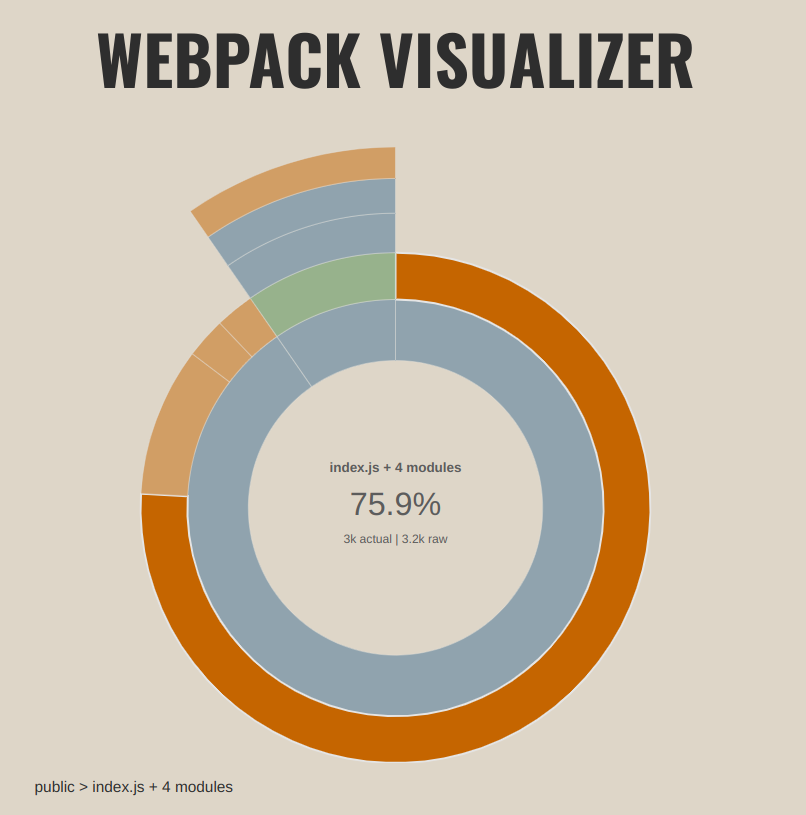
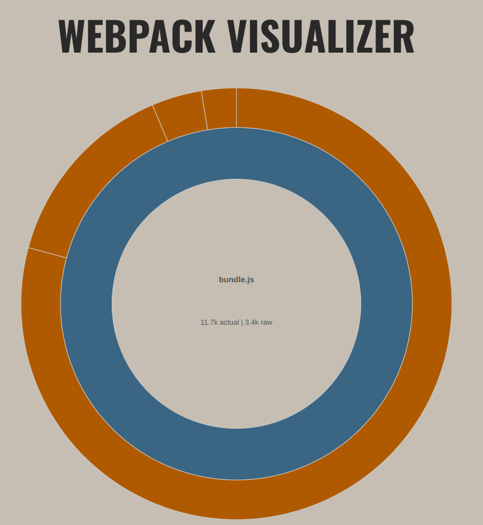

# INDEX

- [INDEX](#index)
- [TODO](#todo)
- [Webpack](#webpack)
  - [What was the intended use of ESmodules before module bundling came along?](#what-was-the-intended-use-of-esmodules-before-module-bundling-came-along)
  - [Why do we install 2 packages (**webpack** and **webpack-cli**) to use Webpack?](#why-do-we-install-2-packages-webpack-and-webpack-cli-to-use-webpack)
  - [What is a `loader` in Webpack?](#what-is-a-loader-in-webpack)
    - [Example of a `loader` configuration](#example-of-a-loader-configuration)
- [Babel](#babel)
  - [What is `@babel/preset-env`](#what-is-babelpreset-env)
    - [Caveats with Experimental JS features](#caveats-with-experimental-js-features)
    - [Caveats with JS methods](#caveats-with-js-methods)
  - [Demonstration of some babel transpilation taking place](#demonstration-of-some-babel-transpilation-taking-place)
- [Building](#building)
  - [Just resolving imports and exports](#just-resolving-imports-and-exports)
  - [Making our bundled code compatible with older browsers (using babel-loader in webpack)](#making-our-bundled-code-compatible-with-older-browsers-using-babel-loader-in-webpack)
    - [1. Transpiling from `ES6` modules to `CommonJS` modules, and other changes](#1-transpiling-from-es6-modules-to-commonjs-modules-and-other-changes)
    - [2. How will treeshaking in Webpack work, since it is only compatible with the ES6 module syntax?](#2-how-will-treeshaking-in-webpack-work-since-it-is-only-compatible-with-the-es6-module-syntax)
  - [`development` mode for more readable bundled code](#development-mode-for-more-readable-bundled-code)
  - [Rebuilding automatically on save](#rebuilding-automatically-on-save)
  - [Webpack `devServer` for hot reloading (`webpack serve`)](#webpack-devserver-for-hot-reloading-webpack-serve)
  - [Plugins](#plugins)
    - [What are Plugins in Webpack and what do they do?](#what-are-plugins-in-webpack-and-what-do-they-do)
    - [How is a plugin different from a regular dev dependency?](#how-is-a-plugin-different-from-a-regular-dev-dependency)
    - [Using plugins in Webpack](#using-plugins-in-webpack)
  - [Analyzing bundle sizes](#analyzing-bundle-sizes)
    - [Getting build stats for using a bundle analyzer](#getting-build-stats-for-using-a-bundle-analyzer)
    - [Difference b/w `raw` and `actual` size in `webpack-visualizer`](#difference-bw-raw-and-actual-size-in-webpack-visualizer)
    - [Difference b/w `stat`, `parsed` and `gzipped` size in `webpack-bundle-analyzer`](#difference-bw-stat-parsed-and-gzipped-size-in-webpack-bundle-analyzer)


# TODO 

Read the comments in the `webpack.config.js` file in my [testing--webpack-and-babel](https://github.com/rohan-v8rma/testing--webpack-and-babel) repo if you have less time.

# Webpack

## What was the intended use of ESmodules before module bundling came along?

The intended use of ES modules in JavaScript was to enable modular code structure in the language itself, without the need for external module bundlers. With ES modules, developers can import and export code between files, making it easier to manage and reuse code across a project.

Before module bundlers became popular, developers had to use different approaches to manage their code structure, such as using global variables, namespaces, or the CommonJS module system. However, these approaches had their own limitations and issues, such as global namespace pollution, naming conflicts, or poor performance.

ES modules were designed to address these issues and provide a standardized, built-in way to define and use modules in JavaScript. While module bundlers like Webpack or Rollup are still widely used, especially for larger and more complex projects, ES modules offer a simpler and more lightweight option for smaller projects or simple scripts.

## Why do we install 2 packages (**webpack** and **webpack-cli**) to use Webpack?

**webpack** and **webpack-cli** are two different packages that are commonly used together in a Webpack build setup.

**webpack** is the main Webpack library that is used to bundle your project's source files into a single file (or multiple files) for deployment. It provides the core functionality for processing your source files, including processing dependencies, transforming code, and creating the bundled output.

**webpack-cli**, on the other hand, is a command line interface (CLI) tool that provides a convenient way to run Webpack builds from the command line. The **webpack-cli** package provides the `webpack` command, which is used to run builds using Webpack; i.e., bundle the code along with carrying out any loading processes.

In order to run Webpack builds from the command line, you will need to have both **webpack** and **webpack-cli** installed in your project.

## What is a `loader` in Webpack?

Refer the Webpack docs : https://webpack.js.org/guides/asset-management/ for more comprehensive information.

A `loader` in Webpack is a module that enables Webpack to process files other than JavaScript, such as CSS, images, fonts, or even text files. 

Loaders are used to transform files from one format to another, and they allow developers to use different languages or pre-processors in their code.

- When a file is imported or required in a JavaScript file, Webpack uses the configured loader to transform the file into a module that can be included in the bundle. 

- Loaders can be configured in the `module.rules` section of the Webpack configuration file.

- Each loader has its own configuration options, and it is common to use multiple loaders in a single Webpack project. 

  For example, a common setup for processing CSS files might include the `style-loader` and `css-loader` modules, which convert CSS code into JavaScript modules that can be included in the bundle and injected into the HTML file.

- Loaders can also be chained together, with the output of one loader being passed as input to another loader. 
  
  This allows for more complex transformations and makes it possible to use different loaders for different parts of a file.

  > Note: A chain is executed in **reverse order**. 
  > 
  > The first loader passes its result (resource with applied transformations) to the next one, and so forth. 
  > 
  > Finally, webpack expects JavaScript to be returned by the **last loader in the chain**.
  >
  > **This is why the order of loaders matters.**

Overall, loaders are a powerful feature of Webpack that enable developers to customize and optimize their build process, and to use a wide range of languages and technologies in their projects.

### Example of a `loader` configuration

```js
 module: {
    rules: [
      {
        test: /\.css$/,
        use: ['style-loader', 'css-loader'],
      },
    ],
  },
```

In this example, 
- The `test` property specifies that the loader should be applied to all files with a `.css` extension. 
- The `use` property specifies that the `css-loader` should be applied first, to convert the CSS code into a JavaScript module, and then the `style-loader` should be applied to inject the CSS code into the HTML file.

If, for instance, we have the following CSS file:

```css
body {
  background-color: #f5f5f5;
  font-family: sans-serif;
}

h1 {
  color: #333;
  font-size: 24px;
  font-weight: bold;
}
```

When `style-loader` and `css-loader` are used together to process this file:

- The `css-loader` converts the CSS code into a JavaScript module that exports the CSS as a string. Here's what the output might look like:

  ```javascript
  module.exports = "body {\n  background-color: #f5f5f5;\n  font-family: sans-serif;\n}\n\nh1 {\n  color: #333;\n  font-size: 24px;\n  font-weight: bold;\n}\n";
  ```
  
  This JavaScript module exports the CSS code as a string, with each line of CSS separated by a newline character. 
- The `style-loader` then takes this JavaScript module and injects it into the HTML file by appending a `<style>` element to the `<head>` element.

---

# Babel

Babel is a toolchain that is mainly used to convert ECMAScript 2015+ code into a backwards compatible version of JavaScript in current and older browsers or environments. 
It can do things like converting JSX to `react.createElement()` syntax in JS.

Refer the [Babel docs](https://babeljs.io/docs/en/) for more info.

## What is `@babel/preset-env`

`@babel/preset-env` figures out what the latest standards of browser support and the amount of backwards compatibility the code should have, based on usage statistics of older browser in the web. 

So, in short, it gives the babel transpiler some standards to transpile to.

Refer the babel docs on `@babel/preset-env` for in-depth information: https://babeljs.io/docs/babel-preset-env

### Caveats with Experimental JS features

***Extract from babel docs...***
    
    ...
    `@babel/preset-env` won't include any JavaScript syntax proposals less than Stage 3 because at that stage in the TC39 process, it wouldn't be implemented by any browsers anyway. Those would need to be included manually. 
    
    The shippedProposals option will include Stage 3 proposals that some browsers have already implemented.
    ...

### Caveats with JS methods

Babel doesn't perform transpiling by-default for methods that require polyfills. It needs to configured separately.

For example, the following method would be kept as-is in the transpiled code.
```js
console.log(['a', 'b', 'c'].includes('b'))
```
The browsers that support this method don't have any problem but that is not the case for older browsers.

The general reasoning behind this is polyfills bloat up your bundled code.


## Demonstration of some babel transpilation taking place

Source code:
```javascript
const obj = {a: "alpha", b: "bravo"};
const newObj = {...obj, c: "charlie"}
```

This code uses the spread operator, which is not supported by most browsers at this time. So, if run 'babel-loader' on this that transpiles this code using the `@babel/core` module according to the guidelines provided by `@babel/preset-env` module.

Transpiled code (*production mode, but with multi-line formatting*):
```javascript
(() => {
    function r(t) {
        return r = "function" == typeof Symbol && "symbol" == typeof Symbol.iterator ? function(r) {
            return typeof r
        } : function(r) {
            return r && "function" == typeof Symbol && r.constructor === Symbol && r !== Symbol.prototype ? "symbol" : typeof r
        }, r(t)
    }

    function t(r, t) {
        var e = Object.keys(r);
        if (Object.getOwnPropertySymbols) {
            var n = Object.getOwnPropertySymbols(r);
            t && (n = n.filter((function(t) {
                return Object.getOwnPropertyDescriptor(r, t).enumerable
            }))), e.push.apply(e, n)
        }
        return e
    }

    function e(r) {
        for (var e = 1; e < arguments.length; e++) {
            var o = null != arguments[e] ? arguments[e] : {};
            e % 2 ? t(Object(o), !0).forEach((function(t) {
                n(r, t, o[t])
            })) : Object.getOwnPropertyDescriptors ? Object.defineProperties(r, Object.getOwnPropertyDescriptors(o)) : t(Object(o)).forEach((function(t) {
                Object.defineProperty(r, t, Object.getOwnPropertyDescriptor(o, t))
            }))
        }
        return r
    }

    function n(t, e, n) {
        return (e = function(t) {
            var e = function(t, e) {
                if ("object" !== r(t) || null === t) return t;
                var n = t[Symbol.toPrimitive];
                if (void 0 !== n) {
                    var o = n.call(t, "string");
                    if ("object" !== r(o)) return o;
                    throw new TypeError("@@toPrimitive must return a primitive value.")
                }
                return String(t)
            }(t);
            return "symbol" === r(e) ? e : String(e)
        }(e)) in t ? Object.defineProperty(t, e, {
            value: n,
            enumerable: !0,
            configurable: !0,
            writable: !0
        }) : t[e] = n, t
    }
    e(e({}, {
        a: "alpha",
        b: "bravo"
    }), {}, {
        c: "charlie"
    })
})();
```

Transpiled code (*development mode*):
```js
/*
 * ATTENTION: The "eval" devtool has been used (maybe by default in mode: "development").
 * This devtool is neither made for production nor for readable output files.
 * It uses "eval()" calls to create a separate source file in the browser devtools.
 * If you are trying to read the output file, select a different devtool (https://webpack.js.org/configuration/devtool/)
 * or disable the default devtool with "devtool: false".
 * If you are looking for production-ready output files, see mode: "production" (https://webpack.js.org/configuration/mode/).
 */
/******/ (() => { // webpackBootstrap
/******/ 	var __webpack_modules__ = ({

/***/ "./src/index.js":
/*!**********************!*\
  !*** ./src/index.js ***!
  \**********************/
/***/ (() => {

eval("function _typeof(obj) { \"@babel/helpers - typeof\"; return _typeof = \"function\" == typeof Symbol && \"symbol\" == typeof Symbol.iterator ? function (obj) { return typeof obj; } : function (obj) { return obj && \"function\" == typeof Symbol && obj.constructor === Symbol && obj !== Symbol.prototype ? \"symbol\" : typeof obj; }, _typeof(obj); }\nfunction ownKeys(object, enumerableOnly) { var keys = Object.keys(object); if (Object.getOwnPropertySymbols) { var symbols = Object.getOwnPropertySymbols(object); enumerableOnly && (symbols = symbols.filter(function (sym) { return Object.getOwnPropertyDescriptor(object, sym).enumerable; })), keys.push.apply(keys, symbols); } return keys; }\nfunction _objectSpread(target) { for (var i = 1; i < arguments.length; i++) { var source = null != arguments[i] ? arguments[i] : {}; i % 2 ? ownKeys(Object(source), !0).forEach(function (key) { _defineProperty(target, key, source[key]); }) : Object.getOwnPropertyDescriptors ? Object.defineProperties(target, Object.getOwnPropertyDescriptors(source)) : ownKeys(Object(source)).forEach(function (key) { Object.defineProperty(target, key, Object.getOwnPropertyDescriptor(source, key)); }); } return target; }\nfunction _defineProperty(obj, key, value) { key = _toPropertyKey(key); if (key in obj) { Object.defineProperty(obj, key, { value: value, enumerable: true, configurable: true, writable: true }); } else { obj[key] = value; } return obj; }\nfunction _toPropertyKey(arg) { var key = _toPrimitive(arg, \"string\"); return _typeof(key) === \"symbol\" ? key : String(key); }\nfunction _toPrimitive(input, hint) { if (_typeof(input) !== \"object\" || input === null) return input; var prim = input[Symbol.toPrimitive]; if (prim !== undefined) { var res = prim.call(input, hint || \"default\"); if (_typeof(res) !== \"object\") return res; throw new TypeError(\"@@toPrimitive must return a primitive value.\"); } return (hint === \"string\" ? String : Number)(input); }\n// import getCars from './getCars'\n\n// console.log(\"Inside index.js LOL\");\n\n// getCars();\n\nvar obj = {\n  a: \"alpha\",\n  b: \"bravo\"\n};\n// Using the spread operator, which is not supported by most browsers at this time\nvar newObj = _objectSpread(_objectSpread({}, obj), {}, {\n  c: \"charlie\"\n});\n\n//# sourceURL=webpack://firebase-testing/./src/index.js?");

/***/ })

/******/ 	});
/************************************************************************/
/******/ 	
/******/ 	// startup
/******/ 	// Load entry module and return exports
/******/ 	// This entry module can't be inlined because the eval devtool is used.
/******/ 	var __webpack_exports__ = {};
/******/ 	__webpack_modules__["./src/index.js"]();
/******/ 	
/******/ })()
;
```

> ***Note***: This is subject to change as the default guidelines for the minimum amount backwards compatibility changes in the `@babel/preset-env` module.


# Building

## Just resolving imports and exports

We can use ***Webpack*** with no separate setup, by just keeping an organized directory structure and file naming convention to prevent errors during bundling.

These include:
- Keeping the name of the js file that is intended to be our main entry point as `index.js` and placing it in the `src` folder in our root directory
- Keeping the import paths and locations of the rest of our files relative to this.

This is enough if we want to just resolve keep multiple js files, resolve imports between them during bundling and resultingly have a single js file in our production code.

## Making our bundled code compatible with older browsers (using babel-loader in webpack)

### 1. Transpiling from `ES6` modules to `CommonJS` modules, and other changes

This is where Babel comes in because the bundled code generated by Webpack is not necessarily compatible with older browsers. 

This is how to configure transpilation by Babel before bundling carried out by Webpack:
```js
module.exports = {
  // ...other webpack config options...
  module: {
    rules: [
      {
        test: /\.js$/,
        exclude: /node_modules/,
        use: {
          loader: 'babel-loader',
          options: {
            presets: ['@babel/preset-env'],
          },
        },
      },
    ],
  },
};

```

This tells webpack to use the `babel-loader` to transpile any `.js` files in your project that are not in the `node_modules` directory. 

The `@babel/preset-env` preset is written about [above](#what-is-babelpreset-env).

> ***Note***: Babel transpiles the code from ES6 module syntax to CommonJS syntax that can run on older browsers.
> 
> The question arises that: 

### 2. How will treeshaking in Webpack work, since it is only compatible with the ES6 module syntax?

Babel can transpile modern ES6 code to a format that is compatible with older browsers, ***while still preserving the original ES6 module syntax***. BRUH.

***Note***: This can be confusing to think about so here's an example transformation:

Original `ES6` module syntax code:
```js
// src/example.js
export const square = x => x * x;
```

`CommonJS` module syntax code, transpiled by Babel:
```js
"use strict";
Object.defineProperty(exports, "__esModule", {
  value: true
});
exports.square = void 0;

var square = function square(x) {
  return x * x;
};

exports.square = square;
```

Keep in mind that the exact transpilation can change overtime as more and more older browsers support a certain threshold of JS features, as determined by `@babel/preset-env`.

Now, let's say we don't care about preserving the `export` statement. Here's an example of what the transpiled code might look like:

```js
"use strict";
function add(x, y) {
  return x + y;
}
module.exports = {
  add: add
};
```

> ***Note***: Since the `import` and `export` statements are preserved in the code, Webpack can take that transpiled code and perform tree shaking on it, reducing the size of the final bundle by removing any unused code. 
>
> This allows you to write modern JavaScript code using ES6 module syntax while still supporting older browsers and optimizing your code for performance.

---

## `development` mode for more readable bundled code

## Rebuilding automatically on save

As explained above, the **webpack-cli** package provides us with the `webpack` command used to run builds using Webpack.

It has a `--watch` flag which builds the existing files and then watches for any file changes. If any file changes occur, it rebuilds those specific files in this mode.

## Webpack `devServer` for hot reloading (`webpack serve`)

`webpack serve` is a command that launches a development server that can serve your webpack-built application. 

It serves the files generated by webpack, and it also supports hot module replacement, which means that it can update modules in the browser without requiring a full page refresh. 

This allows you to see changes in your application immediately as you make them, without having to manually refresh the page. `webpack serve` is often used during the development process to provide a more streamlined experience for developers.

> ***Note***:  When you run `webpack serve`, it will serve the bundled files in memory and they will be updated every time you make a change to your source code. 
> 
> However, the changes will not be written to disk until you run the `webpack` command to generate the final output files. 
> 
> So, the updated files will only be available in memory until you stop the `webpack serve` command.
>
> If you have enabled **source maps** in your webpack configuration, the updated version of your files (not the most recently built one) will be shown to you in the browser's dev tools after running webpack serve. The **source maps** allow the dev tools to map the generated code back to your original source code, making it easier to debug your application.

---

## Plugins

### What are Plugins in Webpack and what do they do?

- Plugins in webpack are additional modules that can be added to the configuration to extend its functionality. 
- They can perform a variety of tasks, such as optimizing the output code, injecting environment variables, creating a manifest file, and more.

### How is a plugin different from a regular dev dependency?

A plugin is different from a regular dev dependency in that ***a plugin is used to customize the behavior of webpack itself***, while a dev dependency is just a package that is used in the development process but does not affect the behavior of webpack directly.

### Using plugins in Webpack

- Plugins are ***defined as instances of a class***, and are typically passed as options to the `plugins` property in the `webpack.config.js` file. 

- For example, `webpack-bundle-analyzer` plugin is a popular plugin for analyzing the contents of a webpack bundle and generating a visual representation of its composition. 

  When the plugin is enabled, it ***hooks into the webpack build process*** to generate an HTML report that shows the size of each module in the bundle, as well as how they are distributed across different chunks.

  1. To use the webpack-bundle-analyzer plugin, you first need to install it as a dependency:
      ```bash
      npm install --save-dev webpack-bundle-analyzer
      ```

  2. Then, you can add it to your webpack configuration file like so:
      ```js
      const BundleAnalyzerPlugin = require('webpack-bundle-analyzer').BundleAnalyzerPlugin;

      module.exports = {
        // ...
        plugins: [
          new BundleAnalyzerPlugin()
        ]
      };
      ```

  This will generate a report of your bundle's contents when webpack is run. The report can be accessed by opening the generated report.html file in your browser.

---

## Analyzing bundle sizes

### Getting build stats for using a bundle analyzer

The following command generates a `.json` file containing the bundle stats:

We can create a script for this in the `package.json` file, like so:
```json
{
  ...
  "scripts": {
    ...
    "stats": "webpack --json build-stats.json"
    ...
  }
  ...
}
```

This script can be run in the following way:
```
npm run stats
```

This `.json` file is stored in the root directory of our npm project.

### Difference b/w `raw` and `actual` size in `webpack-visualizer`

`webpack-visualizer`: https://chrisbateman.github.io/webpack-visualizer/

This bundle analyzer can be used to visualize the bundle size and other details.

- The **`raw` size** is the original size without any tree-shaking, minification and mangling.
- The **`actual` size** is the size achieved after the above processes have been carried out by webpack, along with any other optimizations.

1. If we think intuitively, the `actual` size should always be less than the `raw` size; but this is not always the case. *Expected outcome:*

      

2. The reason that raw size can sometimes be larger than actual size is because the processing and optimization steps performed by webpack can add additional code to the output file. 

    This additional code may be necessary for the code to work correctly (polyfills), but it still contributes to the overall size of the output file. 

    Additionally, some optimization techniques may increase the size of the output file in order to improve performance.

    

Refer the following video for more information: https://www.youtube.com/watch?v=oAgHZ9zlmaY

### Difference b/w `stat`, `parsed` and `gzipped` size in `webpack-bundle-analyzer`

Refer the guide above about [Plugins](#plugins) and how to install [`webpack-bundle-analyzer`](#using-plugins-in-webpack).

- `stat size`: This is the raw size of the JavaScript bundle without any optimizations or compression. It is the size of the bundle as it exists on disk. 
  
    *(Equivalent to `raw size` in `webpack-visualizer`)*

- `parsed size`: This is the size of the JavaScript bundle after it has been parsed by webpack. It represents the amount of code that webpack has analyzed and included in the bundle, as well as any code that webpack has removed through tree shaking. 
    
    *(Equivalent to `actual size` in `webpack-visualizer`)*

- `gzipped size`: This is the size of the JavaScript bundle after it has been compressed using the gzip algorithm. Gzipping is a common technique used to reduce the size of web resources, since it can significantly reduce the amount of data that needs to be transferred over the network.

The `parsed size` is usually smaller than the `stat size`, since webpack removes unused code through tree shaking. 

The `gzipped size` is usually smaller than both the `stat size` and the `parsed size`, since gzip compression can further reduce the size of the bundle by removing redundant data.

> **Short note on *gzipping***
> 
> When a client (i.e., a browser) requests a file from a server, the server compresses the file and sends it back to the client. The browser then decompresses the file and uses it as necessary.
>
> The process of compressing and decompressing files is called "gzip". Gzip is a software application used for file compression and decompression. It is widely used to compress files for faster transmission over a network.
>
> When a browser requests a gzipped file from a server, the server sends the compressed file with a `Content-Encoding: gzip` header. 
> 
> The browser then decompresses the file using its built-in gzip capabilities and uses the file as necessary.
> 
> The use of gzipped files helps to reduce the amount of data that needs to be transferred over the network, resulting in faster loading times for websites and other web applications.

> **Can a client request the non *gzipped* version of a file as well?**
> 
> Yes, a client can request the non-gzipped version of a file by sending a request header of `Accept-Encoding: identity`. 
> 
> This tells the server that the client does not support compressed responses, and the server should send an uncompressed response.